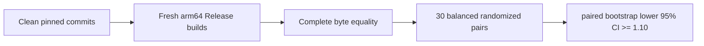

# RFC 9180 HPKE comparison benchmark

This manually invoked benchmark compares SwiftSSL with one pinned official
BoringSSL commit for the RFC 9180 suite
`DHKEM(X25519, HKDF-SHA256)/HKDF-SHA256/AES-128-GCM`.

The workers are enabled only when `SWIFT_SSL_ENABLE_BENCHMARKS=1`. They are not
test targets, are not run by `xcodebuild test`, and do not add BoringSSL to any
SwiftSSL library or runtime target.



## Fixed workload matrix

| Workload | Timed responsibility | Payload | AAD |
|---|---|---:|---:|
| `x25519-shared` | One caller-owned X25519 shared-secret derivation | 32 B peer key | 0 B |
| `recipient-setup` | X25519 decapsulation and RFC 9180 key schedule | 256 B fixture | 32 B |
| `first-open-256` | Recipient setup and first authenticated open | 256 B | 32 B |
| `first-open-1536` | Recipient setup and first authenticated open | 1,536 B | 377 B |

Both workers use the same recipient private scalar, ephemeral scalar, info,
plaintext, and authenticated data. Before timing, the runner compares every
byte of the encapsulation, ciphertext, and recovered plaintext for both payload
sizes. Every timed pair must also produce the same checksum.

The Swift path borrows input through `Span`, writes ciphertext and plaintext
into caller-owned `MutableSpan` storage, derives HPKE key material directly into
one packed `SecretBytes` owner, and performs recipient X25519 directly from the
borrowed encapsulation. AES key schedules and GHASH powers are fixed-width
inline storage. The Apple ARM64 backend uses scoped NEON AES operations,
four-block direct CTR writes, and four-block aggregated carry-less GHASH. All
unsafe pointers remain inside synchronous closures and never cross a Sendable
boundary.

## Formal comparison

The runner reuses the repository benchmark support for clean Git snapshots,
sanitized environments, pinned toolchain checks, fresh builds, Mach-O checks,
quiescence, calibration, convergence, balanced pair ordering, and paired
bootstrap confidence intervals. It additionally checks that the Swift worker
has no external OpenSSL, BoringSSL, EVP HPKE, EVP AEAD, or X25519 dependency and
that its Release image contains UInt128, AES, and polynomial-multiply ARM64
instructions.

```bash
SWIFT_SSL_ROOT=/Users/1amageek/Desktop/networking/swift-ssl
BORINGSSL_ROOT=/Users/1amageek/Desktop/networking/deep-analysis-sessions/2026-07-31_swift-ssl-architecture/.references/boringssl

cd "$SWIFT_SSL_ROOT"
TOOLCHAINS=org.swift.64202607231a \
python3 Benchmarks/HPKE/run_comparison.py \
  --formal \
  --boringssl-source "$BORINGSSL_ROOT" \
  --samples 30 \
  --bootstrap-resamples 10000 \
  --seed 20260802
```

The formal baseline is:

| Component | Required value |
|---|---|
| Swift toolchain | `org.swift.64202607231a` |
| Swift compiler commit | `ef761e567dc94ee` |
| Swift target | `arm64-apple-macosx15.0` |
| Xcode | `27.0` (`27A5209h`) |
| macOS SDK | `27.0` (`26A5368f`) |
| BoringSSL commit | `ae49d2681a56ca7b8609f6039a770fda2a8eb550` |
| BoringSSL origin | `https://boringssl.googlesource.com/boringssl` |
| Build mode | Release with native ARM64 crypto enabled |

## Decision rule

For every fixed workload:

```text
speedup = BoringSSL nanoseconds / SwiftSSL nanoseconds
pass = lower95CI(median paired speedup) >= 1.10
```

All four workloads must pass. A valid measurement which misses the performance
target is retained and reported as a failed gate; it is never converted into a
successful result.

## Current exploratory observation

An interleaved development measurement on 2026-08-02, before the formal clean
snapshot run, measured the 1,536-byte first-open path at approximately 23.9
microseconds for SwiftSSL and 20.6 microseconds for BoringSSL. This corresponds
to approximately `0.86x` and therefore does not establish the `1.10x` release
goal. It is diagnostic evidence only; the formal table is added after a clean,
committed 30-pair run.
