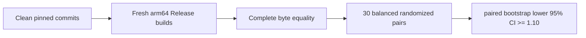

# RFC 9180 HPKE comparison benchmark

This manually invoked benchmark compares SwiftSSL with one pinned official
BoringSSL commit for the RFC 9180 suite
`DHKEM(X25519, HKDF-SHA256)/HKDF-SHA256/AES-128-GCM`.

The workers are enabled only when `SWIFT_SSL_ENABLE_BENCHMARKS=1`. They are not
test targets, are not run by `xcodebuild test`, and do not add BoringSSL to any
SwiftSSL library or runtime target.



## Fixed workload matrix

| Workload | Timed responsibility | Payload | AAD |
|---|---|---:|---:|
| `x25519-shared` | One caller-owned X25519 shared-secret derivation | 32 B peer key | 0 B |
| `recipient-setup` | X25519 decapsulation and RFC 9180 key schedule | 256 B fixture | 32 B |
| `first-open-256` | Recipient setup and first authenticated open | 256 B | 32 B |
| `first-open-1536` | Recipient setup and first authenticated open | 1,536 B | 377 B |

Both workers use the same recipient private scalar, ephemeral scalar, info,
plaintext, and authenticated data. Before timing, the runner compares every
byte of the encapsulation, ciphertext, and recovered plaintext for both payload
sizes. Every timed pair must also produce the same checksum.

The Swift path borrows input through `Span`, writes ciphertext and plaintext
into caller-owned `MutableSpan` storage, derives HPKE key material directly into
one packed `SecretBytes` owner, and performs recipient X25519 directly from the
borrowed encapsulation. AES key schedules and GHASH powers are fixed-width
inline storage. The Apple ARM64 backend uses scoped NEON AES operations,
four-block direct CTR writes, and four-block aggregated carry-less GHASH. All
unsafe pointers remain inside synchronous closures and never cross a Sendable
boundary.

## Formal comparison

The runner reuses the repository benchmark support for clean Git snapshots,
sanitized environments, pinned toolchain checks, fresh builds, Mach-O checks,
quiescence, calibration, convergence, balanced pair ordering, and paired
bootstrap confidence intervals. It additionally checks that the Swift worker
has no external OpenSSL, BoringSSL, EVP HPKE, EVP AEAD, or X25519 dependency and
that its Release image contains UInt128, AES, and polynomial-multiply ARM64
instructions.

```bash
SWIFT_SSL_ROOT=/Users/1amageek/Desktop/networking/swift-ssl
BORINGSSL_ROOT=/Users/1amageek/Desktop/networking/deep-analysis-sessions/2026-07-31_swift-ssl-architecture/.references/boringssl

cd "$SWIFT_SSL_ROOT"
TOOLCHAINS=org.swift.64202607231a \
python3 Benchmarks/HPKE/run_comparison.py \
  --formal \
  --boringssl-source "$BORINGSSL_ROOT" \
  --samples 30 \
  --bootstrap-resamples 10000 \
  --seed 20260802
```

The formal baseline is:

| Component | Required value |
|---|---|
| Swift toolchain | `org.swift.64202607231a` |
| Swift compiler commit | `ef761e567dc94ee` |
| Swift target | `arm64-apple-macosx15.0` |
| Xcode | `27.0` (`27A5209h`) |
| macOS SDK | `27.0` (`26A5368f`) |
| BoringSSL commit | `ae49d2681a56ca7b8609f6039a770fda2a8eb550` |
| BoringSSL origin | `https://boringssl.googlesource.com/boringssl` |
| Build mode | Release with native ARM64 crypto enabled |

## Decision rule

For every fixed workload:

```text
speedup = BoringSSL nanoseconds / SwiftSSL nanoseconds
pass = lower95CI(median paired speedup) >= 1.10
```

All four workloads must pass. A valid measurement which misses the performance
target is retained and reported as a failed gate; it is never converted into a
successful result.

## Formal allocation and dynamic-copy audit

The memory runner is separate from the normal test suite and timing benchmark.
It builds a clean Release snapshot, validates the allocation probe against an
independent C contract executable, and derives exact per-operation slopes from
three repetitions at 1, 10, and 100 iterations.

```bash
TOOLCHAINS=org.swift.64202607231a \
python3 Benchmarks/HPKE/run_memory.py \
  --formal \
  --output .test-artifacts/benchmark/20260802T-formal-hpke-memory-v1.json
```

The formal 2026-08-02 artifact passed at source commit
`581e9666028457f4b39af75ec93a637615d1ffde`. Its SHA-256 is
`b9f9f0cd93b6036c47fee6dbae7bb2dc8af2c0cad30b5ba6cac46a9a59fb42ab`.

| Workload | Allocations/op | Requested bytes/op | Dynamic bulk-copy bytes/op | Gate |
|---|---:|---:|---:|---:|
| `x25519-shared` | 0 | 0 | 0 | Pass |
| `recipient-setup` | 3 | 166 | 840 | Pass |
| `first-open-256` | 3 | 166 | 2,696 | Pass |
| `first-open-1536` | 3 | 166 | 2,696 | Pass |

The two first-open workloads have identical allocation and dynamic bulk-copy
slopes despite a 1,280-byte payload difference. This establishes that the
caller-owned plaintext/ciphertext path does not rematerialize or dynamically
bulk-copy the payload. It does not claim that every internal fixed-size crypto
state copy is zero: recipient setup and first-open retain the measured fixed
copy budgets above. Dynamic `memcpy`/`memmove` interposition cannot observe
compiler-inlined scalar copies, and the artifact is allocation/copy evidence,
not timing evidence.

The committed raw artifact is
[`Benchmarks/HPKE/Results/20260802T-native-hpke-memory.json`](Results/20260802T-native-hpke-memory.json).

## Current formal timing result

The valid formal run completed on 2026-08-02 from clean SwiftSSL commit
`d3fa129cb298cd443d2edd19d09a7afa61fa0c9f` and the pinned BoringSSL commit.
Complete output equality passed, but the aggregate gate failed because both
first-open workloads missed the required `1.10x` lower confidence bound.

| Workload | Swift median ns/op | BoringSSL median ns/op | Speedup | 95% paired bootstrap CI | Gate |
|---|---:|---:|---:|---:|---:|
| `x25519-shared` | 14,387.157 | 16,772.418 | `1.1660x` | `[1.1643, 1.1672]` | Pass |
| `recipient-setup` | 16,144.922 | 18,653.506 | `1.1542x` | `[1.1536, 1.1558]` | Pass |
| `first-open-256` | 17,486.929 | 18,750.276 | `1.0718x` | `[1.0704, 1.0731]` | Fail |
| `first-open-1536` | 19,409.884 | 18,895.543 | `0.9741x` | `[0.9728, 0.9747]` | Fail |

This failed gate is retained as timing evidence rather than relabeled as a
successful result. The committed raw artifact is
[`Benchmarks/HPKE/Results/20260802T034901Z-native-hpke.json`](Results/20260802T034901Z-native-hpke.json)
(SHA-256
`9e7c6f511fa3fa68edec7791d6b4d5185e07a4ef946a9b9c278bb1ac03b98463`).
