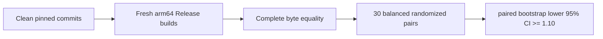

# RFC 9180 HPKE comparison benchmark

This manually invoked benchmark compares SSL with one pinned official
BoringSSL commit for the RFC 9180 suite
`DHKEM(X25519, HKDF-SHA256)/HKDF-SHA256/AES-128-GCM`.

The workers are enabled only when `SWIFT_SSL_ENABLE_BENCHMARKS=1`. They are not
test targets, are not run by `xcodebuild test`, and do not add BoringSSL to any
SSL library or runtime target.



## Fixed workload matrix

| Workload | Timed responsibility | Payload | AAD |
|---|---|---:|---:|
| `x25519-shared` | One caller-owned X25519 shared-secret derivation | 32 B peer key | 0 B |
| `recipient-setup` | X25519 decapsulation and RFC 9180 key schedule | 256 B fixture | 32 B |
| `first-open-256` | Recipient setup and first authenticated open | 256 B | 32 B |
| `first-open-1536` | Recipient setup and first authenticated open | 1,536 B | 377 B |

Both workers use the same recipient private scalar, ephemeral scalar, info,
plaintext, and authenticated data. Before timing, the runner compares every
byte of the encapsulation, ciphertext, and recovered plaintext for both payload
sizes. Every timed pair must also produce the same checksum.

The Swift path borrows input through `Span`, writes ciphertext and plaintext
into caller-owned `MutableSpan` storage, expands the AEAD key once into the
context-owned prepared cipher, keeps the large AES schedule behind a private
stable immutable owner, and stores only the base nonce plus exporter secret in
`SecretBytes`. Recipient X25519 writes into wiped inline fixed-width
storage directly from the borrowed encapsulation. The Apple ARM64 backend uses
scoped NEON AES operations, four-block direct CTR writes, reversed precomputed
GHASH powers, four-block aggregation, and eight-block aggregation for messages
of at least 1,024 bytes. All unsafe pointers remain inside synchronous closures
and never cross a Sendable boundary.

## Formal comparison

The runner reuses the repository benchmark support for clean Git snapshots,
sanitized environments, pinned toolchain checks, fresh builds, Mach-O checks,
quiescence, calibration, convergence, balanced pair ordering, and paired
bootstrap confidence intervals. It additionally checks that the Swift worker
has no external OpenSSL, BoringSSL, EVP HPKE, EVP AEAD, or X25519 dependency and
that its Release image contains UInt128, AES, and polynomial-multiply ARM64
instructions.

```bash
SWIFT_SSL_ROOT=/Users/1amageek/Desktop/networking/swift-ssl
BORINGSSL_ROOT=/Users/1amageek/Desktop/networking/deep-analysis-sessions/2026-07-31_swift-ssl-architecture/.references/boringssl

cd "$SWIFT_SSL_ROOT"
TOOLCHAINS=org.swift.64202607231a \
python3 Benchmarks/HPKE/run_comparison.py \
  --formal \
  --boringssl-source "$BORINGSSL_ROOT" \
  --samples 30 \
  --bootstrap-resamples 10000 \
  --seed 20260802
```

The formal baseline is:

| Component | Required value |
|---|---|
| Swift toolchain | `org.swift.64202607231a` |
| Swift compiler commit | `ef761e567dc94ee` |
| Swift target | `arm64-apple-macosx15.0` |
| Xcode | `27.0` (`27A5209h`) |
| macOS SDK | `27.0` (`26A5368f`) |
| BoringSSL commit | `ae49d2681a56ca7b8609f6039a770fda2a8eb550` |
| BoringSSL origin | `https://boringssl.googlesource.com/boringssl` |
| Build mode | Release with native ARM64 crypto enabled |

## Decision rule

For every fixed workload:

```text
speedup = BoringSSL nanoseconds / SSL nanoseconds
pass = lower95CI(median paired speedup) >= 1.10
```

All four workloads must pass. A valid measurement which misses the performance
target is retained and reported as a failed gate; it is never converted into a
successful result.

## Formal allocation and dynamic-copy audit

The memory runner is separate from the normal test suite and timing benchmark.
It builds a clean Release snapshot, validates the allocation probe against an
independent C contract executable, and derives exact per-operation slopes from
three repetitions at 1, 10, and 100 iterations.

```bash
TOOLCHAINS=org.swift.64202607231a \
python3 Benchmarks/HPKE/run_memory.py \
  --formal \
  --output .test-artifacts/benchmark/20260802T-formal-hpke-memory-v1.json
```

The current formal 2026-08-02 artifact passed at source commit
`a30e5fb788a13f4f717e4050cd460cc13445c895`. Its SHA-256 is
`d36f0df01e80e9e1a671f6d75ee7c54b610bc6a1e2130fa0b09bfb29902d5e6d`.

| Workload | Allocations/op | Requested bytes/op | Dynamic bulk-copy bytes/op | Gate |
|---|---:|---:|---:|---:|
| `x25519-shared` | 0 | 0 | 0 | Pass |
| `recipient-setup` | 2 | 412 | 1,715 | Pass |
| `first-open-256` | 2 | 412 | 2,331 | Pass |
| `first-open-1536` | 2 | 412 | 2,331 | Pass |

The two first-open workloads have identical allocation and dynamic bulk-copy
slopes despite a 1,280-byte payload difference. This establishes that the
caller-owned plaintext/ciphertext path does not rematerialize or dynamically
bulk-copy the payload. The stable prepared AES owner and 44-byte secret owner
are fixed allocations. Setup retains a fixed schedule-placement copy, while
first-open uses 365 fewer dynamic-copy bytes than the previous committed
layout. Dynamic `memcpy`/`memmove` interposition cannot observe
compiler-inlined scalar copies, and the artifact is allocation/copy evidence,
not timing evidence.

The committed raw artifact is
[`Benchmarks/HPKE/Results/20260802T060606Z-native-hpke-memory.json`](Results/20260802T060606Z-native-hpke-memory.json).

## Current formal timing result

The valid formal run completed on 2026-08-02 from clean SSL commit
`a30e5fb788a13f4f717e4050cd460cc13445c895` and the pinned BoringSSL commit.
Complete output equality passed, and all four lower confidence bounds exceed
the required `1.10x` target.

| Workload | Swift median ns/op | BoringSSL median ns/op | Speedup | 95% paired bootstrap CI | Gate |
|---|---:|---:|---:|---:|---:|
| `x25519-shared` | 14,376.509 | 16,740.212 | `1.1644x` | `[1.1630, 1.1666]` | Pass |
| `recipient-setup` | 16,570.616 | 18,588.603 | `1.1219x` | `[1.1207, 1.1244]` | Pass |
| `first-open-256` | 16,700.675 | 18,670.401 | `1.1178x` | `[1.1166, 1.1194]` | Pass |
| `first-open-1536` | 16,875.905 | 18,665.522 | `1.1064x` | `[1.1057, 1.1091]` | Pass |

The narrowest passing lower bound is `1.1057x` for `first-open-1536`. The prior
failed result remains committed as historical evidence and is not used as the
current release result. The current raw artifact is
[`Benchmarks/HPKE/Results/20260802T060532Z-native-hpke.json`](Results/20260802T060532Z-native-hpke.json)
(SHA-256
`c54dcbc132cbbfa04a26a581207d223d1abc49bda9b1d0f8e0ce9ee520d7918c`).
