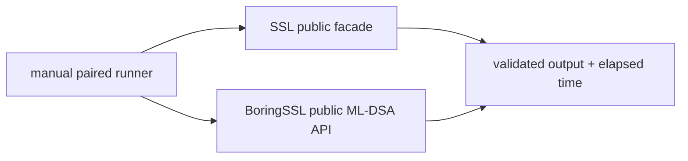
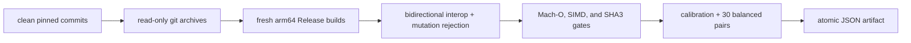

# FIPS 204 ML-DSA comparison benchmark

This manually invoked Native benchmark compares the public SSL
ML-DSA-44, ML-DSA-65, and ML-DSA-87 key-generation, randomized signing, and
verification paths with the same operations in pinned official BoringSSL commit
`ae49d2681a56ca7b8609f6039a770fda2a8eb550`.

The benchmark is enabled only when `SWIFT_SSL_ENABLE_BENCHMARKS=1`. It is not a
test target, is not run by `xcodebuild test`, and does not add BoringSSL to any
SSL library or runtime product.



Timed key generation and signing include each implementation's public entropy
acquisition path. Signing and verification reuse equivalent pre-expanded keys
and use the same 1,024-byte message and 17-byte context. Deterministic seeds and
randomizers are used only by the untimed bidirectional interoperability
transaction and verification fixture. Checksums consume operation output so
the compiler cannot remove the work.

## Formal timing runner

A formal run requires the pinned toolchain, a clean committed SSL
checkout, and a clean official BoringSSL checkout at the pinned commit:

```bash
TOOLCHAINS=org.swift.64202607231a \
python3 Benchmarks/MLDSA/run_comparison.py \
  --formal \
  --boringssl-source /absolute/path/to/pinned/boringssl \
  --samples 30 \
  --bootstrap-resamples 10000 \
  --seed 20260802
```



The interoperability transaction validates Swift-generated signatures with
BoringSSL and BoringSSL-generated signatures with SSL. Both
implementations must reject a mutated signature. Exact public-key and signature
lengths are validated before timing.

The build contract fixes arm64, macOS 15.0, SDK 27.0, Xcode 27 build
`27A5209h`, Swift compiler commit `ef761e567dc94ee`, and BoringSSL assembly
availability. The Swift code-generation gate requires the ML-DSA public entry
points, SIMD Montgomery multiplication shape, and ARM SHA3 instructions.

Each implementation must exceed 200 ms per calibrated sample with the same
iteration count. The latest three pilot durations must converge within five
percent of their median. The runner requires AC power, normal power mode, no
thermal/performance warning, no competing compiler/linker build, and bounded
load before convergence and every measured pair.

Each parameter set's key generation, signing, and verification independently
passes only when:

```text
lower95CI(median(BoringSSL elapsed / SSL elapsed)) >= 1.10
```

## Allocation and bulk-copy runner

The separate memory runner builds a fresh Release worker from a clean Git
archive, injects a benchmark-only allocator/copy interposer, validates the
interposer with a C contract probe, and measures 1, 10, and 100 operations in
three fresh processes each.

```bash
TOOLCHAINS=org.swift.64202607231a \
python3 Benchmarks/MLDSA/run_memory.py --formal
```

Every counter must be an exact linear function of iteration count. The slope
is the per-operation budget and the intercept is process/setup overhead.
Allocation and free slopes must balance; `calloc` and `realloc` are forbidden
inside every operation.

The public message, context, signature, and public-key encodings remain
borrowed. In-place signing writes directly to caller storage. Key generation
and verification have zero per-operation dynamic bulk-copy bytes. The fixed
signing fixtures record parameter-specific algorithm-required mask forks
across deterministic rejection-sampling attempts, not API-boundary or COW
copies.

Dynamic interposition cannot observe compiler-inlined scalar copies. Memory
evidence is therefore combined with source ownership review, caller-output
tests, and failure-preservation tests.

## Result status

The formal Native memory artifact
[`20260801T193538Z-native-mldsa-memory.json`](Results/20260801T193538Z-native-mldsa-memory.json)
was measured from clean source commit
`9344ef40c60fb783839c5c7ccb90893e11874c64`. Its SHA-256 is
`de46a497d115c1ab1805100f8167362f021b1f9acf258ce0d766eb1d144b1c4a`.

| Parameter set and operation | Allocations/op | Allocated bytes/op | Dynamic bulk-copy bytes/op | Gate |
|---|---:|---:|---:|---|
| ML-DSA-44 key generation | 23 | 44,928 | 0 | Pass |
| ML-DSA-44 signing | 30 | 38,800 | 16,384 | Pass |
| ML-DSA-44 verification | 14 | 23,488 | 0 | Pass |
| ML-DSA-65 key generation | 25 | 71,536 | 0 | Pass |
| ML-DSA-65 signing | 62 | 59,248 | 40,960 | Pass |
| ML-DSA-65 verification | 14 | 31,712 | 0 | Pass |
| ML-DSA-87 key generation | 25 | 111,088 | 0 | Pass |
| ML-DSA-87 signing | 48 | 71,120 | 43,008 | Pass |
| ML-DSA-87 verification | 14 | 42,240 | 0 | Pass |

All counters were deterministic and exactly linear at 1, 10, and 100
operations across three fresh processes. Allocation and free slopes balance,
and no per-operation `calloc` or `realloc` was observed.

The preceding formal artifact
[`20260801T193412Z-native-mldsa-memory.json`](Results/20260801T193412Z-native-mldsa-memory.json)
(SHA-256
`853291d7a32aeef4d0b14c86b9ed39e759e6240daea2b8525fcc2934fa651622`)
is retained as failed audit evidence. Its measurements were linear and
balanced, but it exposed two incorrectly transcribed verification byte
budgets: ML-DSA-44 differed by 8 bytes and ML-DSA-87 by 40 bytes. The corrected
gate changed only those descriptive budget literals before the passing rerun.

The formal Native timing artifact
[`20260801T193601Z-native-mldsa.json`](Results/20260801T193601Z-native-mldsa.json)
was measured from clean SSL source commit
`06a2e5eb12c2d6159945e5f48ffb06159e747ce8` and clean BoringSSL commit
`ae49d2681a56ca7b8609f6039a770fda2a8eb550`. Its SHA-256 is
`50acd6db3b8ff88f85001e6485f765670c1a8b58e08b8ee73df61d17ed5f261b`.

| Parameter set and operation | Swift median ns/op | BoringSSL median ns/op | Median speedup | 95% bootstrap CI | Gate |
|---|---:|---:|---:|---:|---|
| ML-DSA-44 key generation | 22,327.662 | 26,261.101 | 1.1757x | 1.1726–1.1796x | Pass |
| ML-DSA-44 signing | 80,587.003 | 109,498.017 | 1.3565x | 1.3485–1.3676x | Pass |
| ML-DSA-44 verification | 12,792.972 | 24,525.670 | 1.9170x | 1.9129–1.9213x | Pass |
| ML-DSA-65 key generation | 38,098.185 | 52,777.962 | 1.3855x | 1.3837–1.3867x | Pass |
| ML-DSA-65 signing | 125,748.938 | 169,388.929 | 1.3475x | 1.3418–1.3498x | Pass |
| ML-DSA-65 verification | 15,819.651 | 37,162.846 | 2.3523x | 2.3289–2.3604x | Pass |
| ML-DSA-87 key generation | 58,567.892 | 67,511.403 | 1.1534x | 1.1517–1.1547x | Pass |
| ML-DSA-87 signing | 133,549.000 | 196,773.756 | 1.4788x | 1.4646–1.4866x | Pass |
| ML-DSA-87 verification | 21,459.804 | 59,675.048 | 2.7822x | 2.7742–2.7894x | Pass |

All nine lower confidence bounds exceed the `1.10x` target. The artifact also
records successful bidirectional signature interoperability and
mutated-signature rejection for every parameter set, BoringSSL assembly use,
530 ML-DSA SIMD Montgomery instructions, and ARM SHA3 instruction counts in
the Swift worker.
