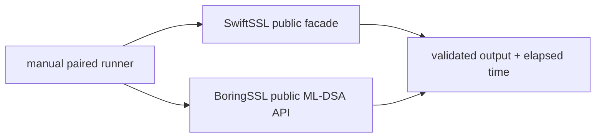
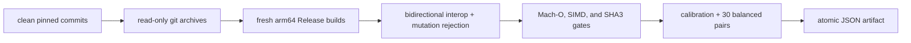

# ML-DSA-65 comparison benchmark

This manually invoked Native benchmark compares the public SwiftSSL
ML-DSA-65 key-generation, randomized signing, and verification paths with the
same operations in pinned official BoringSSL commit
`ae49d2681a56ca7b8609f6039a770fda2a8eb550`.

The benchmark is enabled only when `SWIFT_SSL_ENABLE_BENCHMARKS=1`. It is not a
test target, is not run by `xcodebuild test`, and does not add BoringSSL to any
SwiftSSL library or runtime product.



Key generation includes deterministic injected entropy in both timed paths.
Signing and verification reuse equivalent pre-expanded keys and use the same
1,024-byte message and 17-byte context. Signing uses a deterministic 32-byte
randomizer for repeatable rejection-sampling work. Checksums consume operation
output so the compiler cannot remove the work.

## Formal timing runner

A formal run requires the pinned toolchain, a clean committed SwiftSSL
checkout, and a clean official BoringSSL checkout at the pinned commit:

```bash
TOOLCHAINS=org.swift.64202607231a \
python3 Benchmarks/MLDSA/run_comparison.py \
  --formal \
  --boringssl-source /absolute/path/to/pinned/boringssl \
  --samples 30 \
  --bootstrap-resamples 10000 \
  --seed 20260802
```



The interoperability transaction validates Swift-generated signatures with
BoringSSL and BoringSSL-generated signatures with SwiftSSL. Both
implementations must reject a mutated signature. Exact public-key and signature
lengths are validated before timing.

The build contract fixes arm64, macOS 15.0, SDK 27.0, Xcode 27 build
`27A5209h`, Swift compiler commit `ef761e567dc94ee`, and BoringSSL assembly
availability. The Swift code-generation gate requires the ML-DSA public entry
points, SIMD Montgomery multiplication shape, and ARM SHA3 instructions.

Each implementation must exceed 200 ms per calibrated sample with the same
iteration count. The latest three pilot durations must converge within five
percent of their median. The runner requires AC power, normal power mode, no
thermal/performance warning, no competing compiler/linker build, and bounded
load before convergence and every measured pair.

Each of key generation, signing, and verification independently passes only
when:

```text
lower95CI(median(BoringSSL elapsed / SwiftSSL elapsed)) >= 1.10
```

## Allocation and bulk-copy runner

The separate memory runner builds a fresh Release worker from a clean Git
archive, injects a benchmark-only allocator/copy interposer, validates the
interposer with a C contract probe, and measures 1, 10, and 100 operations in
three fresh processes each.

```bash
TOOLCHAINS=org.swift.64202607231a \
python3 Benchmarks/MLDSA/run_memory.py --formal
```

Every counter must be an exact linear function of iteration count. The slope
is the per-operation budget and the intercept is process/setup overhead.
Allocation and free slopes must balance; `calloc` and `realloc` are forbidden
inside every operation.

The public message, context, signature, and public-key encodings remain
borrowed. In-place signing writes directly to caller storage. Key generation
and verification have zero per-operation dynamic bulk-copy bytes. The fixed
signing fixture records 40,960 bytes: eight algorithm-required 5,120-byte mask
forks across deterministic rejection-sampling attempts, not API-boundary or
COW copies.

Dynamic interposition cannot observe compiler-inlined scalar copies. Memory
evidence is therefore combined with source ownership review, caller-output
tests, and failure-preservation tests.

## Result status

Formal timing and memory artifacts are generated only after this implementation
and both runners are committed. Until those committed artifacts exist, the
exploratory measurements are not release evidence and no formal result is
reported here.
