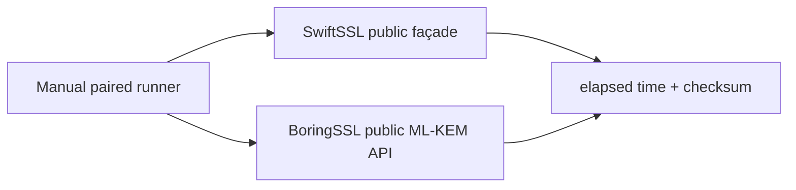

# ML-KEM comparison benchmark

This manually invoked Native benchmark compares the public ML-KEM-768 and
ML-KEM-1024 key-generation, encapsulation, and decapsulation paths with the
same operations in pinned official BoringSSL commit
`ae49d2681a56ca7b8609f6039a770fda2a8eb550`.

The benchmark is enabled only when `SWIFT_SSL_ENABLE_BENCHMARKS=1`. It is not a
test target, is not run by `xcodebuild test`, and does not add BoringSSL to a
SwiftSSL library or runtime target.



Each timed worker performs one public operation per iteration. Key setup for
encapsulation and key/ciphertext setup for decapsulation are outside the timed
region. Public random generation remains inside key generation and
encapsulation for both implementations. The checksum consumes public output
and shared-secret bytes so the operation cannot be removed.

Formal release evidence additionally requires runner-owned clean source
snapshots, pinned build provenance, paired sampling, confidence intervals,
worker code-generation inspection, and correctness/interoperability validation.

## Formal runner

The runner owns both fresh builds and accepts source trees rather than worker
paths. A formal run requires the pinned toolchain in the process environment
and a clean committed SwiftSSL checkout:

```bash
TOOLCHAINS=org.swift.64202607231a \
python3 Benchmarks/MLKEM/run_comparison.py \
  --formal \
  --boringssl-source /absolute/path/to/pinned/boringssl \
  --samples 30 \
  --bootstrap-resamples 10000 \
  --seed 20260801
```

The command is manual. `Package.swift` adds the Swift worker only while
`SWIFT_SSL_ENABLE_BENCHMARKS=1`; normal products and test runs do not compile
or link either benchmark worker.

```mermaid
flowchart LR
    Commits["clean pinned commits"] --> Snapshots["read-only git archives"]
    Snapshots --> Builds["fresh arm64 Release builds"]
    Builds --> Interop["bidirectional interoperability"]
    Interop --> Codegen["Mach-O and code-generation gates"]
    Codegen --> Converge["duration calibration and convergence"]
    Converge --> Pairs["30 balanced randomized pairs"]
    Pairs --> Artifact["atomic raw JSON artifact"]
```



The pre-timing interoperability transaction uses deterministic 64-byte key
seeds for both parameter sets. SwiftSSL-generated public keys, ciphertexts,
and shared secrets are validated by BoringSSL. A separately generated
BoringSSL ciphertext is validated and decapsulated by SwiftSSL. A mutated
ciphertext must produce the same implicit-rejection secret in both
implementations and must not reproduce the valid shared secret.

The build gate fixes arm64, macOS 15.0, SDK 27.0, Xcode 27 build `27A5209h`,
and Swift compiler commit `ef761e567dc94ee`. It rejects non-Release,
sanitizer, profiling, coverage, or BoringSSL assembly-disable flags. Both
workers must have matching Mach-O architecture, platform, minimum OS, and SDK
load commands. The Swift code-generation gate requires the specialized NTT
SIMD reduction shape and ARM SHA3 instructions. The BoringSSL worker must
contain both ML-KEM parameter-set entry points and confirm assembly capability
at runtime.

Each implementation must exceed 200 ms per calibrated sample with the same
iteration count. The latest three pilot durations for each implementation must
remain within five percent of their median. Timing begins only while the host
is on AC power, normal power mode, without thermal or performance warnings,
without a compiler/linker build process, and below the declared load ceiling.
The runner repeats this check before every convergence and measured pair.

The release decision is made independently for all six workloads:

```text
lower95CI(median(BoringSSL elapsed / SwiftSSL elapsed)) >= 1.10
```

Timing evidence does not establish allocation or logical-copy counts. Those
remain a separate instrumented release artifact even though this worker uses
the public in-place encapsulation and decapsulation APIs.
