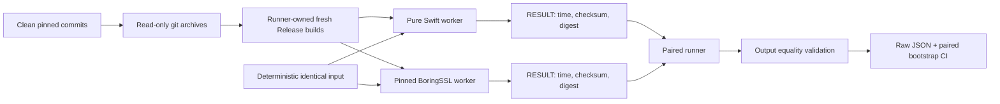
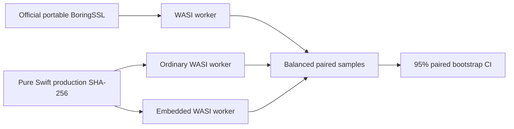
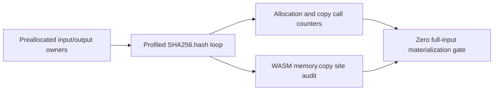

# SHA-256 comparison benchmark

This benchmark compares the production Pure Swift `SHA256.hash` and
`SHA256.hashBatch` paths with the public one-shot `SHA256` API from one exact
official BoringSSL commit:

```text
ae49d2681a56ca7b8609f6039a770fda2a8eb550
```

The directory contains separate manually invoked Native and WASI comparison
runners. Neither runner is a test target or is run by `xcodebuild test`, and
neither adds BoringSSL to any SSL library target or runtime path.

| Runner | Target boundary | BoringSSL backend |
|---|---|---|
| `run_comparison.py` | Native arm64/macOS, one message or `--independent-pair` | Platform assembly enabled |
| `run_wasm_comparison.py` | WASI and Embedded WASI | Portable no-assembly implementation |

## Native comparison boundary



Both workers generate byte `i` as `UInt8(truncatingIfNeeded: i * 31 + 17)` and
replace byte zero with the low byte of the current iteration immediately before
hashing. Pair mode uses the next low-byte value for the second message. Input
allocation, warm-up, and result formatting are outside the timed region. The
iteration-byte mutation, context creation, hashing, finalization, digest write,
and checksum sink are inside the timed region in both implementations.

The Swift worker acquires mutable input and output spans once per measured
batch. The runner inspects the resulting machine code and rejects a worker when
the timed loop contains a copy-on-write uniqueness check, buffer growth,
allocation, retain/release, `memcpy`, or `memmove`, or when it directly calls
anything outside the selected contract: one package-internal
`SHA256Context.hashOneShot` call for one-message mode, or one
`SHA256.hashBatch` call for pair mode. `hashOneShot` owns the context setup,
complete-block compression, bounded tail copy, and finalization for the public
one-shot API. The two current `ContiguousArray` uniqueness checks occur before
the loop and are paid once per batch, not once per digest operation. One-message
mode separately validates the direct-call sets and machine-code contracts of
the helper's context and ARM64 compression paths.

The runner also inspects the active production ARM64 SHA-256 kernel. The
single-message loop must load one 64-byte block with one `LD1x4`, perform eight
constant-vector pair loads, and execute exactly 16 `sha256h`, 16 `sha256h2`,
12 `sha256su0`, and 12 `sha256su1` instructions. The two-message loop must load
one block from each input, share the eight constant-vector pair loads, and
execute twice those round instructions. Calls, spills, lazy initialization,
allocation, reference counting, and bulk copies invalidate either loop. In
pair mode the public timed loop must call `SHA256.hashBatch` exactly once.

The BoringSSL worker is checked symmetrically. Its one-message loop calls the
public one-shot `SHA256` function once; its pair loop calls the same public
function exactly twice. That function must call the BCM initialize, update,
and finalization path; the
public incremental wrappers must call their corresponding BCM functions; and
the linked BCM update/finalization path must call the ARM64 hardware kernel
without a direct no-hardware dispatch.

### 2026-08-13 one-shot dispatch optimization

The public `SHA256.hash` path now performs input-length validation, complete
block compression, bounded tail retention, and finalization through one
package-internal `SHA256Context.hashOneShot` operation. This removes the
separate public `update` entry from the one-shot path while preserving the
incremental context API and its typed output-length failures. The timed worker
and its machine-code contract were updated to validate this actual production
call path.

A local exploratory run used the pinned BoringSSL worker, the current arm64
Release worker, identical deterministic inputs, 30 balanced pairs, and 10,000
paired bootstrap resamples. Digests and checksums matched before timing.

| Message length | Pure Swift / BoringSSL median | 95% paired bootstrap CI |
|---|---:|---:|
| 64 B | `1.167086x` | `1.163573–1.179517x` |
| 1 KiB | `0.892898x` | `0.886693–0.899307x` |
| 16 KiB | `0.879149x` | `0.875764–0.882925x` |

The 64-byte result clears the `1.10x` criterion. Longer single-stream inputs
remain below parity because the fixed Swift 6.4 arm64 backend emits extra
state moves at the ARMv8 SHA-256 tied-operand boundary; that limitation is
documented in ADR 0037. This run used the live worktree and prebuilt workers,
so it is diagnostic evidence rather than formal release-gate evidence.

The worker output contract is:

```text
RESULT,<measured-nanoseconds>,<checksum>,<64-lowercase-hex-digest>
DIGEST,<iteration>,<64-lowercase-hex-digest>
PAIR_RESULT,<measured-nanoseconds>,<checksum>,<digest-1>,<digest-2>
PAIR_DIGEST,<iteration>,<digest-1>,<digest-2>
CAPABILITY,boringssl_asm,<0-or-1>
```

Each worker invocation must emit exactly the records for its selected mode and
must not emit any other stdout or stderr. `DIGEST` records are emitted only by
the untimed validation mode. Before timing,
the runner compares the complete digest for all 256 possible first-byte values
at 64 B, 1 KiB, and 16 KiB. The runner rejects malformed output, nonzero worker
exits, timeouts, mismatched output, worker or repository identity changes,
invalid build provenance, and any BoringSSL commit, origin, or clean-tree
mismatch. Formal runs also reject a modified Swift tree or changed read-only
snapshot. Exploratory runs may start from and continue to expose a dirty live
Swift tree, so they do not claim Swift source immutability and remain
ineligible for release evidence. None of these conditions is converted into a
successful result.
`CAPABILITY` is emitted only by the BoringSSL capability probe. The Native
runner requires `1`; the portable WASI runner requires `0`. A missing record or
a value that disagrees with the selected comparison boundary invalidates the
comparison.

### Native LLVM backend diagnostic

The 2026-08-13 compiler experiment applied
`Validation/CodeGeneration/SHA256TiedOperands/llvm-264fd65923c28-sha256-paired-two-address.patch`
to LLVM commit `264fd65923c28d9060211c1177a8820b76ed3ae2`. Its machine pass
preserves both old state values before their destructive updates. It lets
`SHA256H` and `SHA256H2` update their state registers in place and keeps all 16
instruction pairs adjacent. The product remains Pure Swift; the experiment
changes only the AArch64 compiler backend.

The retained patch has SHA-256
`571561f22f755d026f3fa7cfd724170a9d2d17841c66d0bd7ecd92036276d754`.
The patched LLVM 21.1.6 `llc` passed its end-to-end IR fixture and
positive/negative machine-pass MIR fixtures with the machine verifier and
FileCheck. The standalone runner then performed a fresh SwiftPM Release build,
emitted optimized whole-module `SSLCrypto` IR from the verified source set,
rebuilt only that object with the verified `llc`, and relinked it through the
actual SwiftPM link command. All 768 differential digests matched pinned
BoringSSL before timing. Thirty balanced exploratory pairs with 10,000 paired
bootstrap resamples produced:

| Workload | Patched Swift median ns/op | BoringSSL median ns/op | Ratio | 95% paired bootstrap CI |
|---|---:|---:|---:|---:|
| 64 B | 33.076279 | 39.936701 | `1.207458x` | `1.205406–1.209490x` |
| 1 KiB | 345.369063 | 350.531901 | `1.015725x` | `1.012672–1.017322x` |
| 16 KiB | 5411.467427 | 5414.722727 | `1.000372x` | `1.000084–1.001443x` |

The 1 KiB and 16 KiB confidence-interval lower bounds both exceed the explicit
`1.0x` Native one-shot parity floor. The aspirational `1.10x` lower-bound target
remains unmet. The optimized IR SHA-256 was
`a6b413cc2251a59f161dd5b2b6b0ba22bd19ec78bc6639b8569e6bfb715414d7`;
the rebuilt object was
`7c1c5d0ea6a5507dd9c7ff928d964e04fa9dff123571433866d658d07d747ca0`;
and the resulting Swift worker was
`f8edd6b41ea99bc6e050b8f7efada087b8a552b1d80d27f8ee9bd36273973e0d`.
The raw local artifact SHA-256 was
`22710fcebebaa24b02fb56ad9f6e976f419b94ae0712eb520b7e9fd91a7ddf43`.
The compact retained result is
[`native-one-shot-parity.json`](../../Validation/CodeGeneration/SHA256TiedOperands/native-one-shot-parity.json).
This remains exploratory evidence because it used the dirty live Swift source
tree and a prebuilt external `llc`; the runner rejects that configuration for
formal release evidence.

The aggregate state-only ceiling record and its standalone arithmetic verifier
are retained in `Validation/CodeGeneration/SHA256TiedOperands`. They show that
the state chain would need to be another `6.795374%` faster at 1 KiB and
`5.853974%` faster at 16 KiB merely to reach the `1.10x` per-block time, before
restoring the omitted digest work. The original eight raw state-only pairs were
not retained, so this is a reproducible diagnostic certificate rather than a
formal benchmark artifact.

### 2026-08-05 independent-message batch optimization

`SHA256.hashBatch` accepts one borrowed input owner, borrowed range descriptors,
and one caller-owned packed output. On ARM64, adjacent equal-length messages are
compressed by a Pure Swift two-way kernel. It interleaves two independent state
chains to fill SHA execution latency while sharing round-constant loads. Other
targets and odd or unequal groups use the same API with the sequential Pure
Swift path. No C, assembly source, or BoringSSL runtime dependency is used.

The comparison hashes two independent equal-length messages per iteration.
Pure Swift makes one public `hashBatch` call; BoringSSL makes two sequential
public `SHA256` calls. Times and operation rates count both messages. Before
timing, all 1,536 digests across 64 B, 1 KiB, and 16 KiB matched. The runner then
used 30 balanced AB/BA pairs and 10,000 paired bootstrap resamples.

```sh
TOOLCHAINS=org.swift.64202607231a \
python3 Benchmarks/SHA256/run_comparison.py \
  --boringssl-source "$BORINGSSL_ROOT" \
  --independent-pair \
  --samples 30 \
  --bootstrap-resamples 10000
```

The raw exploratory artifact is retained at
`.test-artifacts/benchmark/20260805T150242Z-sha256-two-way-exploratory.json`.
The source worktree was clean at commit
`e11067c2e76801747d0d75867ab969df898a4f44`, but unrelated build processes
were active and formal mode was not requested. The result is therefore
exploratory rather than formal release evidence.

| Message length | Pure Swift median ns/message | BoringSSL median ns/message | Ratio | 95% paired bootstrap CI |
|---|---:|---:|---:|---:|
| 64 B | 56.1862 | 68.0126 | `1.222479x` | `1.211613–1.236852x` |
| 1 KiB | 602.5743 | 756.9013 | `1.245326x` | `1.214264–1.273710x` |
| 16 KiB | 5849.7463 | 7559.7333 | `1.289170x` | `1.268184–1.293686x` |

All three 95% confidence-interval lower bounds exceed the `1.10x` target. This
passes the exploratory independent two-message batch criterion. It is not a
formal release gate result and does not reclassify or replace the separate
one-message benchmark contract.

## WASI and Embedded WASI comparison

The WASI runner builds official BoringSSL as a portable `OPENSSL_NO_ASM`
baseline and builds the same Pure Swift production path twice with the pinned
ordinary and Embedded WASI SDKs. Both workers use the WASI monotonic clock
directly. Input allocation is outside the timed region, and the optional
one-byte input offset exercises the production unaligned-load path without
materializing another input buffer.



The runner validates 13 boundary and unaligned input cases against both
BoringSSL and Python `hashlib`, audits the BoringSSL `bcm.cc` and `sha256.cc`
Release compile entries, calibrates until both workers run for at least 250 ms,
and measures three sustained-throughput workloads: aligned 1 MiB, aligned
1 MiB + 1 byte, and unaligned 1 MiB + 1 byte. The decision rule is the same
`1.10x` lower bound of the paired median-speedup 95% bootstrap interval.

```sh
cd "$SWIFT_SSL_ROOT"

TOOLCHAINS=org.swift.64202607231a \
python3 Benchmarks/SHA256/run_wasm_comparison.py \
  --boringssl-source "$BORINGSSL_ROOT" \
  --target both \
  --samples 11 \
  --bootstrap-resamples 10000 \
  --enforce-target
```

Use at least 30 pairs and add `--formal` only with a clean Swift source tree.
The 2026-08-03 exploratory run used WasmKit 0.3.1 and produced:

| Target and workload | Swift median ms/op | BoringSSL median ms/op | Ratio | 95% paired bootstrap CI |
|---|---:|---:|---:|---:|
| WASI, aligned 1 MiB | 32.151 | 43.024 | 1.3389x | 1.3371–1.3402 |
| WASI, aligned 1 MiB + 1 B | 32.155 | 42.946 | 1.3370x | 1.3267–1.3373 |
| WASI, unaligned 1 MiB + 1 B | 32.145 | 42.972 | 1.3356x | 1.3352–1.3371 |
| Embedded WASI, aligned 1 MiB | 32.172 | 43.046 | 1.3354x | 1.3344–1.3410 |
| Embedded WASI, aligned 1 MiB + 1 B | 32.903 | 43.791 | 1.3311x | 1.3258–1.3418 |
| Embedded WASI, unaligned 1 MiB + 1 B | 32.675 | 43.720 | 1.3332x | 1.3301–1.3379 |

All six lower confidence bounds exceeded `1.10x`. The ignored raw artifact is
`.test-artifacts/benchmark/20260803T022356Z-sha256-wasm.json`. Because the
Swift tree was dirty and the sample count was 11, this is exploratory evidence,
not a formal release result. It also does not compare against Native BoringSSL
assembly.

## WASI and Embedded WASI allocation/copy runner

`run_wasm_memory.py` is a separate manual runner. It creates fresh ordinary and
Embedded WASI Release workers and uses WasmKit's function-call profile to isolate
the exact production hashing loop. Input/output owners are constructed before
that scope. Each workload is executed at 1, 10, and 100 operations with three
repetitions, and every counter must have a deterministic integral linear slope.



```sh
cd "$SWIFT_SSL_ROOT"

TOOLCHAINS=org.swift.64202607231a \
python3 Benchmarks/SHA256/run_wasm_memory.py \
  --target both \
  --repetitions 3
```

The 2026-08-03 exploratory run produced the same result on ordinary and
Embedded WASI:

| Workload | Heap allocation calls/op | Dynamic copy calls/op | Fixed-copy helper bytes/op | Tail retained/op |
|---|---:|---:|---:|---:|
| Aligned 1 MiB | 0 | 0 | 0 | 0 B |
| Aligned 1 MiB + 1 B | 0 | 0 | 0 | 1 B |
| Unaligned 1 MiB + 1 B | 0 | 0 | 0 | 1 B |

The generated ordinary and Embedded WASM binaries each contain two
`memory.copy` sites in `SHA256Context.update` and none in finalization. The two
sites are accepted only with the production source contract that bounds their
destination to the inline 64-byte pending owner. Complete blocks are borrowed
directly. WasmKit profiles function calls rather than individual
`memory.copy` executions, so neither profile evidence nor source inspection is
reported alone as the zero-copy proof.

The ignored raw artifact is
`.test-artifacts/benchmark/20260803T025221Z-sha256-wasm-memory.json`. It is
exploratory because the Swift source tree was dirty, and it is memory evidence
rather than timing evidence.

## Native required tools and source checkouts

The Native baseline is pinned to:

| Component | Required value |
|---|---|
| Swift toolchain | `org.swift.64202607231a` |
| Swift compiler commit | `ef761e567dc94ee` |
| Xcode | `27.0` (`27A5209h`) |
| macOS SDK | `27.0` (`26A5368f`) |
| Architecture | `arm64` |
| Swift target triple | `arm64-apple-macosx26.0` |
| Deployment target | macOS 26.0 |
| BoringSSL commit | `ae49d2681a56ca7b8609f6039a770fda2a8eb550` |
| BoringSSL origin | `https://boringssl.googlesource.com/boringssl` |
| Build mode | Release |
| CPU feature policy | Native hardware defaults for both workers |

The commands below use task-specific variables. Adjust only the checkout paths.

```sh
SWIFT_SSL_ROOT=/Users/1amageek/Desktop/networking/swift-ssl
BORINGSSL_ROOT=/Users/1amageek/Desktop/networking/deep-analysis-sessions/2026-07-31_swift-ssl-architecture/.references/boringssl

git -C "$BORINGSSL_ROOT" rev-parse HEAD
git -C "$BORINGSSL_ROOT" status --short
TOOLCHAINS=org.swift.64202607231a xcrun swift --version
```

Do not disable BoringSSL assembly for the headline result. Apple arm64
BoringSSL uses the platform SHA-256 instructions by default. The runner rejects
assembly-disable cache values or definitions, requires the benchmark driver,
Apple ARM capability source, SHA-256 wrapper, BCM translation unit, and
`gen/bcm/sha256-armv8-apple.S` exactly once in the compile database, requires
`CRYPTO_has_asm()` to return one, and inspects the linked hardware dispatch and
ARMv8 SHA instruction counts. A scalar-only run is diagnostic and is comparable
only when both implementations explicitly use scalar backends.

## Native runner-owned builds

The comparison runner creates a fresh build root and builds both workers itself.
It does not accept prebuilt worker paths. For a formal run, it creates read-only
source snapshots with `git archive` from the recorded commits and builds only
those snapshots. Formal snapshots reject every symlink, so an extracted source
cannot read a mutable target outside the recorded archive. The parent
environment is reduced to an explicit allowlist;
build-affecting Swift, Clang, CMake, linker, sanitizer, coverage, and `DYLD_*`
variables and the parent `PATH` are not inherited. Top-level tools use fixed or
runner-resolved binaries; the invocation path must still resolve to the same
binary, and its hash is checked again after sampling. The build environment
sets `SDKROOT` to the already verified SDK 27.0 path rather than inheriting it.
BoringSSL compiler and linker response/configuration files are rejected. Each
Swift module must use exactly one source-list response file at its exact fresh
scratch path; its contents must equal the trusted module source set, and the
entire Swift compile command must match the pinned command shape. Every other
Swift response file or external-input option is rejected. Every built
BoringSSL object's Ninja dependency closure must resolve only inside the
selected BoringSSL source, benchmark-driver source, pinned SDK, or pinned Clang
resource directory. Its content manifest is rechecked after sampling. The
final link must consume only the freshly built
benchmark object and `libcrypto.a` from the runner-owned build directory.
The Swift worker uses the fixed snapshot's `native` SwiftPM build system because
that path preserves the requested linked SDK metadata; the final machine code
and Mach-O metadata remain hard gates. The runner validates the exact Release
compile command
for every Swift module used by the worker and every entry in the BoringSSL
compile database. This binds source tree and archive hashes, effective
subprocess environments, top-level build commands, verbose compiler output,
CMake compile database, compiler paths, SDK, Mach-O architecture, deployment
target, optimization flags, machine-code path inspection, and resulting binary
hashes in one raw artifact.

The default build root is a unique child of
`$SWIFT_SSL_ROOT/.build/benchmark-sha256/`. A caller-supplied `--build-root`
must not already exist. Reusing a stale build directory is an invalid run.
The runner requires at least 3 GiB available on both the build and artifact
filesystems before building and reserves at least 256 MiB after the build and
before the final artifact write.

## Run a Native paired comparison

Use one single-threaded benchmark process at a time. Keep the machine on AC
power, disable Low Power Mode, avoid other sustained workloads, and do not run
allocation profiling concurrently with timing.

One invocation measures the fixed 64 B, 1 KiB, and 16 KiB headline matrix. For
each size, it calibrates one sample until both workers run for at least 250 ms,
then requires the last three normalized pilot durations for each worker to stay
within 5% of their median. It runs 30 paired samples with an equal number of
randomized Swift-first and BoringSSL-first pairs.

```sh
cd "$SWIFT_SSL_ROOT"

TOOLCHAINS=org.swift.64202607231a \
caffeinate -dimsu \
python3 Benchmarks/SHA256/run_comparison.py \
  --boringssl-source "$BORINGSSL_ROOT" \
  --samples 30 \
  --bootstrap-resamples 10000 \
  --seed 20260731 \
  --formal
```

The seed is recorded and controls workload ordering, pair ordering, and a
separate derived bootstrap stream. Omit it to generate and record a random
seed.

Before using `--formal`, commit the runner, workers, production implementation,
and configuration. A formal run is rejected if either source tree or either
built worker changes during the run, `swift-ssl` has no clean `HEAD`,
`TOOLCHAINS` is not the pinned identifier, another build process is active,
Low Power Mode or a thermal warning is present, AC power is unavailable, or
one-minute load exceeds 0.25 per logical CPU. Xcode, SDK build, arm64
architecture, macOS 26.0 deployment target, and Release optimization are hard
gates. Failure to inspect the declared compiler, linker, and build-process
families is itself an invalid state. The runner waits for its own build load to
cool before sampling. Without
`--formal`, the runner uses the live working trees with fresh output
directories, records the formal ineligibility reasons, and labels the result
`exploratory`. BoringSSL remains pinned, official-origin, and clean even for an
exploratory run; only the `swift-ssl` tree may be dirty. Exploratory timing uses
the same cooling and per-pair quiescence gates, but mutable live Swift source
prevents it from being release evidence.

## Native sampling and decision rule

| Item | Contract |
|---|---|
| Workloads | Fixed 64 B, 1 KiB, and 16 KiB matrix; all must pass |
| Validation | All 256 first-byte mutations fully compared for every selected message at every workload size outside timing |
| Formal source input | Read-only archives of both recorded commits; symlinks rejected |
| Build/runtime environment | Explicit allowlist and fixed `PATH`; verified `SDKROOT`; unlisted variables discarded |
| Build tools | Resolved binary execution plus initial/final invocation binding and executable hashes |
| Compile inputs and flags | One verified Swift source-list response per module and no others; pinned Swift command shape; no BoringSSL response/config files; exact source/dependency roots; every Swift module uses `-O`; every BoringSSL entry has one `-O3` |
| BoringSSL link/backend | Fresh object/archive inputs; assembly enabled; five exact sources; public-to-BCM-to-ARM64 path and instructions |
| Worker binary | arm64 Mach-O, macOS 26.0 minimum, linked SDK exactly 27.0 |
| Swift timed-loop codegen | No COW check, buffer growth, allocation, refcount, bulk copy, unvalidated call, or external branch transfer |
| Swift SHA-256 callees | Exact direct-call contract for the selected one-message or public batch path |
| Swift ARM64 kernel codegen | Selected single-message or two-way load, round-instruction, memory, and call-free loop contract |
| Calibration | Identical iteration count; both workers run at least 250 ms per sample |
| Pilot convergence | Last 3 per-operation durations within 5% of each worker's median |
| Sample unit | One pair containing the same work in both freshly built workers |
| Order | Balanced randomized `Swift -> BoringSSL` / `BoringSSL -> Swift` |
| Minimum | An even count of at least 30 independent pairs after per-invocation warm-up |
| Speedup | `BoringSSL time / Pure Swift time` |
| Confidence interval | 95% paired percentile bootstrap of median speedup |
| Per-workload pass | Confidence interval lower bound is at least `1.10` |
| Overall pass | Every fixed workload passes |
| Fail | Any workload's confidence interval upper bound is below `1.10` |
| Inconclusive | No failure, but at least one interval crosses `1.10` |
| Reported parity floor | Separate `1.0x` lower-confidence-bound decision; it never replaces the `1.10x` target |

Every complete timing artifact reports the ratio of median throughputs,
duration median/p95, throughput p05/median/p95, operations per second, every
raw worker duration, the exact AB/BA order, complete validation digests, build
commands and logs, compile database and dependency evidence, binary hashes,
source revisions at both ends, compiler and SDK paths, Mach-O metadata,
timed-loop and production multi-block-kernel disassembly, CPU capabilities,
hardware model, load, declared competing build-process families, and
power/thermal observations. Formal complete artifacts additionally include
source archive and extracted-tree hashes. No individual outlier is silently
discarded. An invalid artifact is intentionally partial and contains only the
evidence collected before its failure.

The process exits with status zero only when the `1.10x` timing target passes.
A complete artifact reports the independent `1.0x` parity-floor decision even
when the process exits with status one for the aspirational target. A valid
target failure or inconclusive result exits with status one. An invalid comparison,
including any output or provenance mismatch, exits with status two. After
artifact initialization, the runner writes an explicitly invalid failure
artifact only when the requested output path is unused and can be created.
Command-line errors, output-path preflight failures, an existing output, or
storage exhaustion may prevent that artifact; the runner still exits with
status two and reports the failure.
Exit zero does not by itself mean release evidence: callers must also require a
`formal` classification and inspect `releaseGateSatisfied`, which remains false
until the separately measured allocation/copy and cross-target limitations are
closed.

## Runner contract tests

Adversarial tests for provenance, compile flags, code generation, and invalid
artifact handling are kept with the benchmark rather than the normal Swift test
suite:

```sh
python3 -m unittest discover \
  -s Benchmarks/SHA256/Tests \
  -p 'test_*.py' \
  -v
```

## Result artifacts

The Native default location is:

```text
Benchmarks/SHA256/Results/<UTC timestamp>-native-sha256.json
```

The WASI runner writes exploratory artifacts under:

```text
.test-artifacts/benchmark/<UTC timestamp>-sha256-wasm.json
.test-artifacts/benchmark/<UTC timestamp>-sha256-wasm-memory.json
```

The result directory is intentionally not ignored. Verify and commit the raw
artifact rather than copying only the summary:

```sh
git check-ignore -v Benchmarks/SHA256/Results/*.json
git add Benchmarks/SHA256/Results/*.json
```

Review the file before committing it because provenance includes local absolute
paths and command arguments. The runner refuses to overwrite an existing
artifact.

## What this runner does not prove

This is a Native SHA-256 timing comparison for the selected one-message or
independent-message batch workload. Even a formal timing pass does not establish
all release gates:

- Native allocation and logical copy budgets require a separate instrumented run;
- WASI and Embedded measurements must be reported separately;
- correctness still requires official vectors, negative tests, and differential
  tests through the production path;
- constant-time behavior and generated-code properties require independent
  inspection;
- process scheduling, performance/efficiency core placement, thermal state,
  and dynamic frequency remain sources of variance on macOS.

Incremental SHA-256 cannot literally retain zero bytes at arbitrary update
boundaries: up to 63 trailing bytes must survive until the next update. The
zero-copy budget should distinguish full-input materialization, which must be
zero, from this bounded algorithm-required tail retention and final padding.

For Native allocation inspection, use the exact Pure Swift worker path recorded
at `builds.swift.worker.path` in the raw artifact under the `Allocations`
template and export the trace data. Do not use an instrumented run for timing
results.

```sh
xctrace record \
  --template Allocations \
  --output sha256-allocations.trace \
  --launch -- "<recorded-swift-worker>" 16384 10000 100

xctrace export --input sha256-allocations.trace --toc
```
