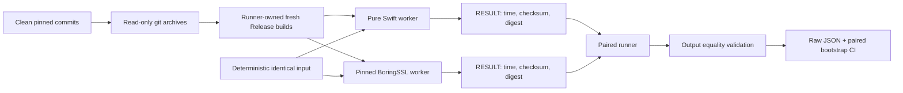

# SHA-256 comparison benchmark

This benchmark compares the production Pure Swift `SHA256.hash` path with the
public one-shot `SHA256` API from one exact official BoringSSL commit:

```text
ae49d2681a56ca7b8609f6039a770fda2a8eb550
```

It is a manually invoked Native benchmark. It is not a test target, is not run
by `xcodebuild test`, and does not add BoringSSL to any SwiftSSL library target
or runtime path.

## Comparison boundary



Both workers generate byte `i` as `UInt8(truncatingIfNeeded: i * 31 + 17)` and
replace byte zero with the low byte of the current iteration immediately before
hashing. Input allocation, warm-up, and result formatting are outside the timed
region. The iteration-byte mutation, context creation, hashing, finalization,
digest write, and checksum sink are inside the timed region in both
implementations.

The Swift worker acquires mutable input and output spans once per measured
batch. The runner inspects the resulting machine code and rejects a worker when
the timed loop contains a copy-on-write uniqueness check, buffer growth,
allocation, retain/release, `memcpy`, or `memmove`, or when it directly calls
anything other than `SHA256Context.update` and
`SHA256Context.finalizeInPlace`. The two current `ContiguousArray` uniqueness
checks occur before the loop and are paid once per batch, not once per digest
operation. The runner separately validates the complete direct-call sets of
both context functions, rejecting an unexpected allocation, reference-count,
copy, or helper call.

The runner also inspects the production ARM64 SHA-256 multi-block kernel. It
requires one context-to-kernel call site, one loop backedge, 16 vector constant
loads before that loop, exactly 16 `sha256h` and 16 `sha256h2` instructions per
block, and one paired state-vector store immediately after the call. Calls,
page-relative address loads, lazy initialization, allocation, reference
counting, bulk copies, or memory operations other than the two 32-byte
input loads at offsets zero and 32 inside the block loop invalidate the run.
The context call site must not be enclosed by a backedge.
Unconditional backedges are included in this control-flow check. External
direct, conditional, compare-and-branch, test-and-branch, and indirect branch
transfers are treated as unvalidated control flow.

The BoringSSL worker is checked symmetrically. Its timed region must contain
one loop whose only call is the public one-shot `SHA256` function. That
function must call the BCM initialize, update, and finalization path; the
public incremental wrappers must call their corresponding BCM functions; and
the linked BCM update/finalization path must call the ARM64 hardware kernel
without a direct no-hardware dispatch.

The worker output contract is:

```text
RESULT,<measured-nanoseconds>,<checksum>,<64-lowercase-hex-digest>
DIGEST,<iteration>,<64-lowercase-hex-digest>
CAPABILITY,boringssl_asm,1
```

Each worker invocation must emit exactly the records for its selected mode and
must not emit any other stdout or stderr. `DIGEST` records are emitted only by
the untimed validation mode. Before timing,
the runner compares the complete digest for all 256 possible first-byte values
at 64 B, 1 KiB, and 16 KiB. The runner rejects malformed output, nonzero worker
exits, timeouts, mismatched output, worker or repository identity changes,
invalid build provenance, and any BoringSSL commit, origin, or clean-tree
mismatch. Formal runs also reject a modified Swift tree or changed read-only
snapshot. Exploratory runs may start from and continue to expose a dirty live
Swift tree, so they do not claim Swift source immutability and remain
ineligible for release evidence. None of these conditions is converted into a
successful result.
`CAPABILITY` is emitted only by the BoringSSL capability probe. A zero value or
missing record invalidates the comparison.

## Required tools and source checkouts

The Native baseline is pinned to:

| Component | Required value |
|---|---|
| Swift toolchain | `org.swift.64202607231a` |
| Swift compiler commit | `ef761e567dc94ee` |
| Xcode | `27.0` (`27A5209h`) |
| macOS SDK | `27.0` (`26A5368f`) |
| Architecture | `arm64` |
| Swift target triple | `arm64-apple-macosx15.0` |
| Deployment target | macOS 15.0 |
| BoringSSL commit | `ae49d2681a56ca7b8609f6039a770fda2a8eb550` |
| BoringSSL origin | `https://boringssl.googlesource.com/boringssl` |
| Build mode | Release |
| CPU feature policy | Native hardware defaults for both workers |

The commands below use task-specific variables. Adjust only the checkout paths.

```sh
SWIFT_SSL_ROOT=/Users/1amageek/Desktop/networking/swift-ssl
BORINGSSL_ROOT=/Users/1amageek/Desktop/networking/deep-analysis-sessions/2026-07-31_swift-ssl-architecture/.references/boringssl

git -C "$BORINGSSL_ROOT" rev-parse HEAD
git -C "$BORINGSSL_ROOT" status --short
TOOLCHAINS=org.swift.64202607231a xcrun swift --version
```

Do not disable BoringSSL assembly for the headline result. Apple arm64
BoringSSL uses the platform SHA-256 instructions by default. The runner rejects
assembly-disable cache values or definitions, requires the benchmark driver,
Apple ARM capability source, SHA-256 wrapper, BCM translation unit, and
`gen/bcm/sha256-armv8-apple.S` exactly once in the compile database, requires
`CRYPTO_has_asm()` to return one, and inspects the linked hardware dispatch and
ARMv8 SHA instruction counts. A scalar-only run is diagnostic and is comparable
only when both implementations explicitly use scalar backends.

## Runner-owned builds

The comparison runner creates a fresh build root and builds both workers itself.
It does not accept prebuilt worker paths. For a formal run, it creates read-only
source snapshots with `git archive` from the recorded commits and builds only
those snapshots. Formal snapshots reject every symlink, so an extracted source
cannot read a mutable target outside the recorded archive. The parent
environment is reduced to an explicit allowlist;
build-affecting Swift, Clang, CMake, linker, sanitizer, coverage, and `DYLD_*`
variables and the parent `PATH` are not inherited. Top-level tools use fixed or
runner-resolved binaries; the invocation path must still resolve to the same
binary, and its hash is checked again after sampling. The build environment
sets `SDKROOT` to the already verified SDK 27.0 path rather than inheriting it.
BoringSSL compiler and linker response/configuration files are rejected. Each
Swift module must use exactly one source-list response file at its exact fresh
scratch path; its contents must equal the trusted module source set, and the
entire Swift compile command must match the pinned command shape. Every other
Swift response file or external-input option is rejected. Every built
BoringSSL object's Ninja dependency closure must resolve only inside the
selected BoringSSL source, benchmark-driver source, pinned SDK, or pinned Clang
resource directory. Its content manifest is rechecked after sampling. The
final link must consume only the freshly built
benchmark object and `libcrypto.a` from the runner-owned build directory.
The Swift worker uses the fixed snapshot's `native` SwiftPM build system because
that path preserves the requested linked SDK metadata; the final machine code
and Mach-O metadata remain hard gates. The runner validates the exact Release
compile command
for every Swift module used by the worker and every entry in the BoringSSL
compile database. This binds source tree and archive hashes, effective
subprocess environments, top-level build commands, verbose compiler output,
CMake compile database, compiler paths, SDK, Mach-O architecture, deployment
target, optimization flags, machine-code path inspection, and resulting binary
hashes in one raw artifact.

The default build root is a unique child of
`$SWIFT_SSL_ROOT/.build/benchmark-sha256/`. A caller-supplied `--build-root`
must not already exist. Reusing a stale build directory is an invalid run.
The runner requires at least 3 GiB available on both the build and artifact
filesystems before building and reserves at least 256 MiB after the build and
before the final artifact write.

## Run a paired comparison

Use one single-threaded benchmark process at a time. Keep the machine on AC
power, disable Low Power Mode, avoid other sustained workloads, and do not run
allocation profiling concurrently with timing.

One invocation measures the fixed 64 B, 1 KiB, and 16 KiB headline matrix. For
each size, it calibrates one sample until both workers run for at least 250 ms,
then requires the last three normalized pilot durations for each worker to stay
within 5% of their median. It runs 30 paired samples with an equal number of
randomized Swift-first and BoringSSL-first pairs.

```sh
cd "$SWIFT_SSL_ROOT"

TOOLCHAINS=org.swift.64202607231a \
caffeinate -dimsu \
python3 Benchmarks/SHA256/run_comparison.py \
  --boringssl-source "$BORINGSSL_ROOT" \
  --samples 30 \
  --bootstrap-resamples 10000 \
  --seed 20260731 \
  --formal
```

The seed is recorded and controls workload ordering, pair ordering, and a
separate derived bootstrap stream. Omit it to generate and record a random
seed.

Before using `--formal`, commit the runner, workers, production implementation,
and configuration. A formal run is rejected if either source tree or either
built worker changes during the run, `swift-ssl` has no clean `HEAD`,
`TOOLCHAINS` is not the pinned identifier, another build process is active,
Low Power Mode or a thermal warning is present, AC power is unavailable, or
one-minute load exceeds 0.25 per logical CPU. Xcode, SDK build, arm64
architecture, macOS 15.0 deployment target, and Release optimization are hard
gates. Failure to inspect the declared compiler, linker, and build-process
families is itself an invalid state. The runner waits for its own build load to
cool before sampling. Without
`--formal`, the runner uses the live working trees with fresh output
directories, records the formal ineligibility reasons, and labels the result
`exploratory`. BoringSSL remains pinned, official-origin, and clean even for an
exploratory run; only the `swift-ssl` tree may be dirty. Exploratory timing uses
the same cooling and per-pair quiescence gates, but mutable live Swift source
prevents it from being release evidence.

## Sampling and decision rule

| Item | Contract |
|---|---|
| Workloads | Fixed 64 B, 1 KiB, and 16 KiB matrix; all must pass |
| Validation | All 256 first-byte mutations fully compared at every workload size outside timing |
| Formal source input | Read-only archives of both recorded commits; symlinks rejected |
| Build/runtime environment | Explicit allowlist and fixed `PATH`; verified `SDKROOT`; unlisted variables discarded |
| Build tools | Resolved binary execution plus initial/final invocation binding and executable hashes |
| Compile inputs and flags | One verified Swift source-list response per module and no others; pinned Swift command shape; no BoringSSL response/config files; exact source/dependency roots; every Swift module uses `-O`; every BoringSSL entry has one `-O3` |
| BoringSSL link/backend | Fresh object/archive inputs; assembly enabled; five exact sources; public-to-BCM-to-ARM64 path and instructions |
| Worker binary | arm64 Mach-O, macOS 15.0 minimum, linked SDK exactly 27.0 |
| Swift timed-loop codegen | No COW check, buffer growth, allocation, refcount, bulk copy, unvalidated call, or external branch transfer |
| Swift SHA-256 callees | Exact direct-call contracts for update and finalization |
| Swift ARM64 multi-block codegen | Constants hoisted once; two input memory loads only; call-free block loop; one state return/store |
| Calibration | Identical iteration count; both workers run at least 250 ms per sample |
| Pilot convergence | Last 3 per-operation durations within 5% of each worker's median |
| Sample unit | One pair containing the same work in both freshly built workers |
| Order | Balanced randomized `Swift -> BoringSSL` / `BoringSSL -> Swift` |
| Minimum | An even count of at least 30 independent pairs after per-invocation warm-up |
| Speedup | `BoringSSL time / Pure Swift time` |
| Confidence interval | 95% paired percentile bootstrap of median speedup |
| Per-workload pass | Confidence interval lower bound is at least `1.10` |
| Overall pass | Every fixed workload passes |
| Fail | Any workload's confidence interval upper bound is below `1.10` |
| Inconclusive | No failure, but at least one interval crosses `1.10` |

Every complete timing artifact reports the ratio of median throughputs,
duration median/p95, throughput p05/median/p95, operations per second, every
raw worker duration, the exact AB/BA order, complete validation digests, build
commands and logs, compile database and dependency evidence, binary hashes,
source revisions at both ends, compiler and SDK paths, Mach-O metadata,
timed-loop and production multi-block-kernel disassembly, CPU capabilities,
hardware model, load, declared competing build-process families, and
power/thermal observations. Formal complete artifacts additionally include
source archive and extracted-tree hashes. No individual outlier is silently
discarded. An invalid artifact is intentionally partial and contains only the
evidence collected before its failure.

The process exits with status zero only when the timing target passes. A valid
failure or inconclusive result exits with status one. An invalid comparison,
including any output or provenance mismatch, exits with status two. After
artifact initialization, the runner writes an explicitly invalid failure
artifact only when the requested output path is unused and can be created.
Command-line errors, output-path preflight failures, an existing output, or
storage exhaustion may prevent that artifact; the runner still exits with
status two and reports the failure.
Exit zero does not by itself mean release evidence: callers must also require a
`formal` classification and inspect `releaseGateSatisfied`, which remains false
until the separately measured allocation/copy and cross-target limitations are
closed.

## Runner contract tests

Adversarial tests for provenance, compile flags, code generation, and invalid
artifact handling are kept with the benchmark rather than the normal Swift test
suite:

```sh
python3 -m unittest discover \
  -s Benchmarks/SHA256/Tests \
  -p 'test_*.py' \
  -v
```

## Result artifacts

The default location is:

```text
Benchmarks/SHA256/Results/<UTC timestamp>-native-sha256.json
```

The result directory is intentionally not ignored. Verify and commit the raw
artifact rather than copying only the summary:

```sh
git check-ignore -v Benchmarks/SHA256/Results/*.json
git add Benchmarks/SHA256/Results/*.json
```

Review the file before committing it because provenance includes local absolute
paths and command arguments. The runner refuses to overwrite an existing
artifact.

## What this runner does not prove

This is a Native one-shot SHA-256 timing comparison. Even a formal timing pass
does not establish all release gates:

- allocation and logical copy budgets require a separate instrumented run;
- WASI and Embedded measurements must be reported separately;
- correctness still requires official vectors, negative tests, and differential
  tests through the production path;
- constant-time behavior and generated-code properties require independent
  inspection;
- process scheduling, performance/efficiency core placement, thermal state,
  and dynamic frequency remain sources of variance on macOS.

Incremental SHA-256 cannot literally retain zero bytes at arbitrary update
boundaries: up to 63 trailing bytes must survive until the next update. The
zero-copy budget should distinguish full-input materialization, which must be
zero, from this bounded algorithm-required tail retention and final padding.

For Native allocation inspection, use the exact Pure Swift worker path recorded
at `builds.swift.worker.path` in the raw artifact under the `Allocations`
template and export the trace data. Do not use an instrumented run for timing
results.

```sh
xctrace record \
  --template Allocations \
  --output sha256-allocations.trace \
  --launch -- "<recorded-swift-worker>" 16384 10000 100

xctrace export --input sha256-allocations.trace --toc
```
