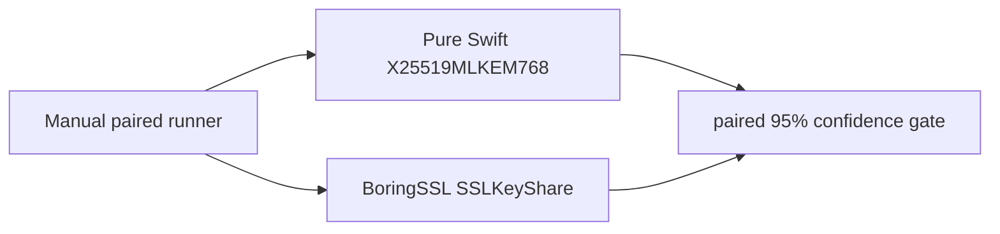
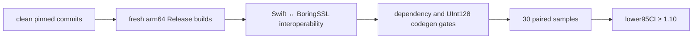

# X25519MLKEM768 TLS key-share comparison benchmark

This manually invoked Native benchmark compares SwiftSSL's complete
X25519MLKEM768 client/server key-share transaction with the equivalent internal
`SSLKeyShare` transaction in pinned official BoringSSL commit
`ae49d2681a56ca7b8609f6039a770fda2a8eb550`.

It is enabled only when `SWIFT_SSL_ENABLE_BENCHMARKS=1`. The workers are not
test targets, are not run by `xcodebuild test`, and do not add BoringSSL to any
SwiftSSL library or runtime target.



One round-trip operation includes client ML-KEM and X25519 key generation,
server ML-KEM encapsulation and X25519 agreement, and client ML-KEM
decapsulation and X25519 agreement. System entropy remains inside the timed
region for both workers. Each result consumes server-share and shared-secret
bytes to keep the complete transaction observable.

## Formal runner

The formal runner builds both workers from clean read-only Git archives. It
first proves interoperability in both directions, inspects the build and
machine-code contracts, calibrates both workers past 200 ms per sample, waits
for timing convergence, then captures 30 balanced randomized pairs.

```bash
TOOLCHAINS=org.swift.64202607231a \
python3 Benchmarks/TLSHybrid/run_comparison.py \
  --formal \
  --boringssl-source /absolute/path/to/pinned/boringssl \
  --samples 30 \
  --bootstrap-resamples 10000 \
  --seed 20260801
```



The release decision is:

```text
lower95CI(median(BoringSSL round-trip / SwiftSSL round-trip)) >= 1.10
```

The artifact records exact client, server, and secret byte lengths plus hashes;
it never stores the shared-secret bytes. The code-generation gate rejects
external BoringSSL/X25519/ML-KEM symbol imports from the Swift executable and
requires the ARM64 multiply-high/carry shape used by the `UInt128` field
arithmetic.

The key-share APIs borrow input `Span` values and write serialized public keys
and combined secrets directly into their final owners. Timing remains separate
from the allocation and bulk-copy evidence below.

## Allocation and bulk-copy runner

The memory runner is manual and is not a test target. It builds the Swift
worker from a clean read-only Git archive, injects a benchmark-only allocator
and bulk-copy interposer, validates the interposer with a separate C process,
executes one exact-path operation outside the probe to initialize Swift runtime
metadata, and then measures 1, 10, and 100 steady-state operations in three
fresh processes each. Cold-start allocation is deliberately outside this
artifact and is not represented by the per-operation budgets.

```bash
TOOLCHAINS=org.swift.64202607231a \
python3 Benchmarks/TLSHybrid/run_memory.py --formal
```

Every counter must be an exact linear function of the iteration count.
Allocation/free slopes must balance, `calloc` and `realloc` slopes must be
zero, and the dynamic `memcpy` plus `memmove` byte slope must be zero.
The declared budgets are:

| Path | Allocation/free calls | Requested bytes | Dynamic bulk-copy bytes |
|---|---:|---:|---:|
| Client offer | 17 / 17 | 15,656 | 0 |
| Server accept | 15 / 15 | 14,464 | 0 |
| Full round trip | 45 / 45 | 40,032 | 0 |
| X25519 public key into caller output | 0 / 0 | 0 | 0 |
| X25519 shared secret into caller output | 0 / 0 | 0 | 0 |

The interposer cannot observe compiler-inlined scalar stores. The artifact is
therefore combined with source review of final owners, scoped `Span` borrows,
and in-place output. It is not used as timing evidence.

## Formal result

No formal timing or memory result has been recorded yet. Add atomic JSON
artifacts, source commits, hashes, and measured decisions here only after both
formal gates complete.
