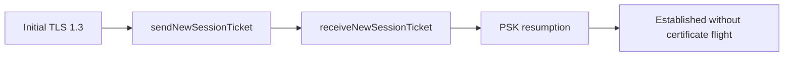

# TLS 1.3 session ticket and PSK resumption benchmark

This manually invoked benchmark exercises the post-handshake session path
added to `SSLTLS`. It is isolated from the normal test targets and is enabled
only with `SWIFT_SSL_ENABLE_BENCHMARKS=1`.



The `ticket` workload measures the initial handshake followed by encrypted
`NewSessionTicket` issuance and parsing. The `resumption` workload constructs
the client and server PSK state and completes a TLS 1.3 resumption handshake.
Each sample uses deterministic fixtures, consumes the resulting bytes, and
checks a stable checksum. The timed region includes the handshake objects and
cryptographic work; trust-validator construction is outside the timed region.

Run it manually after building the benchmark product:

```bash
SWIFT_SSL_ENABLE_BENCHMARKS=1 \
swift run -c release swift-ssl-tls-session-benchmark ticket 16 2

SWIFT_SSL_ENABLE_BENCHMARKS=1 \
swift run -c release swift-ssl-tls-session-benchmark resumption 50 5
```

## 2026-08-05 exploratory result

The worker was built with Swift
`swift-6.4.x-DEVELOPMENT-SNAPSHOT-2026-07-23-a`, arm64, macOS 26.0. Thirty
samples were collected per workload. The host-load gate used by the formal
BoringSSL runner could not be satisfied because another Swift build was active,
so this is an exploratory Swift-only result and is not a BoringSSL speedup
claim. The source commit was
`152495c422ee740053fc683ef976caa69e60f9df`.

| Workload | Iterations/sample | Swift median | Swift p95 | Checksum |
|---|---:|---:|---:|---|
| Ticket issue + receive | 16 | 22,371,545.56 ns/op | 23,913,026.00 ns/op | Stable |
| PSK resumption | 50 | 4,478,393.75 ns/op | 4,792,833.32 ns/op | Stable |

Artifact: [`Results/20260805T075000Z-native-session-exploratory.json`](Results/20260805T075000Z-native-session-exploratory.json).

An equivalent BoringSSL session worker is still required before publishing a
comparative `1.10x` gate for these workloads.
