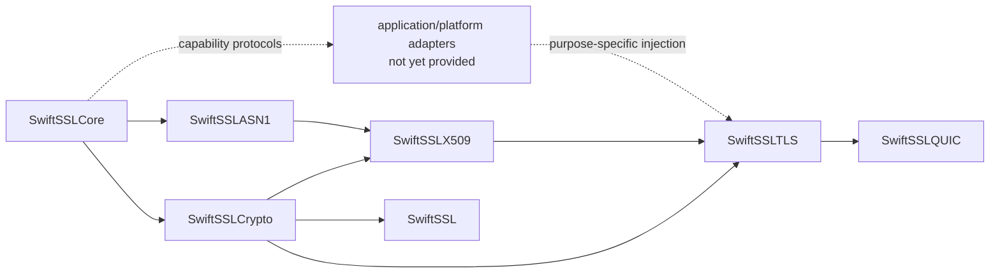

# swift-ssl

`swift-ssl` is an independent, Pure Swift implementation of modern cryptography, PKI, TLS 1.3, DTLS 1.3, and the TLS integration required by QUIC. It is designed to replace the modern responsibilities commonly supplied by BoringSSL without reproducing the OpenSSL/BoringSSL C API, ABI, ownership conventions, or legacy protocol surface.

> Project status: architecture and core implementation are under active development. This repository is not yet suitable for production cryptography or network security.

## Design goals

- Swift-native ownership, errors, protocols, and deterministic state machines.
- One semantic implementation for Native, WASI, and Embedded Swift targets.
- Borrowed byte views on hot paths, explicit owned outputs, and noncopyable secret owners.
- Strict parsers with resource budgets and no silent fallback.
- No socket, event-loop, filesystem, DNS, or platform trust-store dependency in protocol engines.
- Independently verifiable behavior through official vectors, differential tests, interoperability tests, fuzzing, sanitizers, and target-specific execution.

## Modern profile

The implementation target is deliberately smaller than BoringSSL's historical API surface while covering its current security responsibilities.

| Area | Included profile | Status |
|---|---|---|
| Core | Owned and borrowed bytes, strict cursors/builders, secret ownership, constant-time utilities, typed errors | Foundation implemented; verification incomplete |
| Symmetric crypto | AES-GCM, ChaCha20-Poly1305, AES block operations needed by GCM, SHA-2/SHA-3/SHAKE, HMAC, HKDF | AES-128/192/256-GCM, ChaCha20-Poly1305, SHA-256/384/512, SHA3-256/512, SHAKE128/256, HMAC-SHA-256/384/512, and HKDF-SHA-256/384/512 are implemented with vectors and typed failures |
| Public-key crypto | X25519, NIST P-256/P-384/P-521, Ed25519, RSA-PSS, ML-KEM, ML-DSA, approved hybrid groups | RFC 7748 X25519, NIST P-256/P-384/P-521 ECDH, RFC 6979 ECDSA P-256/P-384/P-521 signing/verification, and verification-only RSA-PSS SHA-256/384/512 are implemented; NIST-curve secret operations, protocol signing, and post-quantum algorithms remain gated or required |
| Formats | Strict DER, PEM, SPKI, PKCS #8, encrypted PKCS #8, PKCS #12, certificate containers | Strict DER primitives/writer, strict RFC 7468 PEM, SPKI, unencrypted PKCS #8, and RFC 5915 ECPrivateKey decoding with curve/key consistency checks are implemented; encrypted/container formats planned |
| PKI | X.509 parsing, path construction, policy processing, hostname verification, revocation inputs, trust-provider boundary | Strict X.509 validity, Ed25519, ECDSA P-256/P-384/P-521, and RSA-PSS-with-SHA2 certificate-signature verification, bounded trust-anchor path construction with BasicConstraints/keyCertSign checks, v3 extension parsing, and SAN-only DNS identity matching are implemented; policy, revocation, and trust-store acquisition remain required |
| TLS | TLS 1.3, resumption, 0-RTT policy, client authentication, key update, ECH, certificate compression, delegated credentials, raw public keys | One record-independent client/server state-machine core owns transcript, authentication, key schedule, Finished, resumption, and traffic-secret updates for both Stream TLS and QUIC; the Stream adapter owns only record framing/protection and supplies all three TLS 1.3 AEAD suites, KeyUpdate, encrypted NewSessionTicket transport, Ed25519 and explicit ECDSA P-256/P-384/P-521 CertificateVerify selection, and RFC 5915 EC private-key ingestion; ECDSA authentication remains release-gated pending constant-time, differential, sanitizer, and performance evidence |
| Datagram | DTLS 1.3, replay windows, ACKs, retransmission state, connection IDs, DTLS-SRTP negotiation | Profile/action models and a bounded 64-packet replay window are implemented; flight/ACK/timer engine remains required |
| QUIC | RFC 9001 handshake adapter and traffic-secret events; QUIC packet protection remains owned by the QUIC stack | Ordered action/secret output, RFC 9001 v1 Initial secret derivation, bounded per-encryption-level CRYPTO stream reassembly, zero-copy TLS handshake-message framing, record-independent TLS state transitions, role-correct read/write handshake and 1-RTT secret events, full-handshake completion, and PSK resumption are implemented; QUIC transport parameters, ALPN policy, packet-stack integration, fuzzing, and external interoperability remain required |
| Additional modern constructions | HPKE and narrowly scoped protocol constructions required by the modern profile | RFC 9180 X25519 DHKEM Base/PSK/Auth/AuthPSK with HKDF-SHA256/384/512, AES-GCM, and ChaCha20-Poly1305 is implemented and vector-tested; P-256 DHKEM, ECH, and hybrid profiles remain required |
| Platform composition | Entropy and clock capabilities supplied explicitly per operation | HMAC-DRBG consumes the injected `EntropySource`; concrete platform adapters are not yet provided |
| Public façade | Curated application-facing API without blanket lower-module exports | Explicit AES-GCM, ChaCha20-Poly1305, SHA-256, HMAC-SHA-256, HKDF-SHA-256, X25519, P-256 ECDH, and P-256 ECDSA validation adapters; P-384/P-521 remain lower-module validation APIs |

The following are intentionally absent: SSL, TLS 1.0-1.2, DTLS 1.0-1.2, renegotiation, record compression, CBC cipher suites, RC4, DES/3DES, Blowfish, CAST, MD4, MD5, SHA-1 handshake signatures, DSA, legacy finite-field DH, the C API/ABI, `BIO`, `ENGINE`, `ex_data`, and the thread-local error queue.

Algorithms required only to validate still-current certificate ecosystems are governed separately from handshake algorithms. Any such verification-only algorithm must be explicitly enabled by policy; it is never silently selected.

## Toolchain baseline

Development is pinned to:

- Swift toolchain: `swift-6.4.x-DEVELOPMENT-SNAPSHOT-2026-07-23-a`
- macOS toolchain identifier: `org.swift.64202607231a`
- Swift compiler commit: `ef761e567dc94ee`
- WASI SDK: `swift-6.4.x-DEVELOPMENT-SNAPSHOT-2026-07-23-a_wasm`
- Embedded WASI SDK: `swift-6.4.x-DEVELOPMENT-SNAPSHOT-2026-07-23-a_wasm-embedded`

See [TOOLCHAIN.md](TOOLCHAIN.md) for the exact validation commands and target contract.

## Verification and benchmarks

Correctness tests live under `Tests/`. Long-running differential, interoperability, fuzz, sanitizer, and target execution programs live under `Validation/`. Performance workloads and raw measurements live under `Benchmarks/`; they are not part of the normal test command.

| Implemented primitive | Current evidence | Still required before completion |
|---|---|---|
| AES-GCM | AES-128/192/256 key schedules, GCM counter mode and GHASH; NIST empty, single-block, and additional-authenticated-data vectors; authentication failure leaves plaintext output untouched | Independent differential corpus, boundary/limit coverage, measured allocation/copy counts, target execution, sanitizer/code-generation review, and release benchmark |
| ChaCha20-Poly1305 | RFC 8439 ChaCha20 block function and Poly1305, RFC known-answer vector, exact in-place operation, partial-overlap rejection, and authentication-failure no-write behavior; Native façade and target validation routes | Independent differential corpus, measured allocation/copy counts, target sanitizer/code-generation review, and release benchmark |
| SHA-384/512 | FIPS 180-4 `abc` vectors, incremental clone equivalence, exact output-length failure, Native façade, WASI, and Embedded WASI target validation | Independent differential corpus, long-message boundary corpus, measured allocation/copy counts, sanitizer/code-generation review, and release benchmark |
| HMAC-SHA-384/512 | RFC 4231 case 1, context verification, Native implementation and façade | Independent differential corpus, long-message boundary corpus, sanitizer/code-generation review, and release benchmark |
| HKDF-SHA-384/512 | RFC 5869-shaped extract/expand fixtures, exact output sizes, Native implementation | Independent differential corpus, overlap/limit corpus, target execution, sanitizer/code-generation review, and release benchmark |
| SHA3-256/512 and SHAKE128/256 | FIPS 202 empty-message and incremental SHA3 vectors; SHAKE output vectors; strict output-length validation; scoped incremental contexts | Independent differential corpus, long-message boundary corpus, target execution, sanitizer/code-generation review, and release benchmark |
| X25519 | RFC 7748 Alice public-key vector, independent shared-secret vector, four deterministic field vectors, all-zero peer rejection, invalid-length failures, Native façade, WASI, and Embedded WASI target validation | Independent differential corpus, malformed-coordinate corpus, sanitizer/code-generation review, measured allocation/copy counts, and release benchmark |
| P-256/P-384/P-521 ECDH | Fixed-width field/scalar arithmetic, Jacobian scalar multiplication, SEC1 uncompressed point validation, noncopyable private/shared-secret owners, scoped public-key borrows, P-384/P-521 OpenSSL shared-secret vectors, and targeted AddressSanitizer coverage | Constant-time audit, independent differential corpus for every curve, measured allocation/copy counts, formal benchmark, and security review |
| ECDSA P-256/P-384/P-521 | RFC 6979 P-256/P-384/P-521 raw signing plus fixed-width raw-signature verification, strict DER signature decoding including P-521 long-form lengths, SHA-256/384/512 certificate verification, curve SPKI validation, mutation failures, and TLS 1.3 CertificateVerify | RFC 6979 signing vectors; independent raw-signature vectors; real X.509 certificates signed with ECDSA-with-SHA256, SHA384, and SHA512; P-256/P-384/P-521 TLS handshake completion; malformed/modified signature failures; targeted ASan passes for signing | Constant-time audit, independent differential corpus, measured allocation/copy counts, target execution, formal benchmark, and security review; TLS ECDSA selection is connected but not release-qualified until these gates pass |
| RSA-PSS verification | Verification-only SHA-256/384/512 EMSA-PSS, canonical 2048–4096-bit public keys, bounded Montgomery public exponentiation, strict X.509 PSS parameters, and explicit failure contracts | Independent SHA-256/384/512 signatures including a 4096-bit SHA-512 fixture, 512 Montgomery differential cases, key/length/salt boundaries, signature mutations, real X.509 success/failure, focused ASan including the maximum modulus, and Native/WASI/Embedded WASI runtime validation | Broader external corpus, measured allocation/copy counts, formal benchmark, and security review |
| X.509 path validation | Bounded unordered path search, issuer/subject DER-name matching, validity-window checks, trust-anchor boundary, BasicConstraints CA/pathLen, optional keyCertSign, and SAN-only hostname verification | Real P-256 leaf/root chain, SAN match, modified leaf signature failure, non-CA issuer rejection, hostname mismatch rejection, and bounded path behavior | RFC 5280 policy processing, name constraints, CRL/OCSP, CT, delegated credentials, and broader interoperability |
| HMAC-DRBG | SP 800-90A-style SHA-256 instantiate/generate vectors, additional-input vector, request-limit failure before mutation, and Native/WASI/Embedded WASI target validation | Entropy-source fault corpus, reseed-state corpus, sanitizer/code-generation review, measured allocation/copy counts, and release benchmark |
| TLS 1.3 records | Three RFC 8446 AEAD suites, TLS 1.3 nonce construction, outer header/AAD, sequence-number limits, inner content-type/padding, authentication-failure no-write behavior, zero-copy record-range parsing, direct sealing into the final output backing, Native record tests, explicit CertificateVerify signature-scheme codec, P-256/P-384/P-521 CertificateVerify handshake completion, and DER long-form length handling | RFC 8448 known-answer record corpus, differential/interop tests, broader target execution, sanitizer/code-generation review, allocation/copy measurement, and release benchmark |
| TLS 1.3 key schedule | RFC 8446 early/handshake/master/application secret derivation, SHA-256/SHA-384 suite selection, noncopyable secret owners, Native schedule tests | RFC 8448 transcript vectors, differential/interop tests, target execution, sanitizer/code-generation review, and release benchmark |
| SHA-256 | Incremental/one-shot tests, boundary tests, million-byte vector, scalar/ARM64 differential test, production ARM64 multi-block codegen gate, Native/WASI/Embedded WASI execution | Independent committed differential corpus and release benchmark |
| HMAC-SHA-256 | RFC 4231 cases 1, 2, 3, 4, 6, and 7; incremental equivalence; typed output failure; constant-time verification; three-target execution; ASan/TSan/UBSan; optimized wipe inspection | Independent committed differential corpus, measured allocation/copy counts, and release benchmark |
| HKDF-SHA-256 | RFC 5869 SHA-256 cases 1, 2, and 3, additional fixed fixtures, maximum-length and overlap boundaries, Native/WASI/Embedded WASI execution, ASan/TSan/UBSan, and `-O`/`-Osize` code-generation inspection; caller-provided output, one-time prepared HMAC schedule, zero-heap optimized path, direct full-block writes, and façade route | Independent committed differential corpus, measured allocation/copy counts, and release benchmark |
| HPKE X25519 | RFC 9180 X25519 DHKEM Base/PSK/Auth/AuthPSK, HKDF-SHA256/384/512, AES-128/256-GCM, ChaCha20-Poly1305, sequence-bound nonces, wiped exporter-secret owner, authentication-failure no-write behavior, RFC 9180 A.2 Base/PSK/Auth/AuthPSK vectors, eight native unit tests, and native target validation | Independent full RFC 9180 corpus, P-256 DHKEM/ECH integration, differential/interop, WASI/Embedded runtime execution, sanitizer/code-generation review, measured allocation/copy counts, and release benchmark |
| QUIC CRYPTO/TLS stream | Per-encryption-level sliding ring, exact retransmission handling, transactional conflicting-overlap rejection, bounded offsets/window, exact TLS handshake boundaries, zero-copy message `Span` delivery including ring wrap, and record-independent client/server TLS state transitions with ordered directional secret effects | Native reassembly/framing/core/adapter tests, full and resumed handshakes, tampered-Finished rejection, out-of-order CRYPTO delivery, directional-secret comparison, three guarded adapter repetitions, focused AddressSanitizer execution, and dedicated Native/WASI/Embedded WASI full-handshake runtime validation | QUIC transport parameters, ALPN, allocation measurement, fuzzing, external interoperability, and release benchmark |

The performance release goal is a paired median speedup of at least `1.10x` over BoringSSL for every fixed supported headline workload on the same machine and compiler configuration. The lower bound of the paired 95% bootstrap confidence interval must also be at least `1.10`. Constant-time and memory-safety requirements remain hard gates. No result is reported until runner-owned fresh builds use read-only commit snapshots, an allowlisted environment, verified arm64/SDK/Release code generation, equivalent inputs and CPU features, convergence, paired sampling, and complete output validation.

| Benchmark | Swift median ns/op | BoringSSL median ns/op | Ratio | 95% bootstrap CI |
|---|---:|---:|---:|---:|
| SHA-256 one-shot, 64 B | 33.270145 | 36.317875 | 1.093875x | 1.083631–1.098883 |
| SHA-256 one-shot, 1 KiB | 355.468311 | 306.041342 | 0.861176x | 0.859270–0.862071 |
| SHA-256 one-shot, 16 KiB | 5641.698608 | 4738.278817 | 0.839864x | 0.839507–0.840313 |

Formal benchmark status (2026-08-01 JST): the runner completed 30 paired
samples per workload on an Apple M4 Max (arm64, macOS 27.0) using Swift
toolchain `org.swift.64202607231a` and BoringSSL commit
`ae49d2681a56ca7b8609f6039a770fda2a8eb550`. The raw artifact is retained at
`.test-artifacts/benchmark/20260801T-formal-sha256-v2.json` (ignored by Git).
The result is valid measurement evidence, but the release gate failed: the
required lower confidence bound is `1.10x`; the 64-byte workload reached only
`1.093875x` (lower bound `1.083631x`), while 1 KiB and 16 KiB were slower than
BoringSSL. Allocation/copy counts and WASM/Embedded timings were not measured.
The full 120-second AddressSanitizer suite exceeded its time budget after the
P-384/P-521 workloads were added; the focused P-384/P-521 ECDH run passed all
three tests with zero failures and no runtime warnings in
`.test-artifacts/sanitizers/targeted-ecdh2/asan.xcresult`. Focused RFC 6979
signing runs also passed P-256/P-384 (two tests, no failures) in
`.test-artifacts/sanitizers/targeted-ecdsa-signing/asan-p256-p384.xcresult` and
P-521 (one test, no failures) in
`.test-artifacts/sanitizers/targeted-ecdsa-p521/asan.xcresult`. This does not
clear the full sanitizer release gate.
The prior high-load invalidation remains at
`.test-artifacts/benchmark/20260731T113521Z-native-sha256.json` and is not part
of these ratios.

See [docs/VERIFICATION.md](docs/VERIFICATION.md) for gates and measurement rules.

## Documentation

- [Architecture](docs/ARCHITECTURE.md)
- [Responsibility matrix](docs/RESPONSIBILITY_MATRIX.md)
- [Verification and benchmark policy](docs/VERIFICATION.md)
- [Architecture decision records](docs/adr/)

## License

Apache License 2.0. See [LICENSE](LICENSE).
