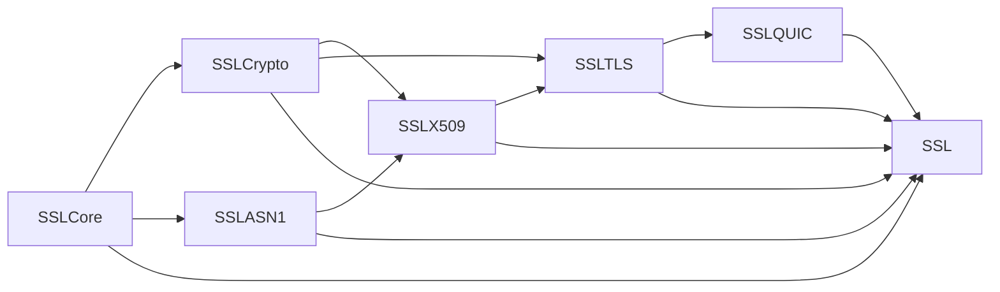

# swift-ssl

`swift-ssl` is a Pure Swift implementation of modern cryptography, PKI, TLS 1.3,
DTLS 1.3, and the TLS integration required by QUIC. It targets Native, WASI, and
Embedded Swift without reproducing the OpenSSL/BoringSSL C API or legacy protocol
surface.

> [!WARNING]
> The project is under active development and is not yet suitable for production
> cryptography or network security.

## Modules



| Product | Responsibility |
|---|---|
| `SSLCore` | Owned and borrowed bytes, secret memory, entropy, clocks, and typed errors |
| `SSLCrypto` | Hashes, AEAD, key agreement, signatures, KEMs, and HPKE |
| `SSLASN1` | Strict DER and PEM parsing and encoding |
| `SSLX509` | Certificates, key containers, path validation, and revocation inputs |
| `SSLTLS` | Transport-independent TLS 1.3 and DTLS 1.3 state machines |
| `SSLQUIC` | QUIC CRYPTO-stream and TLS secret integration |
| `SSL` | Umbrella façade for application-facing composition |

Applications that only need cryptographic primitives should depend directly on
`SSLCore` and `SSLCrypto` instead of the umbrella product.

## Supported profile

- AES-128/192/256-GCM and ChaCha20-Poly1305
- SHA-256/384/512, SHA3-256/512, SHAKE128/256, HMAC, HKDF, and PBKDF2-HMAC-SHA256
- X25519 and P-256 key agreement
- Ed25519 and P-256 ECDSA signing
- P-384/P-521 ECDSA verification
- RSA-PSS signing and verification, and RSA PKCS #1 v1.5 SHA-2 verification
- ML-KEM-768/1024, ML-DSA-44/65/87, and X25519MLKEM768 for TLS
- HPKE with X25519 or P-256 DHKEM
- Strict DER, PEM, SPKI, PKCS #8, modern encrypted PKCS #8, and a narrow PKCS #12 profile
- X.509 parsing and bounded path validation
- TLS 1.3, DTLS 1.3, and the TLS integration required by QUIC

SSL, TLS 1.0-1.2, DTLS 1.0-1.2, renegotiation, CBC cipher suites, obsolete
ciphers and hashes, legacy finite-field DH, and the OpenSSL/BoringSSL C API are
outside the project scope. Algorithms retained only for certificate verification
require explicit policy enablement.

## Installation

No stable release has been tagged yet. Development dependencies may track `main`:

```swift
dependencies: [
    .package(url: "https://github.com/1amageek/swift-ssl.git", branch: "main")
]
```

Select only the products required by the consuming target:

```swift
.target(
    name: "Example",
    dependencies: [
        .product(name: "SSLCore", package: "swift-ssl"),
        .product(name: "SSLCrypto", package: "swift-ssl")
    ]
)
```

## Toolchain

Development is pinned to Swift
`swift-6.4.x-DEVELOPMENT-SNAPSHOT-2026-07-23-a` with the matching WASI and
Embedded WASI SDKs. See [TOOLCHAIN.md](TOOLCHAIN.md) for exact identifiers and
commands.

## Verification and benchmarks

Normal correctness tests live under `Tests/`. Long-running target, differential,
interoperability, sanitizer, and code-generation checks live under `Validation/`.
Benchmarks are isolated under `Benchmarks/` and are not part of the normal test
command.

The performance goal is at least `1.10x` the speed of the pinned BoringSSL
reference for each declared workload, including a paired 95% confidence-interval
lower bound of at least `1.10x`.

| Workload group | BoringSSL time / Swift time | Gate |
|---|---:|---|
| Native SHA-256, 64 B / 1 KiB / 16 KiB | `1.0939x` / `0.8612x` / `0.8399x` | Fail |
| WASI and Embedded WASI SHA-256, 1 MiB variants | `1.3311x`–`1.3389x` | Exploratory pass |
| Native X25519MLKEM768 TLS round trip | `1.1093x` | Pass |
| Native ML-KEM-768/1024 operations | `1.1128x`–`1.3450x` | Pass |
| Native ML-DSA-44/65/87 operations | `1.1534x`–`2.7822x` | Pass |
| Native HPKE X25519 workloads | `1.1064x`–`1.1644x` | Pass |

The Native SHA-256 `1.10x` gate remains unmet. Portable WASI results do not
replace the assembly-enabled Native comparison.

Committed timing and memory artifacts:

- [SHA-256](Benchmarks/SHA256/README.md)
- [ML-KEM](Benchmarks/MLKEM/README.md)
- [ML-DSA](Benchmarks/MLDSA/README.md)
- [X25519MLKEM768 TLS](Benchmarks/TLSHybrid/README.md)
- [HPKE](Benchmarks/HPKE/README.md)

See [docs/VERIFICATION.md](docs/VERIFICATION.md) for measurement and release
gates.

## Documentation

- [Architecture](docs/ARCHITECTURE.md)
- [Responsibility matrix](docs/RESPONSIBILITY_MATRIX.md)
- [Verification policy](docs/VERIFICATION.md)
- [Architecture decision records](docs/adr/)

## License

Apache License 2.0. See [LICENSE](LICENSE).
