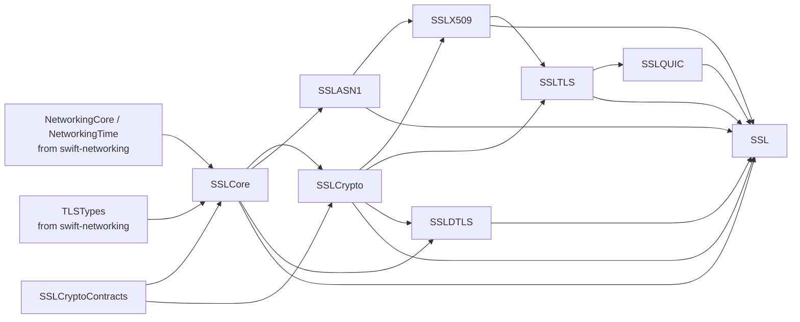
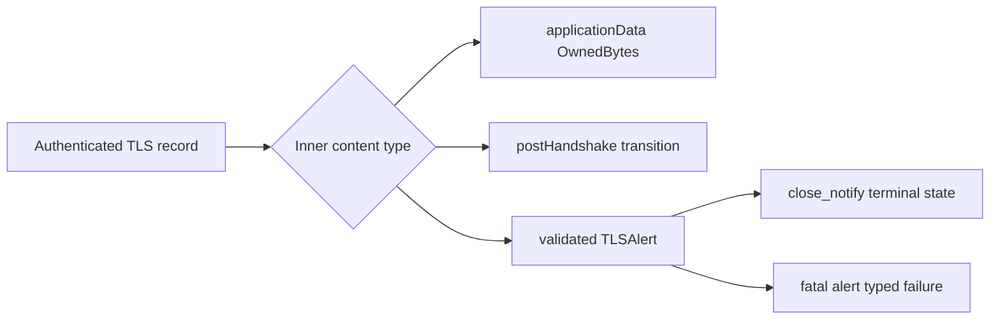

# swift-ssl

`swift-ssl` is a Pure Swift implementation of modern cryptography, PKI, TLS 1.3,
DTLS 1.3, and the scoped DTLS 1.2 WebRTC profile required by WebRTC transports.
It targets Native, WASI, and
Embedded Swift without reproducing the OpenSSL/BoringSSL C API or legacy protocol
surface.

> [!NOTE]
> Version 0.3.0 is the current public release of the declared Pure Swift scope.
> Production deployment remains a separate security-review decision.

## Modules



| Product | Responsibility |
|---|---|
| External `NetworkingCore` / `NetworkingTime` / `TLSTypes` products from `swift-networking` | Protocol-neutral bytes, time capabilities, and dependency-light TLS vocabulary |
| `SSLCore` | Secret memory, entropy, resource/security limits, and TLS-specific ownership; it re-exports the shared networking substrates |
| `SSLCryptoContracts` | Primitive capability protocols and typed primitive errors without concrete algorithms |
| `SSLCrypto` | Hashes, AEAD, key agreement, signatures, KEMs, and HPKE |
| `SSLASN1` | Strict DER and PEM parsing and encoding |
| `SSLX509` | Certificates, key containers, path validation, and revocation inputs |
| `SSLTLS` | Transport-independent TLS 1.3 and DTLS 1.3 state machines |
| `SSLDTLS` | Complete sans-I/O DTLS 1.2 WebRTC mechanism: wire codecs, handshake state, ECDHE/signature seams, cookies, fragmentation, replay, flights, retransmission state, SRTP negotiation/export, and AES-GCM records |
| `TLSWire` / `DTLSWire` | Pure TLS 1.3 / DTLS 1.2 wire codecs with no I/O or cryptographic policy |
| `DTLSHandshake` / `DTLSRecord` | DTLS 1.2 handshake and record-layer contracts used by the `SSLDTLS` engine |
| `SSLQUIC` | QUIC TLS handshake-byte, alert, and traffic-secret mapping; CRYPTO offsets/reassembly belong to `swift-quic` in the target architecture |
| `SSL` | Umbrella façade for application-facing composition |

Applications that only need cryptographic primitives should depend directly on
`SSLCore` and `SSLCrypto` instead of the umbrella product.

## Ecosystem boundary

`swift-ssl` is the canonical mechanism implementation underneath the public
TLS-family session APIs in `swift-tls`:

```text
swift-libp2p -> swift-tls/TLS -> swift-ssl
swift-webrtc -> swift-tls/DTLS -> swift-ssl
swift-quic   -> swift-tls/QUICTLS -> swift-ssl
```

`swift-tls` owns stable Stream TLS, DTLS, and QUIC TLS session contracts.
`swift-ssl` owns the cryptographic, PKI, handshake, record, and key-schedule
mechanisms that implement those contracts. Transport packages own I/O and
transport framing. See the workspace
[Secure Transport Architecture](../SECURE_TRANSPORT_ARCHITECTURE.md).

`swift-networking/TLSTypes` owns only implementation-independent values and
opaque byte-backed names. The secret owner remains
`SSLCore.TLSTrafficSecret`; ownership-backed borrows and output sinks are not
exported by `TLSTypes`.

`swift-ssl` is the only TLS/DTLS mechanism owner. `swift-tls` is a
session-contract and policy facade: it supplies identity, trust, timer, and
transport-facing adapters but does not duplicate wire, transcript, key schedule,
handshake, replay, flight, or record code. QUIC CRYPTO offsets/reassembly remain
owned by `swift-quic`.

The stream mechanism exposes one classified encrypted-record transition so the
facade does not infer protocol state from a generic output or error:



`TLS13ClientHandshake` and `TLS13ServerHandshake` provide
`receiveApplicationRecordStep(_:)` for this boundary. The method opens exactly
one record, preserves the record-protector state on both success and failure,
and rejects change-cipher-spec records and malformed alert levels.

## Supported profile

- AES-128/192/256-GCM and ChaCha20-Poly1305
- SHA-256/384/512, SHA3-256/512, SHAKE128/256, HMAC, HKDF, and PBKDF2-HMAC-SHA256
- X25519, P-256, P-384, and P-521 key agreement
- Ed25519 and P-256/P-384/P-521 ECDSA signing
- RSA-PSS signing and verification, and RSA PKCS #1 v1.5 SHA-2 verification
- ML-KEM-768/1024, ML-DSA-44/65/87, and X25519MLKEM768 for TLS
- HPKE with X25519 or P-256 DHKEM
- Strict DER, PEM, SPKI, PKCS #8, modern encrypted PKCS #8, and a narrow PKCS #12 profile
- X.509 parsing and bounded path validation
- TLS 1.3, DTLS 1.3, and the TLS integration required by QUIC
- DTLS 1.2 WebRTC `use_srtp`, `extended_master_secret`, and `renegotiation_info`
  negotiation; ECDHE-ECDSA authentication; cookie/address validation; bounded
  fragmentation/reassembly; anti-replay; flight retransmission; AES-GCM records;
  and RFC 5705/5764 SRTP exporter

SSL, TLS 1.0-1.2, DTLS 1.0-1.2, renegotiation, CBC cipher suites, obsolete
ciphers and hashes, legacy finite-field DH, and the OpenSSL/BoringSSL C API are
outside the project scope. Algorithms retained only for certificate verification
require explicit policy enablement.

The workspace target architecture reserves one deliberate exception: the narrow
DTLS 1.2 WebRTC interoperability profile is implemented completely in `SSLDTLS`
and exposed to `swift-tls` through a typed facade. It is not a general
TLS 1.2 fallback backend. Browser/native interop and security review remain
release evidence gates, not alternate production implementations.

## Installation

Add `swift-ssl` to the package dependencies:

```swift
dependencies: [
    .package(url: "https://github.com/1amageek/swift-ssl.git", from: "0.3.0")
]
```

Select only the products required by the consuming target:

```swift
.target(
    name: "Example",
    dependencies: [
        .product(name: "SSLCore", package: "swift-ssl"),
        .product(name: "SSLCrypto", package: "swift-ssl")
    ]
)
```

## Toolchain

Development is pinned to Swift
`swift-6.4.x-DEVELOPMENT-SNAPSHOT-2026-07-23-a` with the matching WASI and
Embedded WASI SDKs. See [TOOLCHAIN.md](TOOLCHAIN.md) for exact identifiers and
commands.

## Verification and benchmarks

Normal correctness tests live under `Tests/`. Long-running target, differential,
interoperability, sanitizer, and code-generation checks live under `Validation/`.
Benchmarks are isolated under `Benchmarks/` and are not part of the normal test
command. They are evidence for workload-specific optimization decisions, not a
substitute for the protocol, failure-path, or target validation below.

The SHA-256 comparison against pinned BoringSSL is an independent optimization
measurement. Its `1.10x` ratio is explicitly outside the completion and release
gate for the Pure Swift responsibility migration. This project also does not
promise BoringSSL API, ABI, source, or internal implementation equivalence.

| Workload group | BoringSSL time / Swift time | Gate |
|---|---:|---|
| Native SHA-256, 64 B / 1 KiB / 16 KiB | `1.0939x` / `0.8612x` / `0.8399x` | Historical measurement; not a gate |
| Native SHA-256, one-shot optimized 64 B / 1 KiB / 16 KiB | `1.1671x` / `0.8929x` / `0.8791x` | Exploratory; 64 B pass, long-input gate fail |
| Native SHA-256, corrected LLVM one-shot 64 B / 1 KiB / 16 KiB | `1.2075x` / `1.0157x` / `1.0004x` | Exploratory; all 95% CI lower bounds pass the separate `1.0x` parity floor; `1.10x` target remains unmet |
| Native SHA-256 batch, two independent 64 B / 1 KiB / 16 KiB messages | `1.2225x` / `1.2453x` / `1.2892x` | Exploratory; all 95% CI lower bounds pass `1.10x` |
| WASI and Embedded WASI SHA-256, 1 MiB variants | `1.3311x`–`1.3389x` | Historical exploratory measurement |
| Native X25519MLKEM768 TLS round trip | `1.1093x` | Pass |
| Native X25519MLKEM768 TLS round trip, post-session changes (exploratory) | `1.1652x` (`1.1639x`–`1.1661x` 95% CI) | Exploratory pass |
| Native ML-KEM-768/1024 operations | `1.1128x`–`1.3450x` | Pass |
| Native ML-DSA-44/65/87 operations | `1.1534x`–`2.7822x` | Pass |
| Native HPKE X25519 workloads | `1.1064x`–`1.1644x` | Pass |

The X25519 low-level changes were also isolated with paired internal A/B runs
before the dependent libp2p comparison. These are prior-implementation ratios,
not BoringSSL claims:

| Internal X25519 A/B workload | Optimized / prior time | Result |
|---|---:|---|
| Field multiplication/reduction, 20 paired runs | `0.9427x` | `5.73%` faster; 17/20 wins |
| Fixed-base public-key derivation, 30 paired runs | `0.8429x` | `15.71%` faster; 30/30 wins |

The Native one-message and independent-message batch contracts are reported
separately. The two-way Pure Swift ARM64 batch path exceeds `1.10x` at all three
message lengths by the lower bound of a 30-pair bootstrap confidence interval;
it does not imply that the one-message path meets the same gate. Portable WASI
results are not used to claim Native BoringSSL performance parity. See the
detailed [SHA-256 report](Benchmarks/SHA256/README.md).

Committed timing and memory artifacts:

- [SHA-256](Benchmarks/SHA256/README.md)
- [ML-KEM](Benchmarks/MLKEM/README.md)
- [ML-DSA](Benchmarks/MLDSA/README.md)
- [X25519MLKEM768 TLS](Benchmarks/TLSHybrid/README.md)
- [TLS session ticket and PSK resumption](Benchmarks/TLSSession/README.md)
- [HPKE](Benchmarks/HPKE/README.md)

The post-session-change exploratory run used 30 paired samples of 4,000
X25519MLKEM768 transactions on commit `56af739a6d0e2390ac1628dc3aa8153e7f5738b4`.
Swift's median was
70,621.98 ns/op versus 82,340.53 ns/op for pinned BoringSSL, for a paired
median of `1.1652x`. The formal host-quiescence gate was unavailable because an
unrelated Swift build was active; the result is therefore not a formal release
gate. The direct session-ticket/resumption measurements are reported
separately in [Benchmarks/TLSSession](Benchmarks/TLSSession/README.md) and do
not claim a BoringSSL ratio.

See [docs/VERIFICATION.md](docs/VERIFICATION.md) for measurement and release
gates.

## Documentation

- [Architecture](docs/ARCHITECTURE.md)
- [Responsibility matrix](docs/RESPONSIBILITY_MATRIX.md)
- [Verification policy](docs/VERIFICATION.md)
- [Architecture decision records](docs/adr/)

## License

Apache License 2.0. See [LICENSE](LICENSE).
