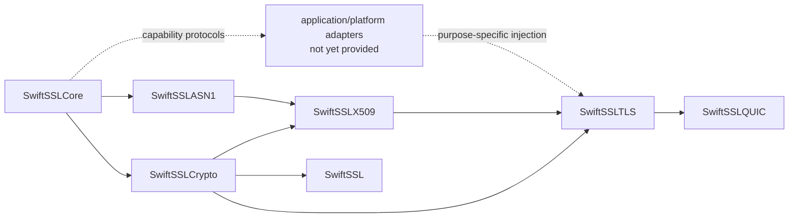

# swift-ssl

`swift-ssl` is an independent, Pure Swift implementation of modern cryptography, PKI, TLS 1.3, DTLS 1.3, and the TLS integration required by QUIC. It is designed to replace the modern responsibilities commonly supplied by BoringSSL without reproducing the OpenSSL/BoringSSL C API, ABI, ownership conventions, or legacy protocol surface.

> Project status: architecture and core implementation are under active development. This repository is not yet suitable for production cryptography or network security.

## Design goals

- Swift-native ownership, errors, protocols, and deterministic state machines.
- One semantic implementation for Native, WASI, and Embedded Swift targets.
- Borrowed byte views on hot paths, explicit owned outputs, and noncopyable secret owners.
- Strict parsers with resource budgets and no silent fallback.
- No socket, event-loop, filesystem, DNS, or platform trust-store dependency in protocol engines.
- Independently verifiable behavior through official vectors, differential tests, interoperability tests, fuzzing, sanitizers, and target-specific execution.

## Modern profile

The implementation target is deliberately smaller than BoringSSL's historical API surface while covering its current security responsibilities.

| Area | Included profile | Status |
|---|---|---|
| Core | Owned and borrowed bytes, strict cursors/builders, secret ownership, constant-time utilities, typed errors | Foundation implemented; verification incomplete |
| Symmetric crypto | AES-GCM, ChaCha20-Poly1305, AES block operations needed by GCM, SHA-2/SHA-3/SHAKE, HMAC, HKDF | AES-128/192/256-GCM, ChaCha20-Poly1305, SHA-256/384/512, SHA3-256/512, SHAKE128/256, HMAC-SHA-256/384/512, and HKDF-SHA-256/384/512 are implemented with vectors and typed failures |
| Public-key crypto | X25519, NIST P-256/P-384/P-521, Ed25519, RSA-PSS, ML-KEM, ML-DSA, approved hybrid groups | RFC 7748 X25519 implementation and façade are present; remaining algorithms planned |
| Formats | Strict DER, PEM, SPKI, PKCS #8, encrypted PKCS #8, PKCS #12, certificate containers | Strict DER primitives/writer, strict RFC 7468 PEM, SPKI, and unencrypted PKCS #8 structural codecs are implemented; encrypted/container formats planned |
| PKI | X.509 parsing, path construction, policy processing, hostname verification, revocation inputs, trust-provider boundary | Strict X.509 validity, Ed25519 certificate-signature verification, v3 extension parsing, and SAN-only DNS identity matching are implemented; path construction, policy, revocation, and trust engine remain required |
| TLS | TLS 1.3, resumption, 0-RTT policy, client authentication, key update, ECH, certificate compression, delegated credentials, raw public keys | A synchronous X25519/Ed25519 TLS 1.3 client/server handshake engine, all three TLS 1.3 AEAD suites, post-handshake KeyUpdate, encrypted NewSessionTicket transport, PSK extension/binder primitives, server ticket age validation, single-use PSK resumption, HKDF key schedule, and AEAD record layer are implemented; 0-RTT, ECH, and broader credential policies remain required |
| Datagram | DTLS 1.3, replay windows, ACKs, retransmission state, connection IDs, DTLS-SRTP negotiation | Profile/action models and a bounded 64-packet replay window are implemented; flight/ACK/timer engine remains required |
| QUIC | RFC 9001 handshake adapter and traffic-secret events; QUIC packet protection remains owned by the QUIC stack | Ordered action/secret output model and RFC 9001 v1 Initial secret derivation are implemented; CRYPTO-stream handshake adapter and packet integration remain required |
| Additional modern constructions | HPKE and narrowly scoped protocol constructions required by the modern profile | Planned |
| Platform composition | Entropy and clock capabilities supplied explicitly per operation | HMAC-DRBG consumes the injected `EntropySource`; concrete platform adapters are not yet provided |
| Public façade | Curated application-facing API without blanket lower-module exports | Explicit AES-GCM, ChaCha20-Poly1305, SHA-256, HMAC-SHA-256, HKDF-SHA-256, and X25519 adapters |

The following are intentionally absent: SSL, TLS 1.0-1.2, DTLS 1.0-1.2, renegotiation, record compression, CBC cipher suites, RC4, DES/3DES, Blowfish, CAST, MD4, MD5, SHA-1 handshake signatures, DSA, legacy finite-field DH, the C API/ABI, `BIO`, `ENGINE`, `ex_data`, and the thread-local error queue.

Algorithms required only to validate still-current certificate ecosystems are governed separately from handshake algorithms. Any such verification-only algorithm must be explicitly enabled by policy; it is never silently selected.

## Toolchain baseline

Development is pinned to:

- Swift toolchain: `swift-6.4.x-DEVELOPMENT-SNAPSHOT-2026-07-23-a`
- macOS toolchain identifier: `org.swift.64202607231a`
- Swift compiler commit: `ef761e567dc94ee`
- WASI SDK: `swift-6.4.x-DEVELOPMENT-SNAPSHOT-2026-07-23-a_wasm`
- Embedded WASI SDK: `swift-6.4.x-DEVELOPMENT-SNAPSHOT-2026-07-23-a_wasm-embedded`

See [TOOLCHAIN.md](TOOLCHAIN.md) for the exact validation commands and target contract.

## Verification and benchmarks

Correctness tests live under `Tests/`. Long-running differential, interoperability, fuzz, sanitizer, and target execution programs live under `Validation/`. Performance workloads and raw measurements live under `Benchmarks/`; they are not part of the normal test command.

| Implemented primitive | Current evidence | Still required before completion |
|---|---|---|
| AES-GCM | AES-128/192/256 key schedules, GCM counter mode and GHASH; NIST empty, single-block, and additional-authenticated-data vectors; authentication failure leaves plaintext output untouched | Independent differential corpus, boundary/limit coverage, measured allocation/copy counts, target execution, sanitizer/code-generation review, and release benchmark |
| ChaCha20-Poly1305 | RFC 8439 ChaCha20 block function and Poly1305, RFC known-answer vector, exact in-place operation, partial-overlap rejection, and authentication-failure no-write behavior; Native façade and target validation routes | Independent differential corpus, measured allocation/copy counts, target sanitizer/code-generation review, and release benchmark |
| SHA-384/512 | FIPS 180-4 `abc` vectors, incremental clone equivalence, exact output-length failure, Native façade, WASI, and Embedded WASI target validation | Independent differential corpus, long-message boundary corpus, measured allocation/copy counts, sanitizer/code-generation review, and release benchmark |
| HMAC-SHA-384/512 | RFC 4231 case 1, context verification, Native implementation and façade | Independent differential corpus, long-message boundary corpus, sanitizer/code-generation review, and release benchmark |
| HKDF-SHA-384/512 | RFC 5869-shaped extract/expand fixtures, exact output sizes, Native implementation | Independent differential corpus, overlap/limit corpus, target execution, sanitizer/code-generation review, and release benchmark |
| SHA3-256/512 and SHAKE128/256 | FIPS 202 empty-message and incremental SHA3 vectors; SHAKE output vectors; strict output-length validation; scoped incremental contexts | Independent differential corpus, long-message boundary corpus, target execution, sanitizer/code-generation review, and release benchmark |
| X25519 | RFC 7748 Alice public-key vector, independent shared-secret vector, four deterministic field vectors, all-zero peer rejection, invalid-length failures, Native façade, WASI, and Embedded WASI target validation | Independent differential corpus, malformed-coordinate corpus, sanitizer/code-generation review, measured allocation/copy counts, and release benchmark |
| HMAC-DRBG | SP 800-90A-style SHA-256 instantiate/generate vectors, additional-input vector, request-limit failure before mutation, and Native/WASI/Embedded WASI target validation | Entropy-source fault corpus, reseed-state corpus, sanitizer/code-generation review, measured allocation/copy counts, and release benchmark |
| TLS 1.3 records | Three RFC 8446 AEAD suites, TLS 1.3 nonce construction, outer header/AAD, sequence-number limits, inner content-type/padding, authentication-failure no-write behavior, Native record tests | RFC 8448 known-answer record corpus, differential/interop tests, target execution, sanitizer/code-generation review, and release benchmark |
| TLS 1.3 key schedule | RFC 8446 early/handshake/master/application secret derivation, SHA-256/SHA-384 suite selection, noncopyable secret owners, Native schedule tests | RFC 8448 transcript vectors, differential/interop tests, target execution, sanitizer/code-generation review, and release benchmark |
| SHA-256 | Incremental/one-shot tests, boundary tests, million-byte vector, scalar/ARM64 differential test, production ARM64 multi-block codegen gate, Native/WASI/Embedded WASI execution | Independent committed differential corpus and release benchmark |
| HMAC-SHA-256 | RFC 4231 cases 1, 2, 3, 4, 6, and 7; incremental equivalence; typed output failure; constant-time verification; three-target execution; ASan/TSan/UBSan; optimized wipe inspection | Independent committed differential corpus, measured allocation/copy counts, and release benchmark |
| HKDF-SHA-256 | RFC 5869 SHA-256 cases 1, 2, and 3, additional fixed fixtures, maximum-length and overlap boundaries, Native/WASI/Embedded WASI execution, ASan/TSan/UBSan, and `-O`/`-Osize` code-generation inspection; caller-provided output, one-time prepared HMAC schedule, zero-heap optimized path, direct full-block writes, and façade route | Independent committed differential corpus, measured allocation/copy counts, and release benchmark |

The performance release goal is a paired median speedup of at least `1.10x` over BoringSSL for every fixed supported headline workload on the same machine and compiler configuration. The lower bound of the paired 95% bootstrap confidence interval must also be at least `1.10`. Constant-time and memory-safety requirements remain hard gates. No result is reported until runner-owned fresh builds use read-only commit snapshots, an allowlisted environment, verified arm64/SDK/Release code generation, equivalent inputs and CPU features, convergence, paired sampling, and complete output validation.

| Benchmark | Swift result | BoringSSL result | Ratio | Evidence |
|---|---:|---:|---:|---|
| SHA-256 one-shot, 64 B | Not measured yet | Not measured yet | — | Formal raw artifact required |
| SHA-256 one-shot, 1 KiB | Not measured yet | Not measured yet | — | Formal raw artifact required |
| SHA-256 one-shot, 16 KiB | Not measured yet | Not measured yet | — | Formal raw artifact required |

Formal benchmark status (2026-07-31): no performance result is recorded yet. The
requested run was rejected before either worker was built because the one-minute
load per logical CPU was `0.938058`, above the runner's `0.25` validity gate. The
invalid precondition artifact is retained at
`.test-artifacts/benchmark/20260731T113521Z-native-sha256.json`. This is an
environmental invalidation, not a Swift-versus-BoringSSL measurement; no speedup
claim, including the `1.10x` target, can be inferred from it. Re-run the formal
command on an otherwise quiescent machine before publishing benchmark numbers.

See [docs/VERIFICATION.md](docs/VERIFICATION.md) for gates and measurement rules.

## Documentation

- [Architecture](docs/ARCHITECTURE.md)
- [Responsibility matrix](docs/RESPONSIBILITY_MATRIX.md)
- [Verification and benchmark policy](docs/VERIFICATION.md)
- [Architecture decision records](docs/adr/)

## License

Apache License 2.0. See [LICENSE](LICENSE).
