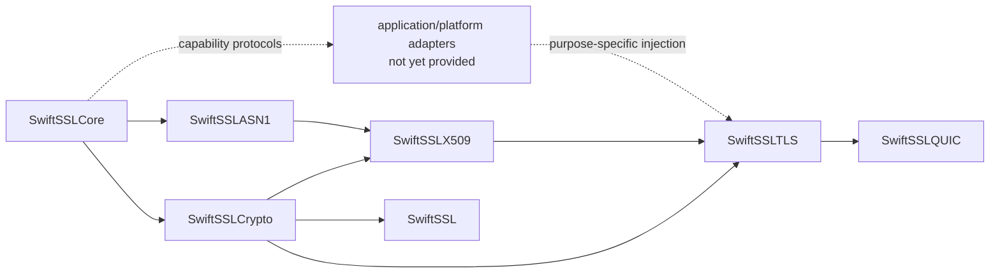

# swift-ssl

`swift-ssl` is an independent, Pure Swift implementation of modern cryptography, PKI, TLS 1.3, DTLS 1.3, and the TLS integration required by QUIC. It is designed to replace the modern responsibilities commonly supplied by BoringSSL without reproducing the OpenSSL/BoringSSL C API, ABI, ownership conventions, or legacy protocol surface.

> Project status: architecture and core implementation are under active development. This repository is not yet suitable for production cryptography or network security.

## Design goals

- Swift-native ownership, errors, protocols, and deterministic state machines.
- One semantic implementation for Native, WASI, and Embedded Swift targets.
- Borrowed byte views on hot paths, explicit owned outputs, and noncopyable secret owners.
- Strict parsers with resource budgets and no silent fallback.
- No socket, event-loop, filesystem, DNS, or platform trust-store dependency in protocol engines.
- Independently verifiable behavior through official vectors, differential tests, interoperability tests, fuzzing, sanitizers, and target-specific execution.

## Modern profile

The implementation target is deliberately smaller than BoringSSL's historical API surface while covering its current security responsibilities.

| Area | Included profile | Status |
|---|---|---|
| Core | Owned and borrowed bytes, strict cursors/builders, secret ownership, constant-time utilities, typed errors | Foundation implemented; verification incomplete |
| Symmetric crypto | AES-GCM, ChaCha20-Poly1305, AES block operations needed by GCM, SHA-2/SHA-3/SHAKE, HMAC, HKDF | AES-128/192/256-GCM, ChaCha20-Poly1305, SHA-256/384/512, SHA3-256/512, SHAKE128/256, HMAC-SHA-256/384/512, and HKDF-SHA-256/384/512 are implemented with vectors and typed failures |
| Public-key crypto | X25519 key agreement, Ed25519 signing, verification-only NIST ECDSA and RSA-PSS, ML-KEM, ML-DSA, approved hybrid groups | RFC 7748 X25519, RFC 8032 Ed25519, FIPS 203 ML-KEM-768/1024, FIPS 204 ML-DSA-44/65/87, and draft-05 X25519MLKEM768 own secret operations; ECDSA P-256/P-384/P-521 and RSA-PSS SHA-256/384/512 are verification-only certificate capabilities; additional approved hybrids remain required |
| Formats | Strict DER, PEM, SPKI, PKCS #8, encrypted PKCS #8, PKCS #12, certificate containers | Strict DER primitives/writer, strict RFC 7468 PEM, SPKI, unencrypted PKCS #8, and RFC 5915 ECPrivateKey decoding with curve/key consistency checks are implemented; encrypted/container formats planned |
| PKI | X.509 parsing, path construction, policy processing, hostname verification, revocation inputs, trust-provider boundary | Strict X.509 validity, Ed25519, ECDSA P-256/P-384/P-521, and RSA-PSS-with-SHA2 certificate-signature verification, bounded trust-anchor path construction with BasicConstraints/keyCertSign checks, v3 extension parsing, and SAN-only DNS identity matching are implemented; policy, revocation, and trust-store acquisition remain required |
| TLS | TLS 1.3, resumption, 0-RTT policy, client authentication, key update, ECH, certificate compression, delegated credentials, raw public keys | One record-independent client/server state-machine core owns transcript, Ed25519 authentication, role-specific X25519 or draft-05 X25519MLKEM768 key exchange, key schedule, Finished, PSK resumption, RFC 9849 ECH accept/reject, and traffic-secret updates for both Stream TLS and QUIC; the Stream adapter owns record framing/protection and all three TLS 1.3 AEAD suites, KeyUpdate, and encrypted NewSessionTicket transport; 0-RTT, client authentication, ECH HelloRetryRequest continuation, certificate compression, delegated credentials, and raw public keys remain required |
| Datagram | DTLS 1.3, replay windows, ACKs, retransmission state, connection IDs, DTLS-SRTP negotiation | Profile/action models and a bounded 64-packet replay window are implemented; flight/ACK/timer engine remains required |
| QUIC | RFC 9001 handshake adapter and traffic-secret events; QUIC packet protection remains owned by the QUIC stack | Ordered action/secret output, RFC 9001 v1 Initial secret derivation, bounded per-encryption-level CRYPTO stream reassembly, zero-copy TLS handshake-message framing, record-independent TLS state transitions, role-correct read/write handshake and 1-RTT secret events, full-handshake completion, and PSK resumption are implemented; QUIC transport parameters, ALPN policy, packet-stack integration, fuzzing, and external interoperability remain required |
| Additional modern constructions | HPKE and narrowly scoped protocol constructions required by the modern profile | RFC 9180 X25519 DHKEM Base/PSK/Auth/AuthPSK with HKDF-SHA256/384/512, AES-GCM, and ChaCha20-Poly1305 is implemented and vector-tested; RFC 9849 ECH is integrated for the X25519/HKDF-SHA256/AES-128-GCM profile; P-256 DHKEM and additional hybrid profiles remain required |
| Platform composition | Entropy and clock capabilities supplied explicitly per operation | HMAC-DRBG consumes the injected `EntropySource`; concrete platform adapters are not yet provided |
| Public façade | Curated application-facing API without blanket lower-module exports | Explicit AES-GCM, ChaCha20-Poly1305, SHA-2, SHA-3/SHAKE, HMAC, HKDF, X25519, Ed25519, ML-KEM-768/1024, ML-DSA-44/65/87, and verification-only P-256 ECDSA adapters; P-384/P-521 certificate verification remains in the lower PKI/crypto modules |

The following are intentionally absent: SSL, TLS 1.0-1.2, DTLS 1.0-1.2, renegotiation, record compression, CBC cipher suites, RC4, DES/3DES, Blowfish, CAST, MD4, MD5, SHA-1 handshake signatures, DSA, legacy finite-field DH, the C API/ABI, `BIO`, `ENGINE`, `ex_data`, and the thread-local error queue.

Algorithms required only to validate still-current certificate ecosystems are governed separately from handshake algorithms. Any such verification-only algorithm must be explicitly enabled by policy; it is never silently selected.

## Toolchain baseline

Development is pinned to:

- Swift toolchain: `swift-6.4.x-DEVELOPMENT-SNAPSHOT-2026-07-23-a`
- macOS toolchain identifier: `org.swift.64202607231a`
- Swift compiler commit: `ef761e567dc94ee`
- WASI SDK: `swift-6.4.x-DEVELOPMENT-SNAPSHOT-2026-07-23-a_wasm`
- Embedded WASI SDK: `swift-6.4.x-DEVELOPMENT-SNAPSHOT-2026-07-23-a_wasm-embedded`

See [TOOLCHAIN.md](TOOLCHAIN.md) for the exact validation commands and target contract.

## Verification and benchmarks

Correctness tests live under `Tests/`. Long-running differential, interoperability, fuzz, sanitizer, and target execution programs live under `Validation/`. Performance workloads and raw measurements live under `Benchmarks/`; they are not part of the normal test command.

| Implemented primitive | Current evidence | Still required before completion |
|---|---|---|
| AES-GCM | AES-128/192/256 key schedules, ARM64 AES round and four-block GHASH kernels, scalar cross-target path, GCM counter mode and GHASH; NIST empty, single-block, and additional-authenticated-data vectors; authentication failure leaves plaintext output untouched; Native/WASI/Embedded execution and focused ASan | Independent differential corpus, broader boundary/limit coverage, measured allocation/copy counts, automated code-generation review, and release benchmark |
| ChaCha20-Poly1305 | RFC 8439 ChaCha20 block function and Poly1305, RFC known-answer vector, exact in-place operation, partial-overlap rejection, and authentication-failure no-write behavior; Native façade and target validation routes | Independent differential corpus, measured allocation/copy counts, target sanitizer/code-generation review, and release benchmark |
| SHA-384/512 | FIPS 180-4 `abc` vectors, incremental clone equivalence, exact output-length failure, Native façade, WASI, and Embedded WASI target validation | Independent differential corpus, long-message boundary corpus, measured allocation/copy counts, sanitizer/code-generation review, and release benchmark |
| HMAC-SHA-384/512 | RFC 4231 case 1, context verification, Native implementation and façade | Independent differential corpus, long-message boundary corpus, sanitizer/code-generation review, and release benchmark |
| HKDF-SHA-384/512 | RFC 5869-shaped extract/expand fixtures, exact output sizes, Native implementation | Independent differential corpus, overlap/limit corpus, target execution, sanitizer/code-generation review, and release benchmark |
| SHA3-256/512 and SHAKE128/256 | FIPS 202 empty-message and incremental SHA3 vectors; SHAKE output vectors; strict output-length validation; scoped incremental contexts | Independent differential corpus, long-message boundary corpus, target execution, sanitizer/code-generation review, and release benchmark |
| X25519 | RFC 7748 Alice public-key vector, independent shared-secret vector, four deterministic field vectors, all-zero peer rejection, invalid-length failures, Native façade, WASI, and Embedded WASI target validation | Independent differential corpus, malformed-coordinate corpus, sanitizer/code-generation review, measured allocation/copy counts, and release benchmark |
| Ed25519 | Owned noncopyable private seed, owned validated public key, separate signing/verification protocol capabilities, fixed-iteration scalar reduction, and mask-selected secret scalar multiplication | RFC 8032 signing/verification vector, modified-message and noncanonical-scalar failures, Native/WASI/Embedded façade verification, Native TLS/Core tests, dedicated Native/WASI/Embedded QUIC/TLS handshakes, focused ASan covering 11 Ed25519/Core/QUIC tests, and manual optimized ARM64 control-flow inspection | Broader RFC 8032 corpus, automated constant-time code-generation gate, TSan/UBSan, allocation/copy measurement, interoperability, and release benchmark |
| ML-KEM-768/1024 | FIPS 203 key generation, encapsulation, decapsulation, implicit rejection, noncopyable erased private/shared-secret owners, expanded-key reuse, caller-owned output, SIMD NTT, and two-stream Keccak | NIST ACVP/TR1 fixtures, arithmetic differential and boundary tests, typed no-write failure tests, 24-test focused ASan, Native/WASI/Embedded WASI façade execution, six secure-wipe code-generation configurations, bidirectional pinned-BoringSSL interoperability, a committed formal timing artifact whose six workloads pass the `1.10x` confidence-bound gate, and a committed formal allocation/dynamic-copy artifact | Broader external corpus, automated constant-time review, TSan/UBSan availability statement, and security review |
| ML-DSA-44/65/87 | FIPS 204 key generation, randomized context-bound signing, verification, distinct parameter-specific public key types, noncopyable erased private owners, synchronized immutable expanded-public caches, caller-owned signature output, scoped raw signing workspaces, SIMD NTT, and two-stream Keccak | NIST ACVP key-generation fixtures and Wycheproof seeded-signature fixtures for all three parameter sets; deterministic/randomized signing, typed no-write entropy failure, and malformed-key rejection; Native/WASI/Embedded WASI façade execution; ASan façade execution; bidirectional pinned-BoringSSL interoperability and mutation rejection; committed formal timing and allocation/dynamic-copy artifacts covering all nine operations | Broader external corpus, automated constant-time review, TSan/UBSan availability statement, and security review |
| TLS X25519MLKEM768 | `draft-ietf-tls-ecdhe-mlkem-05` group `0x11EC`; role-specific one-shot protocols; 1,216-byte client share, 1,120-byte server share, and 64-byte combined secret; borrowed received shares and direct final-owner output | Native key-exchange/Core/Stream/QUIC success and negative tests, X25519 no-write low-order failure, dedicated Native/WASI/Embedded runtime execution, Hybrid ASan execution, committed formal bidirectional pinned-BoringSSL interoperability and `1.10x` timing-gate pass, and a committed formal allocation/dynamic-copy artifact | Second independent peer, automated constant-time review, broader corpus, and security review |
| ECDSA P-256/P-384/P-521 verification | Verification-only fixed-width raw-signature arithmetic, typed owned public keys, strict DER signature decoding including P-521 long-form lengths, SHA-256/384/512 certificate verification, curve SPKI validation, and mutation failures | Independent raw-signature vectors; real X.509 certificates signed with ECDSA-with-SHA256, SHA384, and SHA512; malformed/modified signature failures; dedicated Native/WASI/Embedded Release validation of P-256/P-384/P-521 success and mutation routes | Broader independent differential corpus, measured allocation/copy counts, sanitizer coverage, formal benchmark, and security review; public-input verification has no secret-dependent timing contract |
| RSA-PSS verification | Verification-only SHA-256/384/512 EMSA-PSS, canonical 2048–4096-bit public keys, bounded Montgomery public exponentiation, strict X.509 PSS parameters, and explicit failure contracts | Independent SHA-256/384/512 signatures including a 4096-bit SHA-512 fixture, 512 Montgomery differential cases, key/length/salt boundaries, signature mutations, real X.509 success/failure, focused ASan including the maximum modulus, and Native/WASI/Embedded WASI runtime validation | Broader external corpus, measured allocation/copy counts, formal benchmark, and security review |
| X.509 path validation | Bounded unordered path search, issuer/subject DER-name matching, validity-window checks, trust-anchor boundary, BasicConstraints CA/pathLen, optional keyCertSign, and SAN-only hostname verification | Real P-256 leaf/root chain, SAN match, modified leaf signature failure, non-CA issuer rejection, hostname mismatch rejection, and bounded path behavior | RFC 5280 policy processing, name constraints, CRL/OCSP, CT, delegated credentials, and broader interoperability |
| HMAC-DRBG | SP 800-90A-style SHA-256 instantiate/generate vectors, additional-input vector, request-limit failure before mutation, and Native/WASI/Embedded WASI target validation | Entropy-source fault corpus, reseed-state corpus, sanitizer/code-generation review, measured allocation/copy counts, and release benchmark |
| TLS 1.3 records | Three RFC 8446 AEAD suites, TLS 1.3 nonce construction, outer header/AAD, sequence-number limits, inner content-type/padding, authentication-failure no-write behavior, zero-copy record-range parsing, direct sealing into the final output backing, Native record tests, and an Ed25519-only CertificateVerify codec | RFC 8448 known-answer record corpus, differential/interop tests, broader target execution, sanitizer/code-generation review, allocation/copy measurement, and release benchmark |
| TLS 1.3 key schedule | RFC 8446 early/handshake/master/application/exporter/resumption derivation, SHA-256/SHA-384 suite selection, separate noncopyable application and resumption owners at their distinct transcript boundaries, RFC 8448 handshake/application/exporter/resumption known answers, Native tests, three-target runtime execution, and focused ASan | Broader RFC 8448 record/transcript corpus, differential interoperability, code-generation review, allocation/copy measurement, and release benchmark |
| SHA-256 | Incremental/one-shot tests, boundary tests, million-byte vector, scalar/ARM64 differential test, production ARM64 multi-block codegen gate, Native/WASI/Embedded WASI execution | Independent committed differential corpus and release benchmark |
| HMAC-SHA-256 | RFC 4231 cases 1, 2, 3, 4, 6, and 7; incremental equivalence; typed output failure; constant-time verification; three-target execution; ASan/TSan/UBSan; optimized wipe inspection | Independent committed differential corpus, measured allocation/copy counts, and release benchmark |
| HKDF-SHA-256 | RFC 5869 SHA-256 cases 1, 2, and 3, additional fixed fixtures, maximum-length and overlap boundaries, Native/WASI/Embedded WASI execution, ASan/TSan/UBSan, and `-O`/`-Osize` code-generation inspection; caller-provided output, one-time prepared HMAC schedule, zero-heap optimized path, direct full-block writes, and façade route | Independent committed differential corpus, measured allocation/copy counts, and release benchmark |
| HPKE X25519 | RFC 9180 X25519 DHKEM Base/PSK/Auth/AuthPSK, HKDF-SHA256/384/512, AES-128/256-GCM, ChaCha20-Poly1305, precomputed X25519 key pairs, sequence-bound nonces, wiped exporter-secret owner, exact in-place seal/open, authentication-failure no-write behavior, RFC 9180 A.2 vectors for all four modes, 11 Native tests, Native/WASI/Embedded runtime execution, and focused ASan | Independent full RFC 9180 corpus, P-256 DHKEM, generic differential interoperability, automated code-generation review, formal allocation/copy counts, the `1.10x` release benchmark, and security review |
| ECH RFC 9849 | Strict ECHConfigList parsing and X25519 suite selection; immutable client/server configuration owners; borrowed encapsulation and payload ranges; direct sealing into the final ClientHelloOuter owner; accept/reject and retry configuration integration in Stream and QUIC TLS | 15 Native config/ClientHello tests, accepted/rejected Core and PSK-resumption tests, Native/WASI/Embedded runtime execution, focused ASan, and bidirectional interoperability with pinned BoringSSL | HelloRetryRequest continuation and second-ClientHello confirmation, rotation-snapshot concurrency tests, broader malformed corpus, fuzzing, formal allocation/copy and timing evidence, a second independent peer, and security review |
| QUIC CRYPTO/TLS stream | Per-encryption-level sliding ring, exact retransmission handling, transactional conflicting-overlap rejection, bounded offsets/window, exact TLS handshake boundaries, zero-copy message `Span` delivery including ring wrap, and record-independent client/server TLS state transitions with ordered directional secret effects | Native reassembly/framing/core/adapter tests, full and resumed handshakes, tampered-Finished rejection, out-of-order CRYPTO delivery, directional-secret comparison, three guarded adapter repetitions, focused AddressSanitizer execution, and dedicated Native/WASI/Embedded WASI full-handshake runtime validation | QUIC transport parameters, ALPN, allocation measurement, fuzzing, external interoperability, and release benchmark |

The performance release goal is a paired median speedup of at least `1.10x` over BoringSSL for every fixed supported headline workload on the same machine and compiler configuration. The lower bound of the paired 95% bootstrap confidence interval must also be at least `1.10`. Constant-time and memory-safety requirements remain hard gates. No result is reported until runner-owned fresh builds use read-only commit snapshots, an allowlisted environment, verified arm64/SDK/Release code generation, equivalent inputs and CPU features, convergence, paired sampling, and complete output validation.

### SHA-256 formal benchmark

| Benchmark | Swift median ns/op | BoringSSL median ns/op | Ratio | 95% bootstrap CI |
|---|---:|---:|---:|---:|
| SHA-256 one-shot, 64 B | 33.270145 | 36.317875 | 1.093875x | 1.083631–1.098883 |
| SHA-256 one-shot, 1 KiB | 355.468311 | 306.041342 | 0.861176x | 0.859270–0.862071 |
| SHA-256 one-shot, 16 KiB | 5641.698608 | 4738.278817 | 0.839864x | 0.839507–0.840313 |

Formal benchmark status (2026-08-01 JST): the runner completed 30 paired
samples per workload on an Apple M4 Max (arm64, macOS 27.0) using Swift
toolchain `org.swift.64202607231a` and BoringSSL commit
`ae49d2681a56ca7b8609f6039a770fda2a8eb550`. The raw artifact is retained at
`.test-artifacts/benchmark/20260801T-formal-sha256-v2.json` (ignored by Git).
The result is valid measurement evidence, but the release gate failed: the
required lower confidence bound is `1.10x`; the 64-byte workload reached only
`1.093875x` (lower bound `1.083631x`), while 1 KiB and 16 KiB were slower than
BoringSSL. Allocation/copy counts and WASM/Embedded timings were not measured.
Historical sanitizer artifacts for the removed NIST secret-key
implementations are not release evidence for the current profile. The current
Ed25519 secret path has focused ASan evidence for its direct, TLS Core, and
QUIC/TLS routes; TSan, UBSan, an automated constant-time code-generation gate,
and fresh sanitizer coverage for the current verification-only NIST paths
remain required.

ARM64 code-generation analysis is recorded in ADR 0037. The pinned Swift and
Clang intrinsic forms both retain a recurrent tied-operand copy that BoringSSL
avoids with hand-written assembly. Source rearrangements and an opaque SIMD
identity operation did not produce a repeatable improvement. The Pure Swift
constraint and the `1.10x` goal are both retained; the failed result is not
waived or represented as complete.
The prior high-load invalidation remains at
`.test-artifacts/benchmark/20260731T113521Z-native-sha256.json` and is not part
of these ratios.

### X25519MLKEM768 TLS formal benchmark

| Benchmark | Swift median ns/op | BoringSSL median ns/op | Ratio | 95% bootstrap CI |
|---|---:|---:|---:|---:|
| Full client/server key-share round trip | 70,469.781 | 78,195.411 | 1.1093x | 1.1082–1.1111 |

The formal Native run passed on 2026-08-01. It used 30 balanced randomized
pairs of 4,000 operations, 10,000 bootstrap resamples, Swift source commit
`22df4b61272a3e24596166fee2b2d6ee7f342217`, and BoringSSL commit
`ae49d2681a56ca7b8609f6039a770fda2a8eb550`. Before timing, the runner proved
Swift-client/BoringSSL-server and BoringSSL-client/Swift-server interoperability,
verified the exact 1,216-byte client share, 1,120-byte server share, and
64-byte shared secret, and rejected unexpected binary dependencies or ARM64
code generation.

The committed raw artifact is
[`Benchmarks/TLSHybrid/Results/20260801T150930Z-native-x25519mlkem768.json`](Benchmarks/TLSHybrid/Results/20260801T150930Z-native-x25519mlkem768.json)
(SHA-256
`aef1aaeb1f6ab3ed18619c93577acfb9ebf4cbf48594c6bef4c62ac26f88f347`).

### ML-KEM formal benchmark

| Benchmark | Swift median ns/op | BoringSSL median ns/op | Ratio | 95% bootstrap CI |
|---|---:|---:|---:|---:|
| ML-KEM-768 key generation | 9,774.244 | 12,254.085 | 1.2540x | 1.2490–1.2557 |
| ML-KEM-768 encapsulation | 4,486.583 | 5,635.634 | 1.2545x | 1.2521–1.2579 |
| ML-KEM-768 decapsulation | 7,777.706 | 8,658.050 | 1.1128x | 1.1089–1.1150 |
| ML-KEM-1024 key generation | 14,216.063 | 19,141.245 | 1.3450x | 1.3426–1.3470 |
| ML-KEM-1024 encapsulation | 5,772.702 | 7,561.406 | 1.3109x | 1.3074–1.3135 |
| ML-KEM-1024 decapsulation | 10,429.674 | 11,746.667 | 1.1267x | 1.1248–1.1305 |

Formal ML-KEM status (2026-08-01 JST): all six workloads passed because every
paired 95% bootstrap confidence-interval lower bound exceeded `1.10x`. The run
used 30 balanced randomized pairs per workload, 10,000 bootstrap resamples,
the pinned Swift compiler and SDK, and BoringSSL commit
`ae49d2681a56ca7b8609f6039a770fda2a8eb550`. Before timing, the runner verified
bidirectional ciphertext/shared-secret interoperability, identical implicit
rejection, matching arm64/macOS/SDK load commands, BoringSSL assembly use, and
the expected Swift ARM SHA3 and SIMD NTT code generation. The committed raw
artifact is
[`Benchmarks/MLKEM/Results/20260801T115837Z-native-mlkem.json`](Benchmarks/MLKEM/Results/20260801T115837Z-native-mlkem.json)
(SHA-256
`7c6b21acdb079a55779d64b21cdf03accac1d8df75c18d67b3383f41cba83ec8`).
This timing artifact does not claim allocation or logical-copy counts; those
are established separately below.

### ML-KEM allocation and zero-copy evidence

| Path | Allocation/free calls per operation | Requested bytes | General `malloc` | Dynamic bulk-copy bytes |
|---|---:|---:|---:|---:|
| ML-KEM-768 key generation | 17 / 17 | 20,640 | 6 | 0 |
| ML-KEM-768 in-place encapsulation | 5 / 5 | 6,096 | 0 | 0 |
| ML-KEM-768 in-place decapsulation | 11 / 11 | 9,808 | 0 | 0 |
| ML-KEM-1024 key generation | 17 / 17 | 31,008 | 6 | 0 |
| ML-KEM-1024 in-place encapsulation | 5 / 5 | 7,632 | 0 | 0 |
| ML-KEM-1024 in-place decapsulation | 11 / 11 | 12,336 | 0 | 0 |

The formal memory run uses the public entropy-injected APIs and caller-owned
in-place outputs. Counts are exact linear slopes from 1, 10, and 100 operations
in three fresh processes each. Encapsulation and decapsulation perform only
balanced aligned workspace/secret allocations and no general `malloc`. Caller
inputs remain borrowed and outputs are written directly; there is no
per-operation dynamic `memcpy`/`memmove` byte traffic. This is a zero-copy
caller-payload contract, not an allocation-free claim. Compiler-inlined scalar
stores and algorithm-required result writes are outside the dynamic interposer
and are not misreported as avoided work.

The committed raw artifact is
[`Benchmarks/MLKEM/Results/20260801T122012Z-native-mlkem-memory.json`](Benchmarks/MLKEM/Results/20260801T122012Z-native-mlkem-memory.json)
(SHA-256
`36658642dc4c2bc791288b55fd089f18ac6772cb4b50c0f1dca057a58ec339c5`).

### FIPS 204 ML-DSA formal benchmark and memory evidence

| Benchmark | Swift median ns/op | BoringSSL median ns/op | Ratio | 95% bootstrap CI |
|---|---:|---:|---:|---:|
| ML-DSA-44 key generation | 22,327.662 | 26,261.101 | 1.1757x | 1.1726–1.1796 |
| ML-DSA-44 signing | 80,587.003 | 109,498.017 | 1.3565x | 1.3485–1.3676 |
| ML-DSA-44 verification | 12,792.972 | 24,525.670 | 1.9170x | 1.9129–1.9213 |
| ML-DSA-65 key generation | 38,098.185 | 52,777.962 | 1.3855x | 1.3837–1.3867 |
| ML-DSA-65 signing | 125,748.938 | 169,388.929 | 1.3475x | 1.3418–1.3498 |
| ML-DSA-65 verification | 15,819.651 | 37,162.846 | 2.3523x | 2.3289–2.3604 |
| ML-DSA-87 key generation | 58,567.892 | 67,511.403 | 1.1534x | 1.1517–1.1547 |
| ML-DSA-87 signing | 133,549.000 | 196,773.756 | 1.4788x | 1.4646–1.4866 |
| ML-DSA-87 verification | 21,459.804 | 59,675.048 | 2.7822x | 2.7742–2.7894 |

All nine formal timing workloads passed the `1.10x` lower-confidence-bound
gate. The run used 30 balanced randomized pairs per workload, 10,000 bootstrap
resamples, clean SwiftSSL commit
`06a2e5eb12c2d6159945e5f48ffb06159e747ce8`, and clean BoringSSL commit
`ae49d2681a56ca7b8609f6039a770fda2a8eb550`. It also proved bidirectional
signature interoperability and mutation rejection for all three parameter
sets, BoringSSL assembly use, 530 Swift ML-DSA SIMD Montgomery instructions,
and ARM SHA3 instruction generation.

| Path | Allocation/free calls per operation | Requested bytes | Dynamic bulk-copy bytes |
|---|---:|---:|---:|
| ML-DSA-44 key generation | 23 / 23 | 44,928 | 0 |
| ML-DSA-44 in-place signing | 30 / 30 | 38,800 | 16,384 |
| ML-DSA-44 verification | 14 / 14 | 23,488 | 0 |
| ML-DSA-65 key generation | 25 / 25 | 71,536 | 0 |
| ML-DSA-65 in-place signing | 62 / 62 | 59,248 | 40,960 |
| ML-DSA-65 verification | 14 / 14 | 31,712 | 0 |
| ML-DSA-87 key generation | 25 / 25 | 111,088 | 0 |
| ML-DSA-87 in-place signing | 48 / 48 | 71,120 | 43,008 |
| ML-DSA-87 verification | 14 / 14 | 42,240 | 0 |

The signing copies are parameter-specific algorithm-required mask forks for
the fixed rejection-sampling fixtures; they are not caller-input,
caller-output, or COW materialization. Counts are exact linear slopes over 1,
10, and 100 operations in three fresh processes each.

The committed timing artifact is
[`Benchmarks/MLDSA/Results/20260801T193601Z-native-mldsa.json`](Benchmarks/MLDSA/Results/20260801T193601Z-native-mldsa.json)
(SHA-256
`50acd6db3b8ff88f85001e6485f765670c1a8b58e08b8ee73df61d17ed5f261b`).
The committed memory artifact is
[`Benchmarks/MLDSA/Results/20260801T193538Z-native-mldsa-memory.json`](Benchmarks/MLDSA/Results/20260801T193538Z-native-mldsa-memory.json)
(SHA-256
`de46a497d115c1ab1805100f8167362f021b1f9acf258ce0d766eb1d144b1c4a`).

### X25519MLKEM768 TLS allocation and zero-copy evidence

| Path | Allocation/free calls per operation | Requested bytes | Dynamic bulk-copy bytes |
|---|---:|---:|---:|
| Client offer | 17 / 17 | 15,656 | 0 |
| Server accept | 15 / 15 | 14,464 | 0 |
| Full round trip | 45 / 45 | 40,032 | 0 |
| X25519 public key into caller output | 0 / 0 | 0 | 0 |
| X25519 shared secret into caller output | 0 / 0 | 0 | 0 |

The formal steady-state memory run executes one unmeasured exact-path warmup
before each measurement window, then derives exact slopes from 1, 10, and 100
operations in three fresh processes each. Received key shares remain borrowed,
caller-owned X25519 outputs allocate nothing, and no per-operation dynamic
`memcpy`/`memmove` byte traffic was observed. Cold-start runtime metadata
allocation and compiler-inlined scalar stores are explicitly outside this
artifact.

The committed raw artifact is
[`Benchmarks/TLSHybrid/Results/20260801T150811Z-native-tls-hybrid-memory.json`](Benchmarks/TLSHybrid/Results/20260801T150811Z-native-tls-hybrid-memory.json)
(source commit `6c77e4807fbf23e444e1a61608a6108ee0107a00`, SHA-256
`c50b8a82b8d411ed4e71e24a9dfbf1c458f57c80270bfc4ff12212592d41c7c0`).

See [docs/VERIFICATION.md](docs/VERIFICATION.md) for gates and measurement rules.

## Documentation

- [Architecture](docs/ARCHITECTURE.md)
- [Responsibility matrix](docs/RESPONSIBILITY_MATRIX.md)
- [Verification and benchmark policy](docs/VERIFICATION.md)
- [Architecture decision records](docs/adr/)

## License

Apache License 2.0. See [LICENSE](LICENSE).
