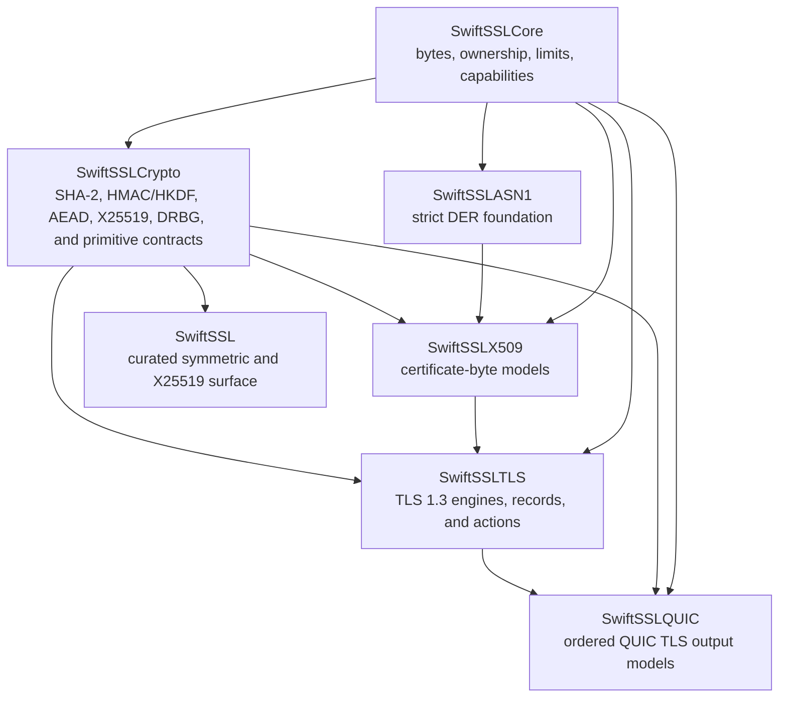
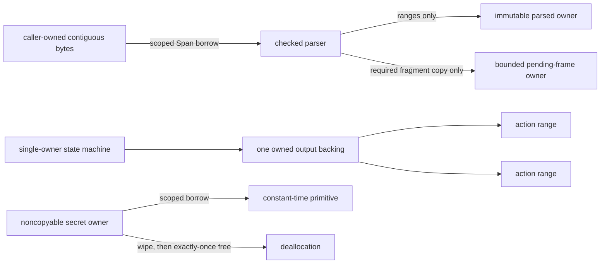
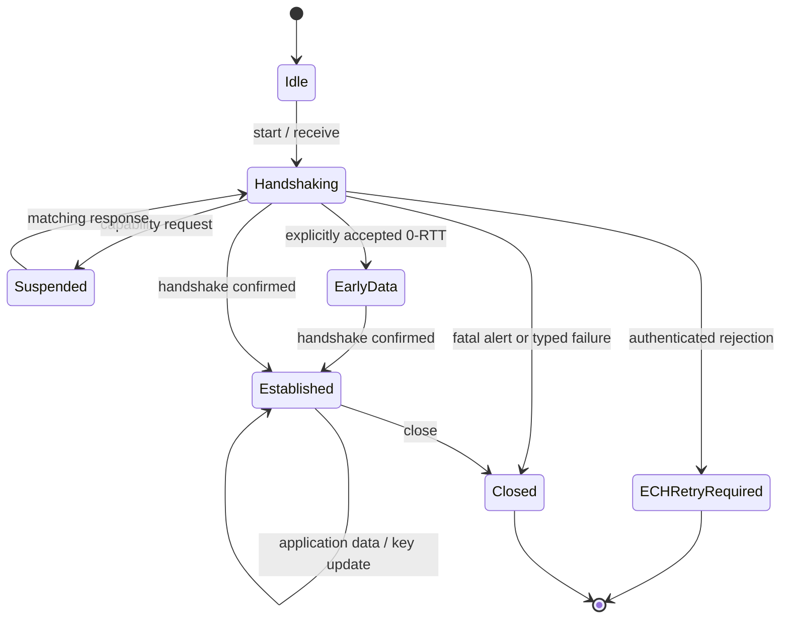

# Architecture

## 1. Definition of replacement

`swift-ssl` replaces BoringSSL by covering each modern security responsibility with a Swift-native owner. It does not replace C symbols one for one. Every BoringSSL subsystem is classified as one of:

1. implemented as a modern security capability;
2. replaced by a Swift language or ownership mechanism;
3. retained only as a policy-gated verification capability for deployed PKI;
4. explicitly excluded as legacy or C-specific infrastructure.

There is no compatibility layer between these classes. Unsupported input produces a typed failure and is never routed to a legacy backend.

## 2. Dependency graph

The current package graph is:

Dependencies flow downward only. The façade currently exposes curated SHA-256, HMAC-SHA-256, HKDF-SHA-256, and X25519 entry points and does not re-export lower modules. As application-facing TLS composition is implemented, the façade may gain explicit dependencies without turning into a blanket module export.

Entropy and clock interfaces live in `SwiftSSLCore`. Concrete platform adapters are intentionally absent until they have real implementations and target-specific verification. They are composed by purpose—entropy for cryptographic operations, wall time for certificate verification, and monotonic time for DTLS—rather than through one all-capabilities container. Cryptographic and protocol modules never import platform implementations.

## 3. Module responsibilities

| Module | Owns | Must not own |
|---|---|---|
| `SwiftSSLCore` | Owned byte storage, scoped byte borrows, checked cursors/builders, resource limits, secret-memory owner, constant-time utilities, entropy/time capability protocols, shared error primitives | Algorithms, ASN.1 meaning, sockets, Foundation data types |
| `SwiftSSLCrypto` | Hash, MAC, KDF, AEAD, key agreement, KEM, signatures, HPKE, fixed-width field/scalar arithmetic, algorithm identifiers and policy gates | Certificates, TLS negotiation, OS entropy selection, arbitrary public mutable big integers |
| `SwiftSSLASN1` | Strict DER TLV parser/writer, OID and primitive codecs, RFC 7468 PEM boundaries, parse budgets | Certificate validation, BER normalization, algorithm policy, file I/O |
| `SwiftSSLX509` | Immutable certificate/CRL/OCSP models, SPKI and private-key containers, path building, RFC 5280 policy, service identity, revocation evidence validation | Network fetching, global trust, UI, silent CN fallback |
| `SwiftSSLTLS` | TLS 1.3 handshake and record layers, DTLS 1.3 framing/replay/flight state, transcript/key schedule, ticket/state/PSK binder primitives, resumption, 0-RTT policy, ECH, alerts, explicit capability suspension | Socket I/O, event loops, DNS, persistent stores, private-key services, QUIC packet protection; the current handshake engine is intentionally limited to the pinned X25519/Ed25519 credential profile and full-handshake path while supporting all three TLS 1.3 AEAD suites |
| `SwiftSSLQUIC` | Mapping TLS handshake bytes, encryption levels, alerts, and traffic-secret events to RFC 9001 | CRYPTO reassembly, QUIC packets, header protection, loss recovery, congestion control, QUIC key phase |
| Platform adapters (future product) | Concrete entropy, clocks, persistence adapters, and diagnostics, each added only with real target verification | Boolean capability claims, protocol semantics, or target-specific weakening of ownership/concurrency contracts |
| `SwiftSSL` | Curated compositions and stable user entry points; currently explicit SHA-256, HMAC-SHA-256, HKDF-SHA-256, and X25519 protocol adapters | Blanket module re-export, duplicate implementation, or hidden fallback |

## 4. Ownership and zero-copy model

The following rules are contractual:

- Public hot-path input is borrowed as `Span<UInt8>` or `RawSpan`; output is written into caller-provided mutable spans when its final size is known.
- A pointer derived from a span never escapes its lexical borrow.
- Parsed objects own one immutable contiguous DER buffer and retain integer ranges, not independent byte arrays.
- A parser copies only an incomplete frame that must survive the current call. That copy is bounded and measured.
- An action batch owns one output buffer. Individual actions retain ranges into that buffer.
- Secret material is owned by a noncopyable type, is never returned as an `Array` or `Data`, and is erased before exactly-once deallocation.
- Incremental keyed contexts use a noncopyable public owner over one private, stable storage object. Key-derived hash state is mutated and wiped at its original address; the storage reference does not escape or cross a `Sendable` boundary.
- Public keys, ciphertexts, encoded certificates, and wire messages are ordinary owned bytes; they are not mislabeled as secret memory.
- Unsafe code is isolated to small internal storage and primitive kernels with explicit owner, range, initialization, alignment, aliasing, and synchronization invariants.

## 5. Protocol families

Protocols describe semantic responsibilities; concrete algorithms and parsers remain separate types. Hot loops use generic specialization or closed internal dispatch after negotiation. Type erasure is limited to configuration and capability boundaries.

### 5.1 Core capabilities

| Protocol | Contract |
|---|---|
| `EntropySource` | Fills a caller-owned mutable span or reports a typed entropy failure. No partial-success or deterministic fallback. |
| `WallClock` | Supplies an explicit verification instant for certificate, ticket, and ECH validity policy. |
| `MonotonicClock` | Supplies deadlines and elapsed time for DTLS retransmission and resource budgets. |
| `DiagnosticSink` | Receives structured, redacted diagnostics outside critical sections; it cannot receive secret bytes. |

### 5.2 Cryptographic primitives

| Protocol | Semantic boundary |
|---|---|
| `HashFunction` / `HashContext` | Incremental and one-shot digest with fixed output size. |
| `MessageAuthenticationCode` / `MessageAuthenticationCodeContext` | Algorithm/factory plus noncopyable keyed context; one-shot and incremental operations share the same cryptographic core while using scoped inline and stable escaping storage respectively, and verification is constant time for equal-length tags. |
| `ExtractAndExpandKeyDerivationFunction` | Extract/expand semantics with caller-owned output; TLS and HPKE labels remain separate constructions. |
| `AuthenticatedCipher` | Seal/open with explicit nonce and associated data; failed open exposes no plaintext. |
| `KeyAgreement` | Validates peer public input and returns a noncopyable shared secret. |
| `KeyEncapsulationMechanism` | Key generation, encapsulation, and decapsulation with `KEMError`; correctly sized ML-KEM ciphertexts use implicit rejection rather than a validity-revealing error. |
| `DigitalSignature` / `SignatureVerifier` | Signing and verification are separate capabilities so verification-only policy can be expressed. |

Algorithm input errors, policy errors, authentication failures, and resource exhaustion are different typed error families.

### 5.3 PKI capabilities

| Protocol | Contract |
|---|---|
| `TrustStore` | Returns immutable trust records; trust is data supplied by the caller, never a process-global singleton. |
| `IssuerResolver` | Asynchronously obtains candidate issuer objects outside the path builder. |
| `RevocationEvidenceProvider` | Obtains OCSP/CRL evidence; fetching and cryptographic validation are separate operations. |
| `CertificatePolicy` | Value describing identity, time, key usage, algorithm, name-constraint, and revocation policy. |
| `PeerTrustEvaluator` | External capability boundary used by a TLS driver; the TLS state machine receives only a correlated result. |

The DER parser is a concrete value type, not a capability protocol. Parsing is deterministic and has no I/O.

### 5.4 TLS capabilities

The engine never invokes asynchronous providers or reentrant callbacks. It emits a correlated request, becomes suspended at a typed continuation point, and resumes only with a matching result.

| Protocol or value | Responsibility |
|---|---|
| `TLSProfile` | Package-sealed protocol associating the legal inbound channel and one concrete action type for TLS stream, DTLS, or QUIC integration. |
| `TLSBatchAction` | Package-sealed validation protocol exposing the optional checked byte range owned by a concrete public action batch. |
| `CredentialProvider` | Selects an immutable credential descriptor for a request. |
| `PrivateKeySigner` | Performs external or local private-key signing without exposing the key to the engine. |
| `SessionRepository` | Loads/consumes/stores resumption state outside the engine. |
| `TicketProtector` | Protects and opens server tickets under explicit rotation policy. |
| `ReplayProtector` | Authorizes server 0-RTT use; absence means rejection, not implicit acceptance. |
| `ECHConfigProvider` | Supplies immutable ECH configuration/key snapshots; DNS acquisition and key rotation stay outside the engine. |

## 6. Deterministic protocol engines

The core connection is a single-owner mutable value with synchronous `step` operations.

Inputs include borrowed inbound bytes with a profile-specific channel, application intent, capability responses, timer events, and close intent. Outputs include owned wire bytes, delivered application ranges, secret-install events, capability requests, timer requests, session events, alerts, diagnostics, and terminal outcomes.

The three transport profiles use distinct concrete action enums and concrete public batch owners. Shared handshake state does not imply a shared effect surface: stream actions cannot express DTLS flight control, DTLS actions cannot express QUIC encryption levels, and QUIC TLS actions cannot express TLS records or TLS application data. Construction is package-restricted so an external conformance cannot hide an unchecked byte range.

An output that mixes copyable actions with noncopyable secrets has one noncopyable transfer owner and an ordered descriptor tape. Each descriptor refers to exactly one action index or one fixed secret slot. Package-restricted construction rejects missing, duplicate, or out-of-range references before the output reaches a driver. Iteration preserves the declared order; taking a secret consumes that slot exactly once.

A future capability request is a terminal suspension result, not an ordinary callback and not an effect that can be followed by more engine output before a response. Its token contains engine identity, a monotonically increasing sequence, and capability kind. Resumption must reject no-pending, duplicate, stale, wrong-kind, and wrong-state responses with typed errors. The current synchronous profile does not expose asynchronous capability requests; those are still required for external private-key and trust-provider integration.

Early data is not an established session. Acceptance is independently decided from resumption acceptance, requires an application replay classification and server replay approval, and is never automatically retransmitted.

### 6.1 TLS stream profile

The profile owns TLS 1.3 records, transcript/key schedule, encrypted NewSessionTicket transport, ticket/state/PSK binder values, post-handshake KeyUpdate, close, and supported modern extensions. It consumes and emits byte streams but performs no I/O. Selection of a PSK identity, binder transcript construction, and the resumed handshake are explicit engine work still required; the current engine never silently treats a parsed PSK extension as an accepted resumption.

### 6.2 DTLS profile

The profile adds epochs, record sequence numbers, record-number protection, replay windows, handshake fragmentation/reassembly, flights, ACKs, retransmission state, connection IDs, and DTLS KeyUpdate. The transport owns datagram I/O, path MTU decisions, and timer delivery.

Invalid or replayed datagrams produce an explicit disposition/diagnostic value where the protocol requires discard. A discard is not represented as successful application data.

### 6.3 QUIC profile

The profile exchanges TLS handshake bytes at Initial, Handshake, and 1-RTT QUIC CRYPTO levels and emits traffic secrets and level-qualified alerts. The CRYPTO-level type intentionally has no 0-RTT case. A separate traffic-secret level includes 0-RTT, Handshake, and 1-RTT.

Wire actions remain copyable metadata backed by one ordinary `OwnedBytes` value. Traffic secrets remain in six fixed noncopyable slots representing read/write × 0-RTT/Handshake/1-RTT. `QUICTLSStepOutput` combines the copyable descriptor order with those separate owners, so a driver observes the exact action/secret sequence without putting secrets in an array or ordinary byte backing. `nextEffect()` consumes each secret slot at most once, and `withBorrowedBytes` exposes the wire backing only through a scoped borrow.

QUIC owns CRYPTO offsets/reassembly, transport parameter encoding/validation, packet/header protection, packet number spaces, ACK/loss recovery, and key-phase updates.

TLS records, TLS application-data records, compatibility ChangeCipherSpec, EndOfEarlyData, and TLS KeyUpdate are forbidden in the QUIC profile.

### 6.4 ECH

ECH owns config parsing/selection, HPKE inner/outer processing, padding, confirmation, HelloRetryRequest continuation, and accepted/rejected state. DNS SVCB/HTTPS lookup, immutable key snapshot rotation, and retry transport establishment are external responsibilities.

An authenticated ECH rejection is a terminal `ECHRetryRequired` outcome for the current transport. The engine does not release origin application data or consume tickets on that connection.

## 7. Parsing and PKI invariants

- X.509 accepts strict DER only. BER normalization and permissive repair are not hidden parser modes.
- High-tag numbers, lengths, integer encodings, BOOLEAN defaults, SET ordering, duplicate extensions, and algorithm parameters are checked for canonical form where required.
- All offset and length arithmetic is overflow checked.
- Parsing uses explicit limits for input bytes, nesting depth, element count, extension count, OID bytes, and string bytes.
- Successful parsing establishes syntax only. Semantic certificate validity and path validity are separate results.
- Path construction is bounded independently by depth, iterations, candidate count, and deadline. A partial chain is not success.
- Service identity uses subjectAltName. Common Name fallback is absent.
- Revocation acquisition, evidence validation, and hard/soft-fail policy are distinct.
- No parser or verifier performs network I/O.

## 8. Concurrency

A connection state machine has one mutable owner and therefore does not lock internally. Shared providers and stores use `Synchronization.Mutex<State>` for short synchronous memory state or actors where ordered suspension is required.

The storage type, isolation primitive, `Sendable` conformance, read path, mutation path, shutdown behavior, and owner-release behavior are identical on Native, WASI, and Embedded targets. Target-specific branches cannot replace synchronized state with raw mutable state.

External callbacks, event emission, I/O, and `await` never occur while a mutex is held.

## 9. Error model

There is no process-global or thread-local error queue.

| Family | Meaning |
|---|---|
| Byte/parser errors | Malformed, noncanonical, truncated, overflowing, or over-budget input |
| Crypto input errors | Invalid length, invalid key, invalid encoding, context too long |
| Crypto operation errors | Authentication failure, output too small, sequence/message limit, entropy failure |
| Algorithm policy errors | Unsupported, disallowed, or experimental algorithm not enabled |
| PKI errors | Path not found, constraint failure, identity mismatch, invalid evidence, resource limit |
| TLS protocol errors | Peer wire violation paired with the required alert or discard disposition |
| TLS configuration errors | Local contradictory or unsupported configuration before wire processing |
| TLS capability errors | Failed, stale, duplicated, or mismatched external response |

Errors are not converted to default values. Authentication failures never expose unauthenticated plaintext. ML-KEM decapsulation follows the standard implicit-rejection contract for correctly sized ciphertext and therefore does not create a validity oracle.

## 10. Platform and compliance boundary

The Pure Swift implementation provides source portability, not automatic platform assurance. Platform adapters must explicitly establish entropy, timing, storage, zeroization, and synchronization semantics. A target receives only the capabilities required by the operation being constructed; the absence of a capability makes that composition unavailable instead of setting a Boolean flag or choosing a fallback.

No `SwiftSSLPlatform` product exists in the current package. A platform product may be introduced only with concrete adapters, typed failure behavior, and Native/WASI/Embedded evidence. Until then, applications provide conformers to the capability protocols declared in `SwiftSSLCore`.

The library does not claim FIPS validation. Algorithm conformance, known-answer tests, a reproducible build, and a validated cryptographic module are separate facts.

## 11. Completion gates

A responsibility is complete only when all of the following are true:

1. the production path contains a real implementation and typed failure behavior;
2. official positive and negative vectors pass;
3. differential or independent-oracle tests cover success and failure semantics;
4. Native, WASI, and Embedded WASI compile and link with the pinned toolchain;
5. executable targets run on every available target, with unexecutable targets reported as unverified;
6. unsafe paths pass boundary, lifetime, overflow, and sanitizer checks where available;
7. the interoperability matrix passes for the relevant wire protocol or format;
8. allocation, copy, and performance budgets are measured;
9. documentation and the responsibility matrix match the implementation.
