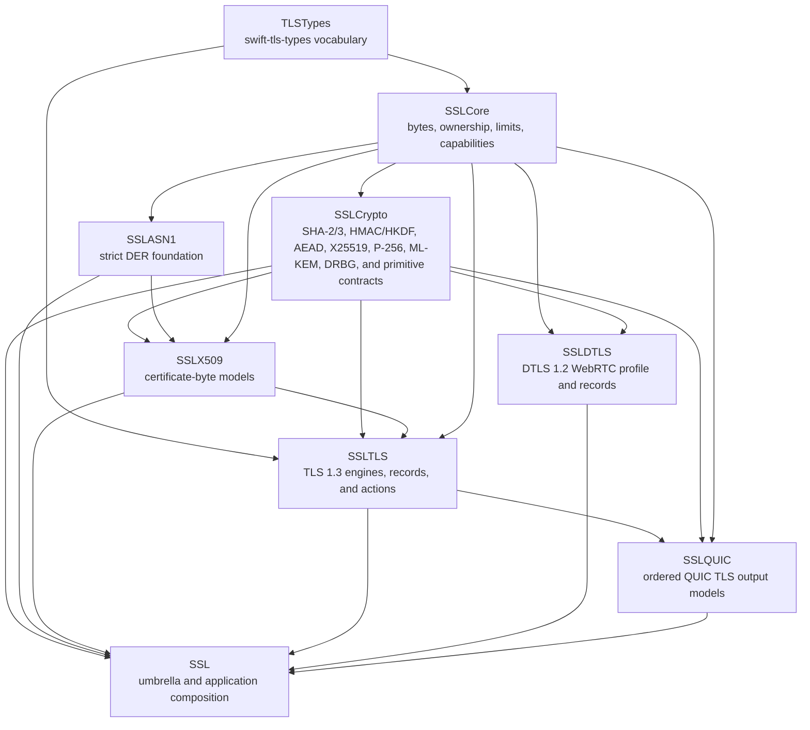
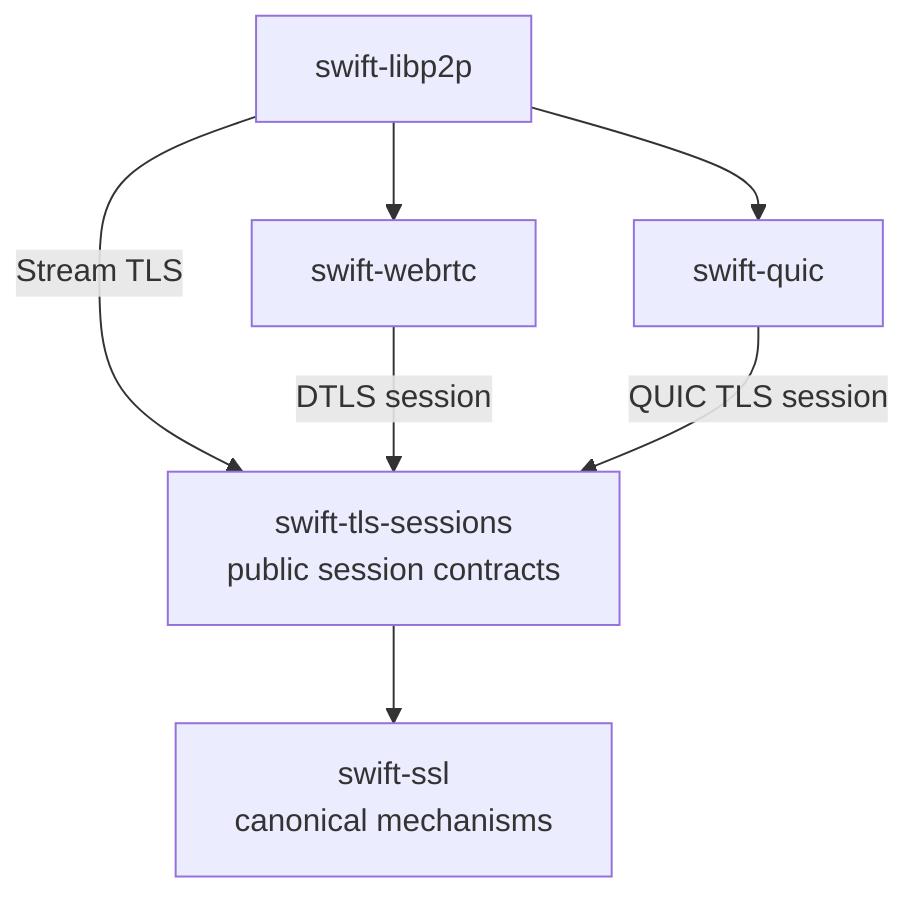
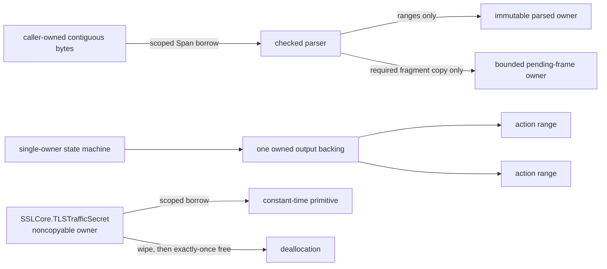
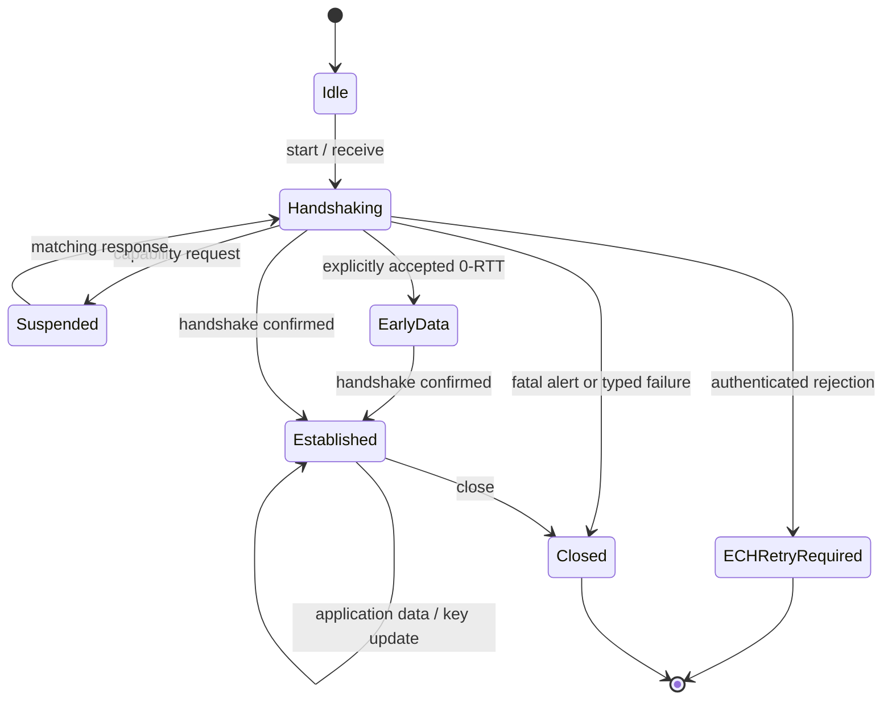

# Architecture

## 1. Definition of replacement

`swift-ssl` replaces BoringSSL by covering each modern security responsibility with a Swift-native owner. It does not replace C symbols one for one. Every BoringSSL subsystem is classified as one of:

1. implemented as a modern security capability;
2. replaced by a Swift language or ownership mechanism;
3. retained only as a policy-gated verification capability for deployed PKI;
4. explicitly excluded as legacy or C-specific infrastructure.

There is no compatibility layer between these classes. Unsupported input produces a typed failure and is never routed to a legacy backend.

## 2. Dependency graph

The current package graph is:

Dependencies between responsibility modules flow downward only. `SSL` is the package umbrella: it re-exports those modules for one-import application use while retaining their separate ownership boundaries. It also owns only application composition, including protocol-backed TLS 1.3 client/server factories; cryptographic and protocol implementations remain in their responsibility modules.

Entropy and clock interfaces and their system implementations live in `SSLCore`. They are composed by purpose—entropy for cryptographic operations, wall time for certificate verification, and monotonic time for DTLS—rather than through one all-capabilities container. Native uses the host POSIX clock backend; WASI and Embedded WASI use WASI clock syscalls. Application storage, trust acquisition, and transport remain injected capabilities.

### 2.1 Workspace ecosystem boundary

The package graph above describes `swift-ssl` internals. Across the networking
workspace, public secure sessions have a separate owner:

`swift-tls-sessions` owns the stable Stream TLS, DTLS, and QUIC TLS configuration,
lifecycle, typed effect, error, and capability-suspension contracts. It maps
those public operations onto the deterministic mechanisms in `SSLTLS` and
`SSLQUIC`; it must not reproduce their transcript, key schedule, wire codec, or
record protection.

`swift-quic` owns CRYPTO offsets/reassembly and all QUIC packet behavior.
`swift-webrtc` owns ICE, DTLS role/fingerprint/session binding, timer delivery,
SRTP/SCTP, and media. `swift-libp2p` is the top-level composition and peer-policy
owner. No dependency from `swift-ssl` to these packages is permitted.

This is the implemented dependency direction. `SSLQUIC` receives only complete
messages and has no offset-qualified input or reassembly state.
The cross-package source of truth is
[Secure Transport Architecture](../../SECURE_TRANSPORT_ARCHITECTURE.md).

## 3. Module responsibilities

| Module | Owns | Must not own |
|---|---|---|
| `TLSTypes` (`swift-tls-types`) | Implementation-independent TLS vocabulary: role, version, cipher-suite identifiers, encryption level, ALPN, and opaque server-name values | Secret ownership, parsing, cryptographic algorithms, policy decisions, transport I/O |
| `SSLCore` | Owned byte storage, scoped byte borrows, checked cursors/builders, resource limits, `TLSTrafficSecret` ownership/wipe/borrow, constant-time utilities, entropy/time capability protocols, shared error primitives | Algorithms, ASN.1 meaning, sockets, Foundation data types |
| `SSLCrypto` | Hash, MAC, KDF, AEAD, key agreement, KEM, signatures, HPKE, fixed-width field/scalar arithmetic, and algorithm policy gates | Certificate policy, TLS negotiation, vocabulary identifiers, OS entropy selection, arbitrary public mutable big integers |
| `SSLASN1` | Strict DER TLV parser/writer, OID and primitive codecs, RFC 7468 PEM boundaries, parse budgets | Certificate validation, BER normalization, algorithm policy, file I/O |
| `SSLX509` | Immutable certificate/CRL/OCSP models, SPKI and private-key containers, path building, RFC 5280 policy, service identity, revocation evidence validation | Network fetching, global trust, UI, silent CN fallback |
| `SSLTLS` | TLS 1.3 handshake and record layers, main/post-handshake server/client certificate authentication with Ed25519, P-256 ECDSA, or RSA-PSS, X25519/`secp256r1`/pinned-hybrid key exchange, DTLS 1.3 framing/replay/flight state, transcript/key schedule, ticket/state/PSK binder primitives, resumption, 0-RTT policy, ECH, alerts, and correlated credential/signature/trust capability suspension | Socket I/O, event loops, DNS, persistent stores, private-key services, and QUIC packet protection |
| `SSLDTLS` | Complete sans-I/O DTLS 1.2 WebRTC mechanism: wire codecs, handshake FSM, ECDHE/signature/certificate seams, cookie/address validation, bounded fragmentation, anti-replay, flights/retransmission state, SRTP negotiation/export, and AES-GCM record protection | Transport I/O, WebRTC SDP/fingerprint policy, ICE, SRTP media packet processing, SCTP, and application lifecycle |
| `SSLQUIC` | Mapping complete, ordered TLS handshake messages, encryption levels, alerts, and traffic-secret events to RFC 9001 | CRYPTO offsets/reassembly, QUIC packets, header protection, loss recovery, congestion control, QUIC key phase |
| `SSLCore` system adapters | Concrete entropy, realtime clock, and monotonic clock backends with typed failures and one cross-target protocol contract | Storage policy, trust acquisition, transport, or target-specific weakening of ownership/concurrency contracts |
| `SSL` | One-import umbrella, curated primitive adapters, and protocol-backed TLS client/server composition over explicit platform and external credential/trust capabilities | Duplicate cryptographic/protocol implementation, socket ownership, private-key service ownership, or hidden fallback |

## 4. Ownership and zero-copy model

The following rules are contractual:

- Public hot-path input is borrowed as `Span<UInt8>` or `RawSpan`; output is written into caller-provided mutable spans when its final size is known.
- A pointer derived from a span never escapes its lexical borrow.
- Parsed objects own one immutable contiguous DER buffer and retain integer ranges, not independent byte arrays.
- A parser copies only an incomplete frame that must survive the current call. That copy is bounded and measured.
- An action batch owns one output buffer. Individual actions retain ranges into that buffer.
- Secret material is owned by a noncopyable type, is never returned as an `Array` or `Data`, and is erased before exactly-once deallocation.
- Incremental keyed contexts use a noncopyable public owner over one private, stable storage object. Key-derived hash state is mutated and wiped at its original address; the storage reference does not escape or cross a `Sendable` boundary.
- Public keys, ciphertexts, encoded certificates, and wire messages are ordinary owned bytes; they are not mislabeled as secret memory.
- Unsafe code is isolated to small internal storage and primitive kernels with explicit owner, range, initialization, alignment, aliasing, and synchronization invariants.

## 5. Protocol families

Protocols describe semantic responsibilities; concrete algorithms and parsers remain separate types. Hot loops use generic specialization or closed internal dispatch after negotiation. Type erasure is limited to configuration and capability boundaries.

### 5.1 Core capabilities

| Protocol | Contract |
|---|---|
| `EntropySource` | Fills a caller-owned mutable span or reports a typed entropy failure. No partial-success or deterministic fallback. |
| `WallClock` | Supplies an explicit verification instant for certificate, ticket, and ECH validity policy. |
| `MonotonicClock` | Supplies deadlines and elapsed time for DTLS retransmission and resource budgets. |
| `DiagnosticSink` | Receives structured, redacted diagnostics outside critical sections; it cannot receive secret bytes. |

### 5.2 Cryptographic primitives

| Protocol | Semantic boundary |
|---|---|
| `HashFunction` / `HashContext` | Incremental and one-shot digest with fixed output size. |
| `MessageAuthenticationCode` / `MessageAuthenticationCodeContext` | Algorithm/factory plus noncopyable keyed context; one-shot and incremental operations share the same cryptographic core while using scoped inline and stable escaping storage respectively, and verification is constant time for equal-length tags. |
| `ExtractAndExpandKeyDerivationFunction` | Extract/expand semantics with caller-owned output; TLS and HPKE labels remain separate constructions. |
| `AuthenticatedCipher` | Seal/open with explicit nonce and associated data; failed open exposes no plaintext. |
| `KeyAgreement` | Validates peer public input and returns a noncopyable shared secret. |
| `KeyEncapsulationMechanism` | Key generation, encapsulation, and decapsulation with `KEMError`; correctly sized ML-KEM ciphertexts use implicit rejection rather than a validity-revealing error. |
| `DigitalSignature` / `SignatureVerifier` | Message signing refines message verification and requires distinct noncopyable private and owned public key types; Ed25519 implements both capabilities. |
| `DigestSignatureVerifier` | Verifies a caller-selected digest without requiring a signing API; P-256/P-384/P-521 expose fixed-width verification and deterministic RFC 6979 signing through separate private-key owners. |

P-256 secret key agreement is shared by RFC 9180
DHKEM(P-256, HKDF-SHA256) and the role-specific TLS 1.3 `secp256r1` key-share
owners. It is selectable by Stream TLS, DTLS, and QUIC TLS but not by
CertificateVerify. It is available through the `SSL` umbrella without
moving its implementation out of `SSLCrypto` and `SSLTLS`.

Algorithm input errors, policy errors, authentication failures, and resource exhaustion are different typed error families.

### 5.3 PKI capabilities

| Protocol | Contract |
|---|---|
| `TrustStore` | Returns immutable trust records; trust is data supplied by the caller, never a process-global singleton. |
| `IssuerResolver` | Asynchronously obtains candidate issuer objects outside the path builder. |
| `RevocationEvidenceProvider` | Obtains OCSP/CRL evidence; fetching and cryptographic validation are separate operations. |
| `CertificatePolicy` | Value describing identity, time, key usage, algorithm, name-constraint, and revocation policy. |
| `PeerTrustEvaluator` | External capability boundary used by a TLS driver; the TLS state machine receives only a correlated result. |

The DER parser is a concrete value type, not a capability protocol. Parsing is deterministic and has no I/O.

### 5.4 TLS capabilities

The engine never invokes asynchronous providers or reentrant callbacks. It emits a correlated request, becomes suspended at a typed continuation point, and resumes only with a matching result.

| Protocol or value | Responsibility |
|---|---|
| `TLSProfile` | Package-sealed protocol associating the legal inbound channel and one concrete action type for TLS stream, DTLS, or QUIC integration. |
| `TLSBatchAction` | Package-sealed validation protocol exposing the optional checked byte range owned by a concrete public action batch. |
| `CredentialProvider` | Selects an immutable credential descriptor for a request. |
| `PrivateKeySigner` | Performs external or local private-key signing without exposing the key to the engine. |
| `SessionRepository` | Loads/consumes/stores resumption state outside the engine. |
| `TicketProtector` | Protects and opens server tickets under explicit rotation policy. |
| `TLS13EarlyDataReplayProtecting` | Atomically authorizes one authenticated server 0-RTT attempt from ticket identity, ticket age, and negotiated ALPN; absence means rejection, not implicit acceptance. |
| `ECHConfigProvider` | Supplies immutable ECH configuration/key snapshots; DNS acquisition and key rotation stay outside the engine. |
| `TLS13ClientIdentity` | Client-owned certificate chain and noncopyable signer, validated for certificate/key correspondence before the handshake starts. |
| `TLS13ClientCertificateValidating` | Server-injected, synchronous, I/O-free client path and revocation validation boundary. |
| `TLS13ClientAuthenticationConfiguration` | Server policy pairing optional/required certificate presence with one validator. |
| `TLS13ValidatedClientCertificate` | Path-validated client material retained internally until CertificateVerify and Finished establish peer authentication. |

## 6. Deterministic protocol engines

The core connection is a single-owner mutable value with synchronous `step` operations.

Inputs include borrowed inbound bytes with a profile-specific channel, application intent, capability responses, timer events, and close intent. Outputs include owned wire bytes, delivered application ranges, secret-install events, capability requests, timer requests, session events, alerts, diagnostics, and terminal outcomes.

The three transport profiles use distinct concrete action enums and concrete public batch owners. Shared handshake state does not imply a shared effect surface: stream actions cannot express DTLS flight control, DTLS actions cannot express QUIC encryption levels, and QUIC TLS actions cannot express TLS records or TLS application data. Construction is package-restricted so an external conformance cannot hide an unchecked byte range.

An output that mixes copyable actions with noncopyable secrets has one noncopyable transfer owner and an ordered descriptor tape. Each descriptor refers to exactly one action index or one fixed secret slot. Package-restricted construction rejects missing, duplicate, or out-of-range references before the output reaches a driver. Iteration preserves the declared order; taking a secret consumes that slot exactly once.

A future capability request is a terminal suspension result, not an ordinary callback and not an effect that can be followed by more engine output before a response. Its token contains engine identity, a monotonically increasing sequence, and capability kind. Resumption must reject no-pending, duplicate, stale, wrong-kind, and wrong-state responses with typed errors. The current synchronous profile does not expose asynchronous capability requests; those are still required for external private-key and trust-provider integration.

Early data is not an established session. The client must provide
`TLS13EarlyDataClientConfiguration`, the ticket must authorize a positive byte
limit, and the ticket ALPN must match the new offer. The server first verifies
the PSK binder, ticket age, cipher suite, and selected ALPN, then invokes
`TLS13EarlyDataReplayProtecting`. A missing configuration or `.reject` decision
rejects early data without rejecting a valid resumed handshake. A replay-policy
error fails the handshake explicitly. Acceptance is independently decided from
resumption acceptance and early data is never automatically retransmitted.

`TLS13EarlyTrafficSecret` is a distinct noncopyable client-to-server owner.
Stream TLS installs it as the client write/server read key and sends
EndOfEarlyData under that key before the client Finished. A rejecting Stream
server derives a discard-only early key when the authenticated PSK is known; if
the ticket is unknown, unauthenticated application-data records are discarded
until a record authenticates with the handshake key. No rejected plaintext is
delivered. QUIC emits only client-write/server-read 0-RTT secret events and
omits EndOfEarlyData as required by its TLS mapping. HelloRetryRequest rejects
the attempt and removes `early_data` from the second ClientHello. DTLS 1.3 does
not expose 0-RTT and rejects an offer.

Handshake and record parsing keep one owned byte backing plus checked ranges or
scoped spans. The replay context intentionally copies the small ticket identity
once because the injected policy receives an independently owned `Sendable`
value; application payloads are never materialized for policy evaluation.

Client authentication follows one transport-independent core path. `TLS13ClientAuthenticationConfiguration` selects main-handshake, post-handshake, or both timings and retains the optional/required server policy. The client retains its noncopyable `TLS13ClientIdentity` when the main handshake does not request it and reuses the same owner for a later request. A matching identity produces Certificate and CertificateVerify; an absent or incompatible identity produces the protocol-defined empty Certificate. External credential selection, signing, and trust evaluation suspend through typed capability tokens without changing the transcript contract. The server's validator authenticates the certificate path before CertificateVerify, but `authenticatedClientIdentity` changes only after the client's signature and Finished both verify.

Each post-handshake exchange clones the transcript through the main-handshake client Finished, appends only that exchange's non-empty and unique CertificateRequest context, and authenticates its Finished with the current client application traffic secret. Concurrent exchanges and reused contexts fail explicitly. The caller supplies the request context and is responsible for generating an unpredictable value. Stream TLS seals these messages as application-key handshake records and DTLS sends them as application-epoch flights. QUIC exposes no post-handshake-authentication operation because its TLS mapping permits only NewSessionTicket after handshake completion.

### 6.1 TLS stream profile

The profile owns TLS 1.3 records, transcript/key schedule, main- and post-handshake client authentication, encrypted NewSessionTicket transport, ticket/state/PSK binder values, 0-RTT record delivery/discard, post-handshake KeyUpdate, close, and supported modern extensions. It consumes and emits byte streams but performs no I/O. Application traffic and exporter secrets use the transcript through Server Finished; a distinct resumption-master owner is created only from the transcript through Client Finished. Ticket issuance returns both the encrypted wire output and the move-only server state that the application must persist. PSK identity selection, binder transcript construction, ticket age validation, early-data replay authorization, and the resumed handshake are explicit engine operations. Cross-process replay coordination and ticket persistence remain application policy boundaries.

### 6.2 DTLS profile

The profile adds epochs, record sequence numbers, record-number protection, replay windows, handshake fragmentation/reassembly, flights, ACKs, retransmission state, connection IDs, post-handshake client authentication, DTLS KeyUpdate, and DTLS-SRTP negotiation/export. The transport owns datagram I/O, path MTU decisions, media transport, and timer delivery.

DTLS retransmission is the one deliberate retained-wire exception in the
ownership model. `SSLTLS` owns the bounded retransmission flight because the
engine must reproduce the exact handshake bytes and epoch metadata after a
timer event. The flight is an immutable owner with a checked byte range; no
borrowed transport pointer is retained. The transport only schedules the timer
and sends a scoped borrow of the retained flight.

Invalid or replayed datagrams produce an explicit disposition/diagnostic value where the protocol requires discard. A discard is not represented as successful application data.

### 6.3 QUIC profile

The profile exchanges TLS handshake bytes at Initial, Handshake, and 1-RTT QUIC CRYPTO levels and emits traffic secrets and level-qualified alerts. The CRYPTO-level type intentionally has no 0-RTT case. A separate traffic-secret level includes 0-RTT, Handshake, and 1-RTT.

Wire actions remain copyable metadata backed by one ordinary `OwnedBytes` value. Traffic secrets remain in six fixed noncopyable slots representing read/write × 0-RTT/Handshake/1-RTT. `QUICTLSStepOutput` combines the copyable descriptor order with those separate owners, so a driver observes the exact action/secret sequence without putting secrets in an array or ordinary byte backing. `nextEffect()` consumes each secret slot at most once, and `withBorrowedBytes` exposes the wire backing only through a scoped borrow.

QUIC owns CRYPTO offsets/reassembly, transport parameter encoding/validation, packet/header protection, packet number spaces, ACK/loss recovery, and key-phase updates.

TLS records, TLS application-data records, compatibility ChangeCipherSpec, EndOfEarlyData, and TLS KeyUpdate are forbidden in the QUIC profile.

### 6.4 ECH

ECH owns config parsing/selection, HPKE inner/outer processing, padding, confirmation, HelloRetryRequest continuation, and accepted/rejected state. The callable profile reuses one HPKE context across the two ClientHello messages, sends an empty second encapsulation, verifies the HelloRetryRequest acceptance confirmation, recomputes a resumed-handshake binder over the replaced transcript, and rejects a second HelloRetryRequest. DNS SVCB/HTTPS lookup, immutable key snapshot rotation, and retry transport establishment are external responsibilities.

An authenticated ECH rejection is a terminal `ECHRetryRequired` outcome for the current transport. The engine does not release origin application data or consume tickets on that connection.

## 7. Parsing and PKI invariants

- X.509 accepts strict DER only. BER normalization and permissive repair are not hidden parser modes.
- High-tag numbers, lengths, integer encodings, BOOLEAN defaults, SET ordering, duplicate extensions, and algorithm parameters are checked for canonical form where required.
- All offset and length arithmetic is overflow checked.
- Parsing uses explicit limits for input bytes, nesting depth, element count, extension count, OID bytes, and string bytes.
- Successful parsing establishes syntax only. Semantic certificate validity and path validity are separate results.
- Path construction is bounded independently by depth, iterations, candidate count, and deadline. A partial chain is not success.
- Service identity uses subjectAltName. Common Name fallback is absent.
- Revocation acquisition, evidence validation, and hard/soft-fail policy are distinct.
- No parser or verifier performs network I/O.

## 8. Concurrency

A connection state machine has one mutable owner and therefore does not lock internally. Shared providers and stores use `Synchronization.Mutex<State>` for short synchronous memory state or actors where ordered suspension is required.

The storage type, isolation primitive, `Sendable` conformance, read path, mutation path, shutdown behavior, and owner-release behavior are identical on Native, WASI, and Embedded targets. Target-specific branches cannot replace synchronized state with raw mutable state.

External callbacks, event emission, I/O, and `await` never occur while a mutex is held.

## 9. Error model

There is no process-global or thread-local error queue.

| Family | Meaning |
|---|---|
| Byte/parser errors | Malformed, noncanonical, truncated, overflowing, or over-budget input |
| Crypto input errors | Invalid length, invalid key, invalid encoding, context too long |
| Crypto operation errors | Authentication failure, output too small, sequence/message limit, entropy failure |
| Algorithm policy errors | Unsupported, disallowed, or experimental algorithm not enabled |
| PKI errors | Path not found, constraint failure, identity mismatch, invalid evidence, resource limit |
| TLS protocol errors | Peer wire violation paired with the required alert or discard disposition |
| TLS configuration errors | Local contradictory or unsupported configuration before wire processing |
| TLS capability errors | Failed, stale, duplicated, or mismatched external response |

Errors are not converted to default values. Authentication failures never expose unauthenticated plaintext. ML-KEM decapsulation follows the standard implicit-rejection contract for correctly sized ciphertext and therefore does not create a validity oracle.

## 10. Platform and compliance boundary

The Pure Swift implementation provides source portability, not automatic platform assurance. Platform adapters must explicitly establish entropy, timing, storage, zeroization, and synchronization semantics. A target receives only the capabilities required by the operation being constructed; the absence of a capability makes that composition unavailable instead of setting a Boolean flag or choosing a fallback.

No separate `SSLPlatform` product exists. `SSLCore` provides system entropy and clock adapters with typed Native/WASI/Embedded WASI backends. Applications provide storage, trust acquisition, transport, and any deployment-specific capability conformers.

The library does not claim FIPS validation. Algorithm conformance, known-answer tests, a reproducible build, and a validated cryptographic module are separate facts.

## 11. Completion gates

A responsibility is complete only when all of the following are true:

1. the production path contains a real implementation and typed failure behavior;
2. official positive and negative vectors pass;
3. differential or independent-oracle tests cover success and failure semantics;
4. Native, WASI, and Embedded WASI compile and link with the pinned toolchain;
5. executable targets run on every available target, with unexecutable targets reported as unverified;
6. unsafe paths pass boundary, lifetime, overflow, and sanitizer checks where available;
7. the interoperability matrix passes for the relevant wire protocol or format;
8. allocation, copy, and performance budgets are measured;
9. documentation and the responsibility matrix match the implementation.
