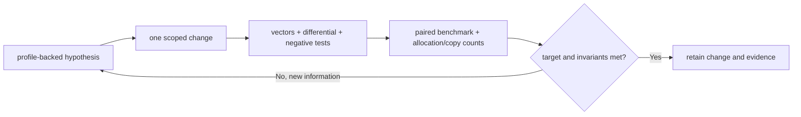

# Verification and benchmark policy

## 1. Evidence ladder

No single test class establishes correctness for cryptographic or protocol code.

```mermaid
flowchart LR
    KAT["official KATs and vectors"] --> Differential["independent differential oracle"]
    Differential --> Negative["negative and boundary behavior"]
    Negative --> Interop["cross-implementation interoperability"]
    Interop --> Fuzz["coverage-guided fuzzing"]
    Fuzz --> Targets["Native / WASI / Embedded execution"]
    Targets --> Sanitizers["ASan / TSan / UB checks where available"]
    Sanitizers --> Performance["allocation, copy, latency, throughput"]
    Performance --> Release["security review and release gate"]
```



Tests validate the actual production implementation path. Type existence, output length, or round-trip through the same implementation is never sufficient evidence by itself.

## 2. Test classes

| Location | Purpose | Normal test run |
|---|---|---|
| `Tests/` | Fast deterministic correctness, official vectors, boundary failures, state transitions | Yes |
| `Validation/Differential/` | Cross-check against independent implementations and generated fixtures | No |
| `Validation/Interop/` | TLS/DTLS/QUIC/X.509 interoperability peers and wire captures | No |
| `Validation/Fuzzing/` | Parsers, key decoders, records, handshake state, certificates, tickets | No |
| `Validation/Sanitizers/` | Unsafe lifetime, overflow, initialization, deallocation, and race harnesses | No |
| `Validation/Targets/` | Compile/link/run probes for WASI and Embedded WASI | No |
| `Benchmarks/` | Performance workloads, BoringSSL baselines, allocation/copy instrumentation, raw results | No |

Normal native tests use `xcodebuild test` under an external timeout. Benchmark and validation programs are separate executable targets and are never dependencies of test targets.

## 3. Required behavior evidence

### Cryptographic primitive

- official known-answer vectors;
- boundary lengths and incremental split points;
- invalid key/input/nonce/output sizes;
- authentication or signature failure behavior;
- aliasing and overlapping-buffer policy;
- output unchanged or inaccessible after failure where required;
- differential checks against at least one independent implementation;
- algorithm-specific invariants such as ML-KEM implicit rejection and HPKE sequence exhaustion.

### Parser and PKI

- valid and invalid official fixtures;
- truncation at every byte boundary for representative structures;
- noncanonical length, integer, BOOLEAN, OID, SET, and algorithm parameters;
- depth, element, byte, candidate, iteration, and deadline exhaustion;
- duplicate extensions and trailing-data rejection;
- path loops, competing issuers, constraints, policy, time, identity, and revocation outcomes;
- independent PKI test suites and cross-validation where semantics agree.

### TLS, DTLS, and QUIC

- full client and server state transitions;
- transcript and traffic-secret comparison against vectors;
- every alert-producing negative path;
- fragmented and coalesced input at every legal boundary;
- asynchronous capability suspension, stale response, duplicate response, and failure;
- resumption independently from 0-RTT acceptance;
- ECH accept, authenticated reject/retry, HelloRetryRequest, and key rotation snapshot behavior;
- DTLS replay, reordering, loss, fragmentation, ACK, retransmission, epoch, and timer behavior;
- QUIC encryption-level ordering, forbidden TLS messages, transport parameters, and secret events;
- interoperability with at least two independent peer implementations for each supported profile.

## 4. Cross-target evidence

Every log records:

- toolchain identifier and compiler commit;
- Swift SDK identifier and target triple;
- Embedded platform implementation and linked runtime libraries;
- compile, link, and execution outcome separately;
- whether sanitizers are available;
- concurrency and entropy capabilities exercised.

Native success does not substitute for WASI or Embedded execution. Compile-only targets are reported as unverified for runtime semantics.

Shared-state changes require this review matrix:

| Logical state | Native storage/isolation | WASI storage/isolation | Embedded storage/isolation | Read/mutation entry points | Shutdown/release |
|---|---|---|---|---|---|
| Template | Must match | Must match | Must match | Must match | Must match |

## 5. Unsafe verification

Each unsafe boundary documents and tests:

- memory owner and exactly-once deallocation;
- borrow duration and pointer non-escape;
- byte count, stride, offset, alignment, and overflow checks;
- initialized and uninitialized regions;
- binding, aliasing, and mutation exclusivity;
- owner retention and synchronization across `Sendable` boundaries;
- success, failure, cleanup, zero-length, maximum-length, and overlapping-input behavior.

Address Sanitizer and Thread Sanitizer are required on supported host configurations. WASI and Embedded gaps are covered by shared host fixtures plus target-specific boundary programs. Generated SIL/LLVM is inspected for security-sensitive erasure and constant-time kernels before making those claims.

## 6. Copy and allocation budgets

Hot paths define a budget before optimization.

| Path | Required budget |
|---|---|
| Hash update | 0 input copies; 0 heap allocations after context creation |
| HMAC context creation | One stable storage allocation for an escaping incremental context; the concrete scoped one-shot path uses inline prepared/working contexts and must compile without heap allocation |
| HMAC update | 0 additional input copies; 0 heap allocations and 0 reference-count operations |
| HKDF expand | 0 heap/container materializations of caller input; one fixed 64-byte HMAC key-schedule scratch per operation; two inline working SHA-256 contexts plus one wiped 32-byte inner digest per block; full digest blocks written directly to caller output; at most one additional wiped 32-byte temporary for a partial final block; optimized allocation count must be 0 |
| AEAD seal/open | 0 input copies when nonoverlapping buffers are supplied; 0 heap allocations after context creation |
| X25519 in-place public-key derivation/shared-secret | 0 heap allocations after caller output creation; 0 dynamic bulk-copy bytes; encoded peer input remains borrowed; caller output is unchanged on length or all-zero-peer failure; no escaping unsafe pointer |
| ML-KEM-768 key generation | 17 balanced allocations requesting 20,640 bytes; owned serialized/expanded keys and algorithm workspaces; 0 dynamic bulk-copy bytes beyond fixed process overhead |
| ML-KEM-768 in-place encapsulation | 5 balanced aligned workspace allocations requesting 6,096 bytes; 0 general `malloc`; 0 caller-input/output materializations; 0 dynamic bulk-copy bytes |
| ML-KEM-768 in-place decapsulation | 11 balanced aligned workspace/secret allocations requesting 9,808 bytes; 0 general `malloc`; 0 caller-input/output materializations; 0 dynamic bulk-copy bytes |
| ML-KEM-1024 key generation | 17 balanced allocations requesting 31,008 bytes; owned serialized/expanded keys and algorithm workspaces; 0 dynamic bulk-copy bytes beyond fixed process overhead |
| ML-KEM-1024 in-place encapsulation | 5 balanced aligned workspace allocations requesting 7,632 bytes; 0 general `malloc`; 0 caller-input/output materializations; 0 dynamic bulk-copy bytes |
| ML-KEM-1024 in-place decapsulation | 11 balanced aligned workspace/secret allocations requesting 12,336 bytes; 0 general `malloc`; 0 caller-input/output materializations; 0 dynamic bulk-copy bytes |
| X25519MLKEM768 client offer | 17 balanced allocations requesting 15,656 bytes for final owners, noncopyable key material, and ML-KEM workspaces; 0 dynamic bulk-copy bytes |
| X25519MLKEM768 server accept | 15 balanced allocations requesting 14,464 bytes for final owners, noncopyable key material, and ML-KEM workspaces; borrowed client share; 0 dynamic bulk-copy bytes |
| X25519MLKEM768 full round trip | 45 balanced allocations requesting 40,032 bytes; role-specific received shares remain borrowed; 0 dynamic bulk-copy bytes |
| HMAC-DRBG generate | Caller-owned output; K/V remain in one `SecretBytes` owner; temporary HMAC messages and digests are wiped before return; entropy input is copied only into bounded seed material |
| DER field access | 0 field copies after certificate parse; ranges borrow the certificate owner |
| TLS complete inbound record | 0 record copies; plaintext written once into the action batch |
| TLS incomplete record | At most one bounded copy of the unconsumed fragment |
| TLS outbound action batch | One backing allocation, range-only actions |
| QUIC handshake input | 0 copy for a complete contiguous CRYPTO fragment; bounded copy only for state that must survive the call |

Instrumentation must measure actual allocation and copy counts. A zero-copy claim is not inferred solely from use of `Span` or unsafe pointers.

The committed X25519MLKEM768 steady-state measurement is
`Benchmarks/TLSHybrid/Results/20260801T150811Z-native-tls-hybrid-memory.json`
(SHA-256
`c50b8a82b8d411ed4e71e24a9dfbf1c458f57c80270bfc4ff12212592d41c7c0`).
It executes one exact-path operation outside each probe window to initialize
Swift runtime metadata. Cold-start allocation is not part of the reported
per-operation slopes.

## 7. Benchmark methodology

Benchmarks are manually invoked from `Benchmarks/` and never run through the normal correctness-test scheme.

### 7.1 Comparison contract

- Compare the same operation, algorithm parameters, input bytes, output validation, and CPU feature policy.
- Build both workers inside the benchmark runner from read-only `git archive` snapshots of clean pinned commits in a fresh build root; reject every formal snapshot symlink; prebuilt, caller-selected, or live mutable source inputs are not formal evidence. Exploratory runs may use dirty live `swift-ssl` sources, but BoringSSL remains pinned, official-origin, and clean.
- Run build and worker processes with an explicit environment allowlist and fixed `PATH`. Unlisted compiler, linker, CMake, coverage, sanitizer, and dynamic-loader variables must not cross the benchmark boundary. Set `SDKROOT` only from the already verified absolute SDK path.
- Execute top-level build and inspection operations with the resolved executable while preserving required driver names; record invocation and resolved paths, reject retargeted invocation paths, and recheck executable hashes after sampling.
- Pin the exact `swift-ssl` commit and tree, BoringSSL commit and tree, Swift compiler, C/C++ compiler, Xcode build, SDK build, optimization flags, arm64 target triple, and deployment target. Record the exact machine model, OS, power mode, load, declared competing build-process families, and thermal state.
- Parse both Mach-O binaries and build logs/compile databases to verify architecture, platform, deployment target, linked SDK version, SDK path, and optimization configuration.
- Validate the pinned compile-command shape for every Swift module used by the worker and every BoringSSL compile-database entry. Require exactly one verified fresh-scratch Swift source-list response per module and reject every other Swift response or external-input option; reject every BoringSSL response/configuration file, external source root, mixed or repeated optimization, target, SDK, deployment, sanitizer, coverage, or assembly-disable flag. Validate every built BoringSSL object's Ninja dependency closure against the selected source, benchmark driver, pinned SDK, and pinned Clang resource roots. Bind the BoringSSL worker link to the fresh benchmark object and `libcrypto.a`.
- Require the exact BoringSSL benchmark driver, Apple ARM capability source, SHA-256 wrapper, BCM translation unit, and Apple ARM64 SHA-256 assembly source; require `CRYPTO_has_asm()` at runtime; inspect the timed loop, public one-shot/incremental functions, linked BCM hardware dispatch, and complete ARMv8 SHA instruction schedule.
- Inspect the Pure Swift worker machine code and reject a timed loop containing copy-on-write uniqueness checks, buffer growth, allocation, retain/release, `memcpy`, `memmove`, a direct call outside the declared SHA-256 context path, or an external direct, conditional, compare-and-branch, test-and-branch, or indirect transfer. Validate the complete direct-call contracts of update and finalization separately, including unconditional backedges.
- Inspect the production ARM64 SHA-256 multi-block kernel and reject code generation unless the context has one non-looping kernel call site, constants are hoisted before one call-free block loop, the only memory operations in that loop are the two input loads, each loop body contains the complete hardware round schedule, and the returned state vectors are stored once after the call.
- Recheck both source revisions and origins, BoringSSL cleanliness, both worker hashes, and the complete BoringSSL dependency-content manifest after sampling. Formal runs additionally recheck Swift cleanliness, source snapshot manifests, and archive hashes before writing the artifact.
- Require at least 3 GiB available before building and retain at least 256 MiB for post-build and final failure/success artifact writes. Atomically publish without replacing an existing artifact path.
- Keep setup, allocation, key expansion, parsing, and random generation either inside both timed regions or outside both.
- Fix the headline workload matrix before measuring; the Native SHA-256 matrix is 64 B, 1 KiB, and 16 KiB.
- Calibrate an identical iteration count until both implementations meet the declared minimum sample duration.
- Warm both implementations to a declared convergence rule before sampling.
- Require AC power, Low Power Mode disabled, no thermal/performance warning, no process from the declared compiler/linker/build families, and bounded load after building and before every convergence or sample pair for both formal and exploratory timing. An unavailable process observation is an invalid state.
- Randomize implementation order across paired samples.
- Completely compare every declared validation fixture outside the timed region and fail the run on any mismatch; a checksum or final output alone is insufficient.
- Record an even count of at least 30 independent paired samples after warm-up and retain raw data.
- Report median, p95, dispersion, confidence interval, bytes/second, and operations/second in the timing artifact. Report allocation/copy counts in a separate instrumented artifact and require both evidence classes for release.
- Treat an overlapping confidence interval around the target as inconclusive, not as success.

### 7.2 Performance target

For every workload in a selected supported hot-path matrix, the release target is:

```text
lower95CI(median(BoringSSL elapsed / swift-ssl elapsed)) >= 1.10
```

The paired median and its confidence interval are the normative estimator because each pair shares the closest environmental conditions. Ratio of median throughputs remains descriptive. Every fixed workload must pass; a favorable size cannot substitute for a failing size. Latency workloads use the equivalent paired inverse ratio. Security, correctness, constant-time behavior, and memory invariants are hard gates; the implementation is not weakened to obtain the ratio.

Results are added to `README.md` only from committed raw artifacts with the full comparison contract. Missing or failed measurements remain explicit and are never represented as zero or success.

## 8. Iterative optimization loop



The loop converges only when the performance budget is met with correctness and security gates intact, or when a documented physical/compiler limitation is established. A time or iteration limit alone is not convergence.
