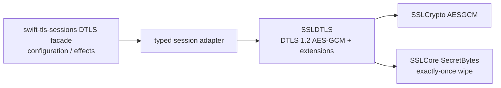

# ADR 0002: Own DTLS 1.2 record protection in SSLDTLS

## Context

The WebRTC profile requires DTLS 1.2 AES-GCM records, explicit nonces, and
authenticated-data construction. Keeping record protection in the session
facade would duplicate the cryptographic owner and make the mechanism depend on
the facade's compatibility representation.

## Decision

`SSLDTLS` owns the DTLS 1.2 wire, handshake, key material, AES-GCM record
operation, sequence/epoch/replay state, flights, retransmission state, SRTP
negotiation, and exporter. Its primitive boundary borrows plaintext, explicit
nonce, and authenticated data as `Span<UInt8>` and returns an `OwnedBytes`
result. `SecretBytes` remains the unique key owner and wipes the key when the
owner is released.

`swift-tls-sessions` uses a small typed adapter that converts its existing
compatibility arrays at the package boundary. The adapter does not implement a
second AEAD and does not silently fall back to another provider.

## Consequences

- Stream TLS consumers do not link DTLS code unless they select `SSLDTLS`.
- Payload input is borrowed and the record path has one owned output allocation.
- The facade may copy at its owned-array boundary; that copy is outside the
  canonical `SSLDTLS` record path and does not create a second cryptographic
  implementation.
- Browser/native differential tests and real network loss/reorder validation
  remain release evidence gates, not alternative mechanism owners.
