# ADR 0010: Bind Formal Benchmarks to Runner-Owned Fresh Builds

## Status

Accepted.

## Context

A timing artifact is not reproducible evidence when it accepts arbitrary
prebuilt executables. Recording a binary hash and a source commit does not prove
that the executable was produced from that source. A caller can accidentally
select a stale experimental worker while every statistical check still passes.

Single-size measurements also permit an implementation to report only a
favorable message length. Fixed warm-up counts and unchecked host load leave
frequency ramp, competing builds, and thermal state inside the comparison.

## Decision

The SHA-256 comparison runner owns the complete formal measurement transaction:

```mermaid
flowchart LR
    Sources["Clean pinned commits"] --> Archives["Read-only git archives"]
    Archives --> Build["Fresh runner-owned builds"]
    Build --> Validate["Complete digest fixtures"]
    Validate --> Converge["Duration calibration and pilot convergence"]
    Converge --> Sample["Fixed three-size paired sampling"]
    Sample --> Recheck["Source, binary, and host recheck"]
    Recheck --> Artifact["Self-contained raw artifact"]
```

- Formal runs accept source paths, never worker executable paths.
- The runner creates read-only `git archive` snapshots from both recorded
  commits and builds only the extracted snapshots. Formal snapshots containing
  any symlink are rejected.
- Build and runtime subprocesses inherit only an explicit environment allowlist;
  all unlisted variables and the parent `PATH` are discarded. `SDKROOT` is set
  by the runner to the verified SDK path.
- Top-level tools execute the recorded resolved binary while retaining the
  required driver name. Invocation bindings and executable hashes are recorded
  and rechecked after sampling.
- The runner creates a new build root and records verbose build output, compiler
  and SDK paths/builds, the CMake compile database, target/deployment flags,
  Mach-O metadata, and binary hashes.
- The exact compile command for every required Swift module and every BoringSSL
  compile-database entry must satisfy the Release optimization, compiler,
  architecture, SDK, deployment, sanitizer, and coverage contract. Swift
  requires one verified fresh-scratch source-list response per module and
  rejects every other response or external-input option. BoringSSL rejects all
  response/configuration files, and every built object's Ninja dependency
  closure must remain inside the selected source, benchmark driver, pinned SDK,
  and pinned Clang resource roots. The final BoringSSL link is bound to the
  fresh benchmark object and archive.
- Both workers are arm64 Release binaries with macOS 15.0 as the deployment
  target and linked SDK 27.0. The Xcode and macOS SDK builds are pinned. The
  fixed snapshot uses SwiftPM's `native` build system because its final Mach-O
  preserves the requested SDK metadata; this is one explicit build contract,
  not a fallback.
- BoringSSL assembly-disable flags are rejected. The compile database must
  include the five exact SHA-256/Apple ARM64 responsibility sources, the runtime
  must report assembly enabled, and the timed public-one-shot-to-BCM-to-hardware
  path and SHA instruction schedule must pass inspection.
- The Pure Swift timed loop is disassembled and rejected if it contains COW
  uniqueness checks, buffer growth, allocation, retain/release, bulk copies, or
  a direct call or external direct, conditional, compare-and-branch,
  test-and-branch, or indirect transfer outside the declared SHA-256 context
  path. The direct-call sets of the context update and finalization functions
  are validated separately, and unconditional backedges are included.
- Native SHA-256 always measures 64-byte, 1-KiB, and 16-KiB one-shot inputs.
- Before timing, all 256 possible low-byte input mutations are compared at each
  headline size using complete digests.
- Both workers must exceed the minimum sample duration with one identical
  iteration count.
- A pilot converges only when the latest three normalized durations for each
  implementation remain within five percent of their median.
- Every timing classification requires AC power, Low Power Mode disabled, no
  thermal or performance warning, no process from the declared
  compiler/linker/build families, an available process observation, and bounded
  load per logical CPU after building and before convergence and sample pairs.
- Source revisions, origins, clean-tree state, source archive hashes,
  extracted-tree manifests, BoringSSL dependency contents, and worker hashes
  are checked again before the raw artifact is written.
- Storage capacity is checked before building, after building, and before the
  final artifact write. Artifact publication is atomic and never replaces an
  existing path. An unwritable failure artifact never becomes a valid result.
- Every headline workload must pass the paired 95% confidence-interval target.

## Consequences

- Formal runs are slower because both implementations are rebuilt and the host
  may need to cool after compilation.
- Build logs and compile metadata make raw artifacts larger.
- Exploratory runs may use dirty live `swift-ssl` sources, but BoringSSL remains
  pinned, official-origin, and clean. They use the same fresh-build, cooling,
  quiescence, and fixed-workload path and are labeled ineligible for release
  evidence.
- Allocation and copy counts remain a separate instrumented artifact; timing
  evidence alone does not satisfy the memory budget.

## Verification

A formal artifact is valid only when it records:

1. the expected Swift compiler commit and BoringSSL commit;
2. clean source trees at the beginning and end;
3. commit/tree identifiers, read-only archive hashes, symlink-free snapshots,
   and stable extracted-tree manifests;
4. an allowlisted build/runtime environment with a fixed `PATH` and verified
   `SDKROOT`;
5. runner-issued build commands and fresh build-root creation;
6. stable invocation-to-resolved tool bindings and initial/final executable
   hashes;
7. per-module/per-entry exact command shape, verified Swift source-list
   responses, BoringSSL dependency roots, arm64, deployment, linked SDK, exact
   optimization, and assembly gates plus exact fresh link inputs;
8. Swift timed-loop/multi-block and BoringSSL timed-public/backend codegen gates;
9. identical initial and final worker hashes;
10. complete untimed digest equality for the fixed fixture matrix;
11. successful calibration and pilot convergence for every workload;
12. quiescence observations for every timed pair;
13. an even count of at least 30 balanced randomized pairs per workload; and
14. a separate decision for each workload plus one all-workloads decision; and
15. sufficient capacity for the raw success or failure artifact.
