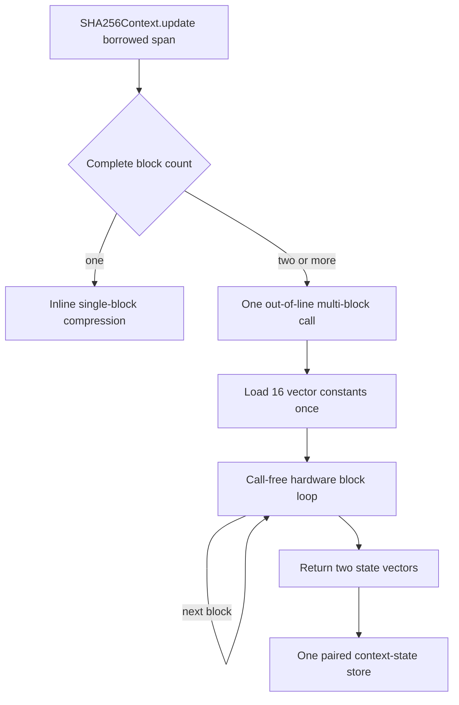

# ADR 0011: Separate SHA-256 Single-Block and Multi-Block Kernels

## Status

Accepted.

## Context

SHA-256 processes one 64-byte block during finalization and many contiguous
blocks during large updates. Treating both cases as repeated calls to the same
out-of-line ARM64 function charged call overhead and reloaded the 64 round
constants for every block. Moving constants into static Swift storage was not
acceptable because it introduced lazy-initialization checks into the production
path.

The optimization must preserve the existing borrowed-input contract: the caller
owns initialized contiguous bytes for the duration of the call, the pointer
does not escape, and the kernel neither allocates nor retains the input.

## Decision

The ARM64 SHA-256 backend uses two internal execution shapes:

- A single block uses the inline compression body and pays no helper-call
  boundary.
- Two or more contiguous blocks use one `@inline(never)` multi-block helper.
- The helper loads the 16 vector round-constant groups before the block loop,
  keeps both SHA-256 state vectors live across blocks, advances the borrowed
  pointer by exactly 64 initialized bytes per iteration, and returns the final
  state in registers.
- The context stores the returned state once after the helper call.
- Constants remain compile-time literals. The production path does not depend
  on static Swift storage or lazy runtime initialization.
- The scalar backend remains the semantic reference and the implementation used
  on targets without ARM64 SHA-256 instructions.

## Consequences

- Long updates avoid per-block calls, repeated literal-address formation, and
  repeated state loads and stores.
- Finalization and short messages retain the smaller single-block path.
- The multi-block helper is deliberately coupled to inspected arm64 code
  generation. A compiler change that alters the required shape fails the
  benchmark build gate rather than silently changing the performance contract.
- This decision establishes a structural performance invariant, not proof of
  the `1.10x` BoringSSL timing target. That target still requires the formal
  paired benchmark.

## Verification

The Release benchmark runner disassembles the built production path and
requires:

1. exactly one multi-block helper call site in `SHA256Context.update`;
2. exactly one helper block-loop backedge;
3. exactly 16 vector constant loads before the block loop;
4. zero calls, page-relative address loads, lazy initialization, allocation,
   reference counting, or bulk copies inside the loop;
5. exactly two vector memory operations in the loop: paired input loads at byte
   offsets zero and 32;
6. exactly 16 `sha256h` and 16 `sha256h2` instructions per block;
7. a context call site that is not enclosed by a backedge; and
8. one paired state-vector store immediately after the helper returns.

Correctness remains independently covered by known-answer boundary lengths,
incremental split points, and scalar-versus-ARM64 differential checks across
aligned and unaligned inputs. Native sanitizers and Native/WASI/Embedded build
and execution gates remain required after production-kernel changes.
