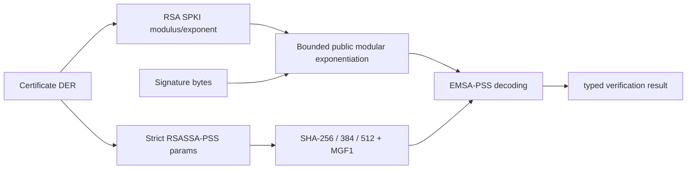

# ADR 0028: Verification-only RSA-PSS at the X.509 boundary

## Status

Accepted for production certificate-signature verification.

## Context

RSA-PSS certificates are common in current PKI, but the certificate parser had
no way to decode RSA SPKI modulus/exponent values or validate the
RSASSA-PSS-params structure. Treating those certificates as unsupported would
leave the X.509 responsibility incomplete.

## Decision

Add `RSAPublicKey` and `RSAPSS` to `SSLCrypto`. RSA public exponentiation
uses bounded fixed-width limbs with Montgomery reduction, while
`SSLX509` owns DER parsing of the RSA public key and the PSS parameter
sequence. SHA-256, SHA-384, and SHA-512 are accepted only when the MGF1 hash
matches and the salt length equals the selected digest length. The default
trailer field is interpreted as `1`.

The surface is verification-only. RSA-PSS signing, TLS CertificateVerify
selection, and private-key arithmetic are separate responsibilities. The
modulus, exponent, signature, and encoded message are public, so this
verification-only arithmetic does not carry a secret-dependent timing
contract. Release evidence includes independent SHA-256/384/512 fixtures, a
4096-bit SHA-512 fixture at the supported modulus limit, 512 Montgomery
differential cases against full-width host arithmetic, canonical key and
length boundaries, signature mutations, focused Address Sanitizer execution
including the maximum modulus, and Native, WASI, and Embedded WASI runtime
validation.

