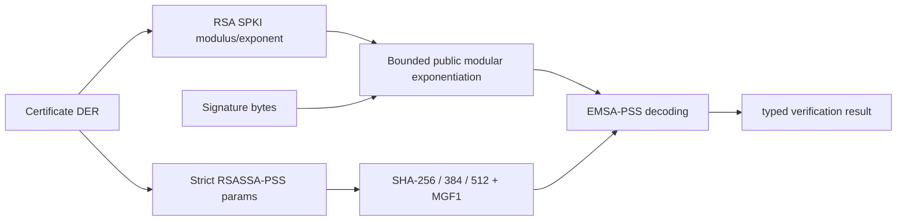

# ADR 0028: Verification-only RSA-PSS at the X.509 boundary

## Status

Accepted as a compatibility-validation implementation; production release
gates remain open.

## Context

RSA-PSS certificates are common in current PKI, but the certificate parser had
no way to decode RSA SPKI modulus/exponent values or validate the
RSASSA-PSS-params structure. Treating those certificates as unsupported would
leave the X.509 responsibility incomplete.

## Decision

Add `RSAPublicKey` and `RSAPSS` to `SwiftSSLCrypto`. RSA public exponentiation
uses bounded fixed-width limbs, while `SwiftSSLX509` owns DER parsing of the
RSA public key and the PSS parameter sequence. SHA-256, SHA-384, and SHA-512
are accepted only when the MGF1 hash matches and the salt length equals the
selected digest length. The default trailer field is interpreted as `1`.

The surface is verification-only. RSA-PSS signing, TLS CertificateVerify
selection, constant-time audit, differential comparison, sanitizer evidence,
and performance gates remain separate completion requirements.

