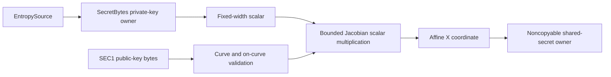

# ADR 0029: Add P-384 and P-521 ECDH key-agreement owners

Status: superseded by ADR 0036; the callable secret-key and ECDH surfaces were removed

## Context

The public-key profile already contained P-384 and P-521 ECDSA verification,
but key agreement stopped at P-256. That left the NIST TLS key-agreement
family split across a verification-only path and a callable ECDH path.

## Decision

Expose `P384` and `P521` as `KeyAgreement` implementations with distinct
noncopyable private-key and shared-secret owners. Public keys own one
immutable SEC1 buffer and retain the validated point used by the arithmetic.
The fixed-width Jacobian implementation is shared with ECDSA verification;
no general-purpose big integer or platform crypto dependency is introduced.

P-521 generation masks the seven unused high bits before canonical scalar
validation. Every public-key and shared-secret byte view is borrowed only
inside its closure. Temporary entropy buffers are wiped after the owner takes
its copy.

## Consequences

- OpenSSL-generated P-384 and P-521 ECDH vectors are now covered by tests.
- The implementation remains validation-gated because the shared arithmetic
  is variable-time and has not yet passed the constant-time, differential,
  target, allocation, and benchmark release gates.
- ADR 0036 removed these secret-key backends. P-384 and P-521 remain
  verification-only public-input capabilities and have no TLS selection path.
