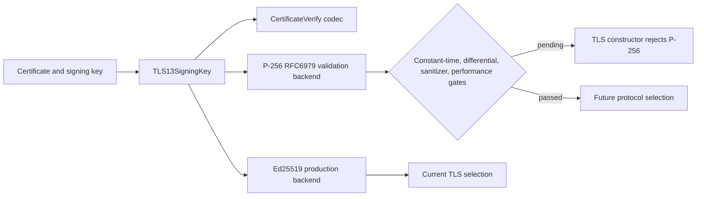

# ADR 0030: Validation-Gated P-256 ECDSA Signing

- Status: Superseded by ADR 0036; signing and TLS selection were removed
- Date: 2026-08-01

## Context

The cryptographic layer now contains RFC 6979 P-256 ECDSA signing and
verification over fixed-width raw signatures. The TLS 1.3 message codec and
key-selection type also model the `ecdsa_secp256r1_sha256` signature scheme.
This gives the implementation a complete data path for vectors and future
differential testing, but the shared point arithmetic is not yet a
constant-time implementation and has not completed the release differential,
sanitizer, and performance gates.

Selecting that path for production authentication before those gates pass
would expose timing and interoperability risk while making a validation
fixture look like a finished TLS backend.

## Decision

Keep P-256 signing, verification, DER conversion, and TLS CertificateVerify
codec support available as explicit validation surfaces. The TLS 1.3 client
and server constructors reject every signature scheme except Ed25519 until
the P-256 release gates are recorded as passed. The typed `TLS13SigningKey`
keeps the algorithm choice explicit so a future backend can be added without
reintroducing an untyped signing callback.

The guard is at the protocol-selection boundary, not in the cryptographic
primitive. This preserves vector coverage and makes the eventual promotion a
small, reviewable change: replace the gate only after the constant-time
implementation and its differential evidence are complete.

## Consequences

- P-256 ECDSA vectors can be tested without silently claiming production TLS
  support.
- Existing Ed25519 TLS behavior remains the only selectable certificate
  authentication profile.
- The release checklist must include constant-time review, cross-checks with
  an independent implementation, sanitizer runs, and performance evidence
  before the guard is relaxed.
- P-384, P-521, RSA-PSS, and post-quantum signature schemes remain separate
  work items; this ADR does not imply their protocol integration.
