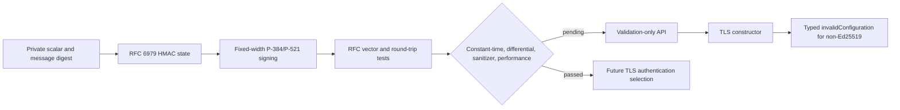

# ADR 0031: P-384/P-521 ECDSA Validation Backend

- Status: Accepted
- Date: 2026-08-01

## Context

The fixed-width Weierstrass implementation now provides RFC 6979 signing and
raw `r || s` verification for NIST P-384 and P-521. The public key and private
key owners validate SEC1 encodings and keep secret material in noncopyable
storage. The arithmetic is still variable-time and has not passed the
constant-time, differential, sanitizer, allocation, and performance gates
required for protocol authentication.

## Decision

Expose P-384/P-521 ECDSA as explicit cryptographic validation surfaces. Cover
the signing path with the RFC 6979 Appendix A.2.6/A.2.7 vectors and mutation
tests, but keep TLS selection on Ed25519 until the release gates are recorded
as passed. The protocol layer must not silently promote these primitives based
on their presence in the module.

## Consequences

- RFC 6979 state performs both update rounds and rejects out-of-range nonce
  candidates instead of reducing them modulo the group order.
- Temporary DRBG inputs and state are erased before release; public signatures
  remain ordinary owned output.
- P-384/P-521 signing is callable for differential and conformance work, but
  the remaining gates are visible in the source marker and responsibility
  matrix rather than hidden behind an implicit fallback.
