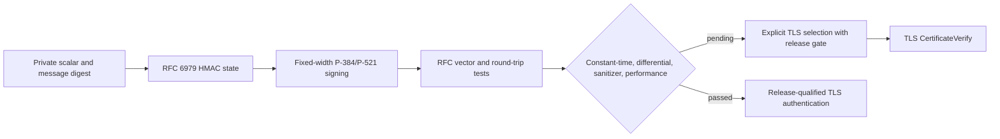

# ADR 0031: P-384/P-521 ECDSA Validation Backend

- Status: Superseded by ADR 0036; signing and TLS selection were removed
- Date: 2026-08-01

## Context

The fixed-width Weierstrass implementation now provides RFC 6979 signing and
raw `r || s` verification for NIST P-384 and P-521. The public key and private
key owners validate SEC1 encodings and keep secret material in noncopyable
storage. The arithmetic is still variable-time and has not passed the
constant-time, differential, sanitizer, allocation, and performance gates
required for protocol authentication.

## Decision

Expose P-384/P-521 ECDSA as explicit cryptographic surfaces and connect them to
the TLS CertificateVerify protocol through an explicit signing-key enum. The
default remains Ed25519, while callers may select an ECDSA curve deliberately.
The wire path is covered by X.509-backed TLS handshakes, but the arithmetic
remains release-gated until constant-time, differential, sanitizer, allocation,
performance, and interoperability evidence is recorded.

## Consequences

- RFC 6979 state performs both update rounds and rejects out-of-range nonce
  candidates instead of reducing them modulo the group order.
- Temporary DRBG inputs and state are erased before release; public signatures
  remain ordinary owned output.
- P-384/P-521 signing is callable and exercised through the complete TLS
  handshake path; the remaining gates are visible in the source marker and
  responsibility matrix rather than hidden behind an implicit fallback.
