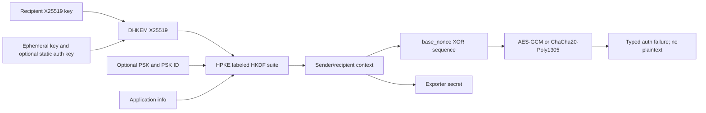

# ADR 0032: Complete X25519 HPKE profile before broader KEM promotion

- Status: Accepted
- Date: 2026-08-01

## Context

HPKE is a construction rather than one primitive. Its KEM transcript, labeled
HKDF suite identifiers, mode-dependent key schedule, AEAD sequence, exporter,
and failure contract must be owned together. Adding only an `HPKE` model would
make the API callable without a correct wire-compatible path.

## Decision

Implement the RFC 9180 X25519 DHKEM profile as one explicit `HPKEX25519`
surface. The profile supports Base, PSK, Auth, and AuthPSK setup, HKDF-SHA256,
HKDF-SHA384, HKDF-SHA512, AES-128-GCM, AES-256-GCM, ChaCha20-Poly1305,
sequence-bound nonces, exporter output, and typed authentication failures.
P-256 DHKEM, X448, ECH, and post-quantum KEMs must use separate identifiers and
cannot silently fall back to X25519.

## Consequences

- The sender and recipient are distinct noncopyable owners; key material,
  nonce material, and exporter secret are held in one wiped secret allocation.
- Exporter output is a separate noncopyable secret owner and is exposed only
  through a scoped borrow; empty output does not allocate secret storage.
- Sequence overflow is a typed failure, and a failed open does not advance the
  recipient sequence.
- The RFC 9180 A.2 Base, PSK, Auth, and AuthPSK vectors and all four modes are
  tested independently of round-trip-only fixtures.
- Broader KEM and protocol integration remain explicit work rather than being
  hidden behind a generic algorithm enum.
