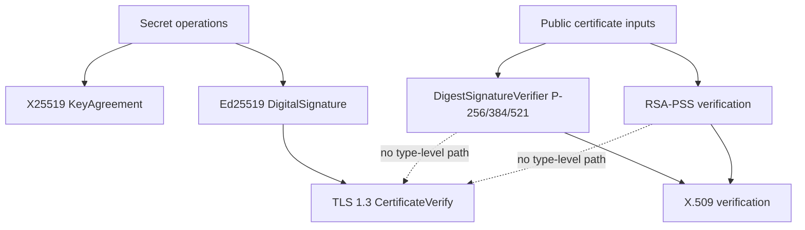

# ADR 0036: Modern secret-key and certificate-verification profile

- Status: Accepted
- Date: 2026-08-01

## Context

The first NIST curve implementation shared variable-time fixed-width point
arithmetic between public certificate verification and private ECDH/signing.
Markers prevented release qualification, but the callable private-key surface
still made a verification backend look like a future protocol signer. The
project does not require legacy API compatibility, and its modern TLS profile
already uses X25519 and Ed25519.

## Decision

The only secret-bearing classical public-key operations are X25519 key
agreement and Ed25519 message signing. TLS 1.3 exposes one signature scheme,
Ed25519, and `TLS13SigningKey` owns only an `Ed25519PrivateKey`. The client
validates and owns an `Ed25519PublicKey` during construction. A caller cannot
select a NIST curve or RSA key for CertificateVerify.

P-256, P-384, and P-521 remain as verification-only certificate
compatibility capabilities. Their public enums conform to
`DigestSignatureVerifier`, accept typed owned public keys, and expose no
private key, signing, key-generation, ECDH, or shared-secret API. RSA-PSS has
the same verification-only policy. RFC 5915 remains a strict format parser but
does not construct a TLS signing key.

Ed25519 conforms to `DigitalSignature`, which refines `SignatureVerifier` and
requires distinct noncopyable private and owned public key types. Its secret
scalar reduction uses a fixed 512-iteration long division, scalar
multiplication always computes addition and doubling, and field limbs are
selected by a mask. Optimized code generation and sanitizer evidence remain
mandatory before release; source structure alone is not constant-time proof.

## Design alignment

| Concern | Library invariant | Decision | Classification |
|---|---|---|---|
| Public API | Small protocols and separate implementations | Signing, message verification, and digest verification are distinct protocols | Aligned |
| Error contract | Typed failure and no fallback | Invalid key/signature/configuration remains an explicit typed failure | Aligned |
| Ownership | Owned storage plus scoped borrows | Private keys are noncopyable; public keys own validated bytes; spans do not escape | Aligned |
| Concurrency | One contract on all targets | Immutable public owners and exclusively mutated handshake values are `Sendable` | Aligned |
| Lifetime | Pointer and span lifetime follows an owner | All raw storage access remains closure- or expression-scoped | Aligned |
| Compatibility | Modern responsibilities, not C/API parity | NIST secret operations are removed rather than deprecated | Aligned |
| Performance | Measure hot paths; unsafe boundaries stay narrow | Fixed-control-flow Ed25519 retains value storage; allocation and codegen gates remain open | Compatible |
| Platform capability | Same source for Native, WASI, and Embedded | No platform crypto backend or target-specific fallback exists | Aligned |
| Tests | Success and failure on the real path | Raw vectors, mutations, X.509, TLS/Core/QUIC, sanitizer, and target programs own separate evidence | Aligned |

## Consequences

- NIST ECDH and ECDSA signing source and tests are deleted, not deprecated.
- Removed API names produce compile-time failure; no compatibility shim or
  silent Ed25519 fallback exists.
- Public certificate verification may use variable-time arithmetic because it
  handles no secret input, but remains bounded and subject to correctness and
  robustness gates.
- Adding another TLS signer requires a new constant-time secret implementation,
  an explicit protocol/profile decision, and complete cross-target and
  interoperability evidence.
