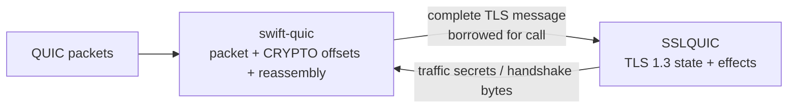

# ADR 0036: Keep QUIC CRYPTO reassembly in the QUIC transport package

## Status

Accepted.

## Context

TLS over QUIC has two different boundaries. QUIC owns packet parsing, encryption
levels, CRYPTO offsets, overlap policy, loss recovery, and delivery ordering.
TLS owns the TLS 1.3 transcript, authentication, key schedule, and handshake
state. Keeping a CRYPTO byte stream inside `swift-ssl` duplicated transport
ownership and made the TLS package aware of QUIC offset state.

## Decision

`swift-quic` is the only owner of CRYPTO offset spaces and reassembly. It emits
complete, header-inclusive TLS handshake messages in transport order. The
`SSLQUIC` mechanism accepts exactly one complete message through
`processHandshakeMessage(_:at:)` and returns typed, ordered effects. It has no
CRYPTO offset, stream reassembler, or packet API.

The four-byte TLS handshake header and message-size policy are transport
framing responsibilities in `swift-quic`; `SSLQUIC` validates the complete
message again at its semantic boundary and never buffers an incomplete input.

## Contracts

| Boundary | Owner | Input contract | Output contract |
|---|---|---|---|
| Packet to QUIC | `swift-quic` | QUIC packets and CRYPTO offsets | Ordered complete TLS messages, typed transport failures |
| QUIC to TLS | caller/adapter | Header-inclusive message valid for one encryption level | Scoped borrow only for the duration of the call |
| TLS to QUIC | `SSLQUIC` | Deterministic handshake state | Owned output backing, checked ranges, typed secret events |

No pointer or borrowed view escapes the call. Reassembly storage and overlap
validation are tested in `swift-quic`; TLS semantic success and failure are
tested in `swift-ssl`.

## Consequences

- `swift-ssl` no longer imports or implements QUIC stream storage.
- `swift-quic` can change its packet/reassembly strategy without changing TLS
  state-machine APIs.
- Complete-message delivery makes incomplete input an adapter error instead of
  hidden TLS buffering.
- QUIC and TLS each keep one ownership boundary and one mutation path on
  Native, WASI, and Embedded WASI.
- Existing offset-stream APIs are intentionally removed; this profile does not
  preserve the superseded compatibility surface.

## Verification

- `SSLQUIC` complete-message client/server handshake and truncated-input tests.
- `swift-quic` CRYPTO reassembly tests for ordering, overlap, bounds, and
  encryption-level isolation.
- Native, WASI, and Embedded WASI compile/link checks using the pinned Swift 6.4
  toolchain and matching SDKs.
