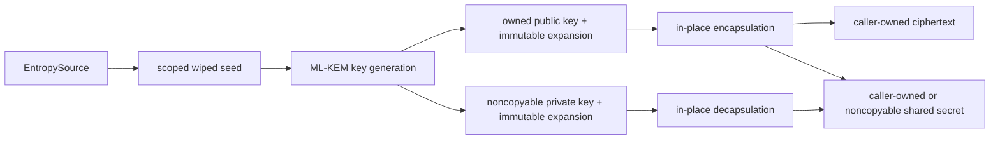

# ADR 0038: Own ML-KEM keys and borrow hot-path output

## Status

Accepted on 2026-08-01.

## Context

The modern replacement profile requires FIPS 203 ML-KEM-768 and ML-KEM-1024
without importing BoringSSL or reproducing its opaque C structs. Key
generation, encapsulation, and decapsulation operate on large polynomial
states, while private keys, seeds, noise, and shared secrets require explicit
lifetime and erasure behavior. Correctly sized malformed ciphertexts must use
implicit rejection and cannot become a validity oracle.

The same implementation must compile for Native, WASI, and Embedded WASI.
Platform crypto dispatch, target-specific semantic fallback, and a compatibility
surface would split that contract.

## Decision

`KeyEncapsulationMechanism` defines owned key generation, encapsulation, and
decapsulation. `InPlaceKeyEncapsulationMechanism` refines it with caller-owned
`MutableSpan` output for the fixed-size ciphertext and shared secret. ML-KEM-768
and ML-KEM-1024 are separate concrete, statically dispatched implementations.
The `SSL` façade owns equivalent wrapper types rather than re-exporting
the lower module.

Public keys and ciphertexts own ordinary immutable contiguous storage. Private
keys and shared secrets own noncopyable `SecretBytes`. Expanded public keys are
immutable values. Expanded private keys are immutable reference owners built
from one consumed, uniquely initialized polynomial allocation; a scoped
immutable borrow is the only access path after construction. No pointer or span
escapes its owner or crosses a suspension boundary.

The low-level implementation isolates raw allocation in
`MLKEMPolynomialStorage`, two-stream SHA3/SHAKE state in `KeccakX2Core`, and
stack-scoped entropy blocks in `MLKEMSecretFactory`. These types state owner,
range, initialization, alignment, binding, aliasing, mutation, erasure, and
deallocation invariants adjacent to the unsafe boundary. Public operations are
safe typed APIs.

Encapsulation and decapsulation validate every public size before mutating
caller output. An entropy or length failure leaves output unchanged. A
correctly sized ciphertext always yields a shared secret; ciphertext equality
selects the real or rejection key without exposing validity as an error.

## Design alignment

| Concern | Decision | Classification |
|---|---|---|
| Public API | Small KEM and in-place KEM protocols with separate concrete implementations | Aligned |
| Error contract | Typed size, encoding, entropy, and secret-memory failures; implicit rejection for correctly sized ciphertext | Aligned |
| Ownership | Ordinary public owners and noncopyable erased secret owners | Aligned |
| Concurrency | Immutable expanded keys and no shared mutable global state on any target | Aligned |
| Lifetime | Scoped spans and pointers retained only by their explicit owner | Aligned |
| Compatibility | FIPS 203 responsibility without a BoringSSL C/API compatibility layer | Aligned |
| Performance | Caller-owned output, expanded-key reuse, fused arithmetic, SIMD NTT, and two-stream Keccak | Compatible and measured |
| Platform | One semantic source implementation for Native, WASI, and Embedded WASI | Aligned |
| Tests | NIST ACVP, differential arithmetic, negative paths, interoperability, sanitizer, code generation, and target execution | Aligned |

## Consequences

- Callers choose owned convenience results or exact-size in-place output
  without selecting an implementation backend.
- Output ownership avoids façade-layer re-materialization on the in-place path;
  internal polynomial workspaces remain explicit allocations. The formal
  allocation artifact records 5 balanced allocations for encapsulation and 11
  for decapsulation, with no per-operation general `malloc` and no dynamic
  bulk-copy bytes. Key generation records 17 balanced allocations because it
  also constructs the owned serialized and expanded key results.
- The optimized arm64 kernels are not semantic fallbacks. WASI and Embedded
  use the same algorithms and contracts with portable constant-control-flow
  arithmetic where the arm64 instruction selection is unavailable.
- Any future hybrid KEM is a distinct construction that composes this protocol;
  it does not change ML-KEM key or failure semantics.
