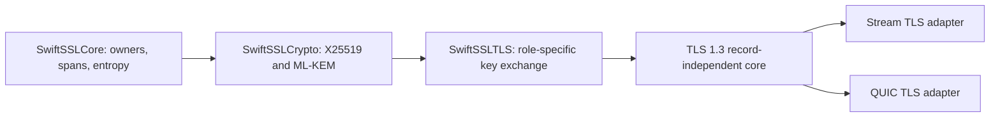

# ADR 0039: Own X25519MLKEM768 at the TLS key-exchange boundary

## Status

Accepted for the experimental TLS profile pinned to
[`draft-ietf-tls-ecdhe-mlkem-05`](https://datatracker.ietf.org/doc/html/draft-ietf-tls-ecdhe-mlkem-05).
A later draft or RFC revision requires a new
decision, fresh vectors, and interoperability evidence. The same public group
name must never be silently assigned different wire semantics.

## Context

The modern TLS profile needs the registered `X25519MLKEM768` supported group
without importing BoringSSL or exposing a C-style generic key-share API. The
current IETF draft assigns value `4588` (`0x11EC`) and defines asymmetric
client/server encodings:

| Value | Encoding | Bytes |
|---|---|---:|
| Client key share | ML-KEM-768 encapsulation key, then X25519 public key | 1,184 + 32 = 1,216 |
| Server key share | ML-KEM-768 ciphertext, then X25519 public key | 1,088 + 32 = 1,120 |
| Shared secret | ML-KEM shared secret, then X25519 shared secret | 32 + 32 = 64 |

The obsolete `X25519Kyber768Draft00` group is not accepted, emitted, aliased,
or migrated. Source and ABI compatibility with BoringSSL are outside the
project contract.

## Decision

The responsibilities are separated as follows:



- `InPlacePublicKeyDerivation`, `InPlaceKeyAgreement`,
  `InPlaceEncodedKeyAgreement`, and
  `InPlaceEncodedPublicKeyEncapsulationMechanism` expose narrow cryptographic
  capabilities. Implementations borrow inputs and write into caller-owned
  output spans.
- `TLS13ClientKeyExchange` owns client-offer construction and one-shot server
  share completion. `TLS13ServerKeyExchange` owns one-shot client-share
  acceptance. Neither protocol owns transcript, records, transport, or I/O.
- `TLS13X25519MLKEM768ClientKeyExchange` owns the immutable final client share
  and both noncopyable private keys until completion.
- `TLS13X25519MLKEM768ServerKeyExchange` owns only its noncopyable X25519
  private key before acceptance. It borrows the client's encoded ML-KEM key
  and writes the ciphertext, X25519 public key, and combined secret directly
  into final owners.
- Client and server states consume their private material exactly once. A
  second operation fails with `TLS13KeyExchangeError.invalidState`.
- Length, key-encoding, entropy, secret-memory, and all-zero X25519 failures
  remain distinct typed failures. Invalid in-place X25519 output is not
  modified.

## Ownership and zero-copy contract

```text
caller-owned input owner
    -> scoped Span borrow
        -> role-specific offsets
            -> in-place ML-KEM/X25519 operation
                -> one final share owner + one final secret owner
```

The required final protocol concatenation is an output write, not an avoidable
intermediate materialization. Client construction copies the already-owned
1,184-byte ML-KEM public-key encoding once into the final 1,216-byte share;
X25519 writes its 32 bytes directly. Server acceptance and client completion
borrow received shares without creating typed public-key/ciphertext owners.
No pointer escapes a scoped closure.

The Native measurement budgets are:

| Path | Balanced allocations | Requested bytes | Dynamic bulk-copy bytes |
|---|---:|---:|---:|
| Client offer | 17 | 15,656 | 0 |
| Server accept | 15 | 14,464 | 0 |
| Full round trip | 45 | 40,032 | 0 |
| X25519 public key into caller output | 0 | 0 | 0 |
| X25519 shared secret into caller output | 0 | 0 | 0 |

These are exact release budgets, not allocation-free claims. Dynamic
`memcpy`/`memmove` interposition does not observe compiler-inlined scalar
stores, so the formal artifact is combined with the owner/span source audit.

## Unsafe boundary

The X25519 implementation uses five radix-2^51 `UInt64` limbs, `UInt128`
products, an immutable generated fixed-base table, and one scoped 64-byte
temporary digit allocation. Table pointers and temporary pointers never
escape their synchronous closures. Table offsets are bounded by 32 positions,
8 candidates, and 15 limbs; the generated table contains exactly 3,840 limbs.
Secret digits are initialized before use and wiped before the temporary
allocation expires. X25519 peer agreement uses value storage and writes the
caller output only after the canonical result passes the all-zero check.

## Cross-target capability and state matrix

The entropy implementation has one real link-capability difference. Native
and regular WASI call the pinned Swift runtime C ABI once for the complete
borrowed buffer. The pinned Embedded static standard library does not export
that private symbol to another module, so Embedded uses the public
`SystemRandomNumberGenerator` entry point. Both routes use the same runtime
entropy backend and expose the same stateless, synchronous `EntropySource`
contract.

| Logical state | Native | WASI | Embedded WASI | Read/mutation | Release |
|---|---|---|---|---|---|
| System entropy | Stateless value | Stateless value | Stateless value | One synchronous scoped `fill` | No retained state |
| Client private material | Noncopyable local owners | Same | Same | One-shot key-exchange mutation | Automatic exactly-once release and secret wipe |
| Server private material | Noncopyable local owner | Same | Same | One-shot key-exchange mutation | Automatic exactly-once release and secret wipe |
| Shares | Immutable `OwnedBytes` | Same | Same | Scoped `Span` borrow | Owner lifetime |
| Combined secret | Noncopyable `SecretBytes` | Same | Same | Scoped mutable/immutable borrow | Automatic exactly-once wipe and release |

No logical state is shared between tasks or threads, and no target weakens a
`Sendable`, isolation, ownership, or mutation contract. Consequently no
`Mutex` or actor is required inside these per-transaction values.

## Design-principle comparison

| Concern | Existing library invariant | Project-wide principle | Classification and decision |
|---|---|---|---|
| Public API | Narrow protocol capabilities and role-specific TLS types | Protocol-first responsibility separation | Aligned; retain |
| Error contract | Typed errors and no fallback | Never convert failure to success | Aligned; retain and test output preservation |
| Ownership/lifetime | Noncopyable secrets, immutable shares, scoped borrows | Explicit owner/view split | Aligned; retain |
| Concurrency | Per-transaction values have no shared mutable state | Isolate shared mutable state uniformly on every target | Compatible; no isolation primitive is necessary |
| Compatibility | Modern responsibility replacement, not BoringSSL API emulation | Library-specific design has authority | Aligned; obsolete Kyber and C compatibility remain excluded |
| Performance | Final owners, borrowed wire input, in-place primitives | Measured zero-copy and unsafe boundaries | Aligned; exact allocation/copy budgets are release gates |
| Platform capability | One semantic API across targets | Target branches only for real capability differences | Compatible; only entropy linking differs |
| Tests | Production-path vectors, failures, target execution, interop | Behavior and evidence ladder before completion | Aligned; formal memory/timing artifacts and security review remain gates |

## Consequences

Stream TLS and QUIC use the same key-exchange state and therefore cannot drift
in group encoding or secret order. Callers cannot accidentally reuse private
material, hold an escaping input view, or select the obsolete Kyber draft
group. The API is intentionally allowed to make a breaking change if the
pinned Internet-Draft changes before publication.

The implementation is not declared complete from this ADR. Completion still
requires the committed formal allocation artifact, bidirectional BoringSSL
interoperability, the paired timing confidence gate, target execution,
sanitizer evidence, and security review.
