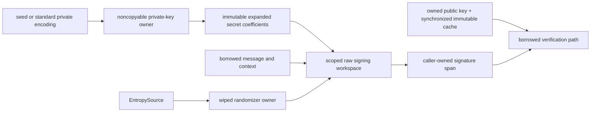

# ADR 0040: Own FIPS 204 ML-DSA keys and scope signing workspaces

## Status

Accepted on 2026-08-02 for the FIPS 204 ML-DSA-44, ML-DSA-65, and ML-DSA-87
primitives. This decision does not enable ML-DSA in TLS or X.509 policy.

## Context

The modern replacement profile requires FIPS 204 signatures without importing
BoringSSL or reproducing its opaque C key objects. Signing retains secret
polynomials, uses rejection sampling, and needs several large simultaneous
work vectors. Verification is public-input work but must not introduce hidden
copy-on-write materializations. Native, WASI, and Embedded WASI must execute
the same semantic implementation.

## Decision

`ContextualRandomizedDigitalSignature` separates context-bound randomized
signing and verification from unrelated signature schemes.
`InPlaceContextualRandomizedDigitalSignature` refines it with caller-owned
fixed-size signature output. `MLDSA44`, `MLDSA65`, and `MLDSA87` are statically
dispatched FIPS 204 implementations over one internal parameterized core in
`SwiftSSLCrypto`; `SwiftSSL` exposes its own equivalent key and error types
rather than re-exporting implementation types. Distinct concrete key types
make cross-parameter key use unrepresentable at the public API boundary.



The private key is noncopyable. Generated keys retain only the 32-byte seed as
their serialized secret owner and transfer the already allocated NTT
coefficient arrays into the immutable expanded owner. Imported keys retain the
validated parameter-specific FIPS representation. `standardRepresentation()`
creates an explicit new secret owner instead of exposing internal storage.

The expanded public key owns its decoded public coefficients. Its derived NTT
and matrix material is immutable and lazily published through one
`Synchronization.Mutex` contract on Native, WASI, and Embedded WASI. Cache
construction occurs outside the critical section; competing immutable results
are safe and only one is retained.

Signing allocates one internal raw workspace containing all coefficient
regions and mask bytes. The owner initializes every byte, lends pairwise
bounded pointers only to one synchronous closure, erases the complete
allocation, deinitializes it, and releases it exactly once. The same owner also
prevents intermediate arrays from escaping or crossing a `Sendable` boundary.
Verification consumes the decoded `z` array as its NTT workspace and performs
subtraction and hint application in place, avoiding three COW copies.

Failures are typed. Length and context validation occurs before output
mutation. Entropy failure leaves caller output unchanged. A correctly sized
but invalid signature returns `false`; it is not converted to a successful
value or a fallback implementation.

## Ownership and copy contract

```text
caller owner
    -> scoped Span / MutableSpan
        -> immutable expanded key owner
            -> scoped pointer kernel
                -> direct caller output
```

The Native fixed-fixture memory budgets are:

| Parameter set and path | Balanced allocations | Requested bytes | Dynamic bulk-copy bytes |
|---|---:|---:|---:|
| ML-DSA-44 key generation | 23 | 44,928 | 0 |
| ML-DSA-44 in-place signing | 30 | 38,800 | 16,384 |
| ML-DSA-44 verification | 14 | 23,488 | 0 |
| ML-DSA-65 key generation | 25 | 71,536 | 0 |
| ML-DSA-65 in-place signing | 62 | 59,248 | 40,960 |
| ML-DSA-65 verification | 14 | 31,712 | 0 |
| ML-DSA-87 key generation | 25 | 111,088 | 0 |
| ML-DSA-87 in-place signing | 48 | 71,120 | 43,008 |
| ML-DSA-87 verification | 14 | 42,240 | 0 |

The signing copies preserve a parameter-specific mask vector while a second
copy is transformed into the NTT domain. They are explicit algorithm
workspace forks, not input/output materialization or Swift COW. Attempt count
and therefore total work vary with valid randomized signing. The benchmark
fixture fixes entropy, message, and context so the release budget is
deterministic.

Dynamic `memcpy`/`memmove` interposition cannot observe compiler-inlined scalar
stores. The formal artifact is therefore combined with the owner/span source
audit and in-place failure tests.

## Cross-target state matrix

| Logical state | Native | WASI | Embedded WASI | Read/mutation | Release |
|---|---|---|---|---|---|
| Private serialized secret | Noncopyable `SecretBytes` | Same | Same | Scoped immutable borrow | Wipe and exactly-once release |
| Expanded secret coefficients | Immutable private owner | Same | Same | Scoped pointer borrow | Wipe and exactly-once release |
| Public derived cache | `Mutex<Material?>` | Same | Same | Locked publication, immutable read | ARC owner release |
| Signing workspace | Unique raw owner | Same | Same | One synchronous mutable borrow | Full wipe and exactly-once release |
| Public inputs/output | Borrowed spans/caller owner | Same | Same | Synchronous only | Caller responsibility |

No target uses `hasFeature(Embedded)` to weaken storage, `Sendable`, locking,
ownership, or lifetime contracts.

## Design-principle comparison

| Concern | Existing library invariant | Project-wide principle | Classification and decision |
|---|---|---|---|
| Public API | Narrow, statically dispatched primitive capabilities | Protocol-first responsibility separation | Aligned; add contextual and in-place signature protocols |
| Error contract | Typed failures and transactional caller output | Never hide or round failure to success | Aligned; validate and test both error and invalid-signature paths |
| Ownership | Noncopyable secrets and scoped byte views | Explicit owner/view split | Aligned; retain seed/encoding owners and borrowed hot paths |
| Concurrency | Immutable key material with a derived public cache | One isolation contract on every target | Compatible; protect cache publication with the same `Mutex` everywhere |
| Lifetime | Pointer kernels are internal implementation details | Unsafe boundaries must be owner-scoped | Aligned; use nonescaping closures and exactly-once deallocation |
| Compatibility | Modern responsibility, not BoringSSL API/ABI | Library design has authority over general compatibility | Aligned; expose FIPS encoding only, with no legacy adapter |
| Performance | Expanded-key reuse and fixed-size polynomial work | Measure copies and allocations before claiming zero-copy | Aligned; gate exact slopes and paired BoringSSL timing |
| Platform | One algorithm source across all targets | Branch only for real platform capability differences | Aligned; no ML-DSA semantic target branch |
| Tests | Production API, official vectors, negative paths, and interop | Evidence ladder before completion | Aligned; require target execution, sanitizer, memory, and formal timing evidence |

## Consequences

- Callers can choose an owned convenience signature or exact-size in-place
  output without choosing a backend.
- Private material cannot be copied through supported APIs; standard export is
  an explicit secret-owner creation boundary.
- Public-key expansion is amortized and race-safe without holding a lock during
  cryptographic work.
- The primitive remains independent from TLS and certificate policy.
- Broader external vectors, automated constant-time review, and security
  review remain separate completion responsibilities.
