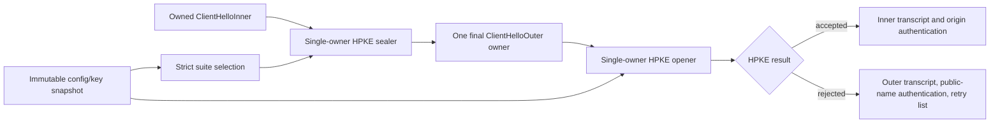

# ADR 0041: RFC 9849 ECH owner and borrow boundary

- Status: Accepted
- Date: 2026-08-02

## Context

ECH combines configuration parsing, HPKE, two related ClientHello encodings,
padding, transcript substitution, acceptance confirmation, and authenticated
rejection. Treating it as a Boolean extension would lose the ownership and
state transitions that prevent origin-name disclosure, ciphertext reuse, and
incorrect transcript selection.

## Decision

`SSLTLS` owns RFC 9849 ECH protocol semantics. Configuration acquisition,
DNS SVCB/HTTPS processing, immutable key-set rotation, and retry-transport
establishment remain caller responsibilities.

The public configuration and server key set are immutable owners. The sealer
and opener are noncopyable state owners because HPKE sequence state must have
one mutation path. Parsers retain checked byte ranges for encapsulation,
ciphertext, and legacy session ID. The opener borrows those ranges directly
from caller storage. It owns only the zeroed authenticated ClientHelloOuter
body required as HPKE associated data.

The sealer validates all counts and ranges before consuming HPKE sequence
state, allocates the final ClientHelloOuter once, copies the authenticated body
once, and seals ciphertext directly into its final payload range. Its unsafe
mutable-span boundary is scoped to that allocation: the array is the sole
owner, initialized and writable bounds are exact, `UInt8` alignment is
sufficient, mutation is exclusive, and no pointer escapes the closure.

Only HPKE authentication failure maps to ECH payload-authentication failure.
Key, KDF, memory, and configuration failures retain their typed causes. A
failed trial opening may continue only to another matching immutable server
configuration; it never falls back to plaintext success.

The TLS core authenticates the origin name and uses the inner transcript after
acceptance. Authenticated rejection uses the outer transcript, authenticates
the public name, returns retry configurations, and prevents origin application
data on that connection. HelloRetryRequest retains the single-owner HPKE
context across the retry, seals and opens the second ClientHello with an empty
encapsulation, recomputes the binder over the second inner transcript, and
verifies the retry acceptance confirmation. A second HelloRetryRequest,
context mismatch, or confirmation mismatch fails explicitly.

## Verification

- Native config and ClientHello positive/negative tests cover strict parsing,
  selection, padding, accept/reject, invalid encapsulation, and error identity.
- Stream/Core/QUIC tests cover accepted ECH, authenticated rejection, and PSK
  resumption using the inner binder transcript.
- Core tests cover accepted and rejected HelloRetryRequest continuation,
  second-ClientHello binder recomputation, context reuse, acceptance
  confirmation, and second-HelloRetryRequest rejection.
- The production target-validation route executes on Native, WASI, and
  Embedded WASI with the pinned Swift 6.4 toolchain and matching SDKs.
- Focused AddressSanitizer execution covers AES-GCM, HPKE, ECH config, and ECH
  ClientHello paths.
- Bidirectional interoperability at pinned BoringSSL commit
  `ae49d2681a56ca7b8609f6039a770fda2a8eb550` reaches accepted origin-name
  handling in both directions.

Formal allocation/copy measurement, the `1.10x` performance gate,
rotation-snapshot concurrency tests, fuzzing, a second independent peer, and
security review remain required before the ECH responsibility is complete.
