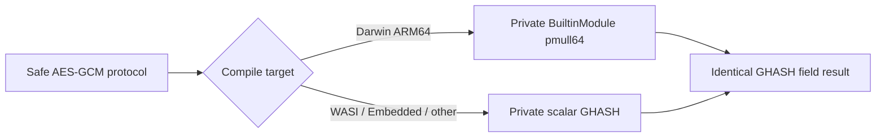

# ADR 0043: Use Swift BuiltinModule for direct ARM64 GHASH multiplication

- Status: Accepted
- Date: 2026-08-02

## Context

Apple ARM64 provides a single-instruction 64-by-64-bit carry-less polynomial
product. Clang exposes it as `vmull_p64`, but the function cannot be imported
into Swift because its `poly128_t` return type has no imported Swift
representation. The previous Pure Swift kernel recursively represented each
64-bit product with four byte-lane `vmull_p8` operations. A four-block GHASH
step consequently issued 48 polynomial instructions plus packing and spill
traffic.

The pinned Swift 6.4 development toolchain exposes LLVM intrinsics through the
experimental `BuiltinModule` language feature. Its
`int_aarch64_neon_pmull64` operation accepts the initialized builtin storage of
two `UInt64` values and returns one initialized `Vec16xInt8` value. The result
can remain inside standard-library fixed-width SIMD storage.

## Decision

- Enable `BuiltinModule` for the `SSLCrypto` target through the SwiftPM
  experimental-feature setting. Do not add an unsafe compiler flag.
- Import `Builtin` only in the Darwin ARM64 GHASH source branch.
- Keep the intrinsic inside the private `carrylessMultiply64` helper. Its safe
  interface remains two `UInt64` operands and a low/high `UInt64` result.
- Store the returned builtin vector in `SIMD16<UInt8>` and reinterpret it as
  `SIMD2<UInt64>`. Apple ARM64 little-endian lane order maps lane zero to the
  low product limb and lane one to the high product limb.
- Keep the existing scalar constant-time GHASH implementation for platforms
  without the Apple ARM64 capability. Both backends implement the same field
  operation and retain the same public AES-GCM contracts.
- Reject Release benchmark workers that omit `pmull.1q` or contain the former
  `pmull.8h` emulation sequence.

## Safety and ownership

Both operands and all 128 result bits are initialized value storage. The
intrinsic uses no pointer, binding, allocation, deallocation, alias, or shared
mutable state. No builtin type appears in a public signature, crosses a module
boundary, or escapes the synchronous helper. The AES-GCM owner, borrowed input
spans, caller-owned output, authentication-before-decryption rule, exact
in-place behavior, and no-write-on-failure guarantee remain unchanged.

## Verification

- One thousand deterministic randomized products match an independent
  bit-serial GHASH reference implementation.
- The four-block aggregation matches sequential field evaluation for another
  one thousand deterministic randomized fixtures.
- NIST AES-GCM vectors, exact in-place operation, overlap rejection, and
  authentication-failure output preservation pass.
- HPKE Base, PSK, Auth, and AuthPSK success and failure routes pass.
- The Release worker produces complete byte equality with the previous worker
  for both formal payload sizes.
- Release disassembly contains direct `pmull.1q` instructions and no
  `pmull.8h` emulation instructions in the HPKE worker.
- AddressSanitizer and Undefined Behavior Sanitizer each pass 164 Core/Crypto
  tests without runtime warnings.
- Native package consumption and WASI and Embedded WASM Release execution pass
  with the pinned Swift 6.4 toolchain and matching SDKs.

Formal clean-commit timing remains the performance acceptance gate. The
experimental compiler feature stays pinned to the verified toolchain until a
stable Swift intrinsic surface replaces it.
