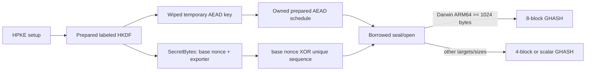

# ADR 0044: Prepare HPKE AEAD state and batch ARM64 GCM work

- Status: Accepted
- Date: 2026-08-02

## Context

The X25519 HPKE profile met its zero-copy payload contract, but every message
reconstructed an AEAD instance from raw key bytes. Recipient setup also
repeated SHA-256 HMAC pad preparation for labels derived from the same empty or
secret key. The resulting key expansion and heap-backed secret layout were
outside the payload copy budget but remained on the latency-critical setup and
first-open paths.

Apple ARM64 AES-GCM already aggregated four GHASH blocks. It stored hash powers
in network order, reversed them for every product, incremented four counters
serially, and reduced every four blocks even for larger records.

## Design-authority comparison

The repository's existing HPKE and AEAD contracts remain authoritative. The
following comparison was completed before accepting the change.

| Concern | Repository contract | Applied decision | Classification |
|---|---|---|---|
| Public API | Narrow Swift protocols and noncopyable state | Make AEAD operations nonmutating and require `Sendable`; no C compatibility surface | Aligned |
| Errors | Typed failures and transactional output | Preserve `AEADError`/`HPKEError`; no fallback or partial plaintext | Aligned |
| Ownership | Unique secret owners and scoped borrows | Context owns one prepared cipher; temporary DH/key bytes stay in wiped inline storage | Aligned |
| Concurrency | Transferable noncopyable contexts | Cipher schedules are immutable; sequence remains exclusively mutated by the outer context | Compatible |
| Lifetime | Span values cannot outlive owners | Every new pointer and Span remains inside a synchronous closure | Aligned |
| Compatibility | Modern Swift API; no legacy ABI promise | The protocol requirement change is intentionally source-breaking before release | Aligned |
| Performance | Measured zero-copy/latency budgets | Reuse HMAC/AEAD setup and batch GHASH only where measured beneficial | Aligned |
| Platform capability | Same semantics on Native, WASI, and Embedded | ARM64 uses private SIMD/Builtin kernels; other targets retain the scalar implementation | Compatible |
| Testing | Success, failure, differential, target, and sanitizer evidence | Add sequential-message and four/eight-block differential coverage | Aligned |

## Decision

- `AuthenticatedCipher` is a noncopyable `Sendable` protocol whose `seal` and
  `open` requirements are nonmutating. AES-GCM and ChaCha20-Poly1305 own
  immutable prepared key state behind that contract.
- Each `HPKESenderContext` and `HPKERecipientContext` owns one
  `HPKEAEADContext`. AEAD key expansion occurs once during HPKE setup. Raw AEAD
  key bytes are not retained in `SecretBytes`.
- The remaining HPKE secret allocation contains only the 12-byte base nonce
  followed by the exporter secret. Sequence progression remains a `UInt64`
  property of the unique outer context.
- SHA-256 labeled HKDF reuses prepared empty-key contexts for KEM and context
  hashes, then reuses prepared secret-key contexts for key, nonce, and exporter
  expansion.
- X25519 shared secrets use initialized `SIMD32<UInt8>` or
  `SIMD64<UInt8>` storage. A closure borrows the resulting Span synchronously,
  and the complete owner is wiped before scope exit.
- ARM64 stores H through H^4 in reversed polynomial order, derives H^5 through
  H^8 only for messages of at least 1,024 bytes, evaluates eight GHASH blocks
  with one reduction, and advances four GCTR counters through one SIMD add.
- The scalar GCM path and all public error, overlap, and output-preservation
  contracts remain unchanged.

## Unsafe and zero-copy contract

The fixed DH, context-hash, HMAC-output, and derived-key buffers are initialized
inline owners. Their byte counts are compile-time 32/64-byte extents or checked
16/32-byte prefixes. Raw storage is explicitly bound to `UInt8`, mutable access
is exclusive, immutable access starts only after mutation ends, and no pointer
or Span escapes a `withUnsafeBytes` closure. Every sensitive temporary is wiped
on success and failure. There is no manual allocation in these new boundaries.

Payload input remains borrowed and output remains caller-owned. HPKE setup owns
only the final encapsulation, secret state, and prepared cipher. No message path
materializes a plaintext, ciphertext, key, or nonce array.

## Cross-target state review

| Logical state | Storage on Native / WASI / Embedded | Isolation | Read entry | Mutation entry | Release |
|---|---|---|---|---|---|
| Prepared AEAD schedule | Same noncopyable cipher owner | Immutable scoped borrow | `seal` / `open` | None | Cipher `deinit` wipes key state |
| Base nonce and exporter | Same `SecretBytes` unique owner | Immutable scoped borrow | nonce/export helpers | None | `SecretBytes.deinit` wipes and deallocates |
| Sequence number | Same inline `UInt64` | Exclusive access to noncopyable HPKE context | `sequenceNumber` | successful `seal` / `open` only | Value destruction |

No shared mutable state, callback, I/O, or `await` occurs in these paths, so a
Mutex or actor is neither removed nor required. The `Sendable` contract is the
same on every target; a context may be transferred, not copied or concurrently
aliased.

## Verification

- AES-GCM four-block and eight-block kernels each match 1,000 deterministic
  randomized sequential GHASH evaluations.
- Native Core/Crypto/X.509/TLS tests pass 311 of 311, including all nine HPKE
  KDF/AEAD combinations and two sequential messages per combination.
- The expanded target validation executes AES-128-GCM, AES-256-GCM, and
  ChaCha20-Poly1305 HPKE messages through sequence two on Native, WASI, and
  Embedded WASM with the pinned matching Swift 6.4 toolchain and SDKs.
- AddressSanitizer and Undefined Behavior Sanitizer each pass 165 Core/Crypto
  tests without runtime diagnostics.
- ThreadSanitizer cannot compile this package with the pinned toolchain because
  the Swift frontend asserts in `emitTsanInoutAccess`; the same failure is
  reproduced from pristine `HEAD`, before this decision's changes.
- Formal clean-commit memory and timing artifacts remain the acceptance gates
  for allocation/copy budgets and the 1.10x lower-confidence-bound target.
