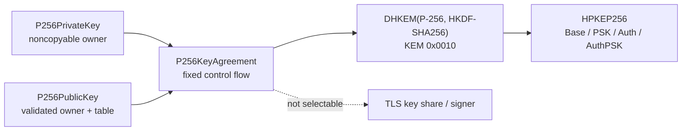

# ADR 0045: Validation-gated P-256 HPKE DHKEM profile

- Status: Accepted
- Date: 2026-08-02
- Amends: ADR 0036

## Context

RFC 9180 assigns KEM identifier `0x0010` to DHKEM(P-256, HKDF-SHA256).
Completing the modern HPKE responsibility therefore requires a secret P-256
operation even though ADR 0036 removed NIST curves from the TLS key-exchange
and CertificateVerify profiles. Reusing the public-input ECDSA verifier would
violate its variable-time contract, while routing to a platform or BoringSSL
backend would violate the Native/WASI/Embedded single-source requirement.

## Decision

Add a distinct fixed-control-flow P-256 key-agreement implementation for the
RFC 9180 DHKEM profile. `P256PrivateKey` and `P256SharedSecret` are noncopyable
secret owners, `P256PublicKey` owns and validates one uncompressed SEC 1 point,
and `P256KeyAgreement` writes the x-coordinate directly to caller-owned output.
The field uses four 64-bit Montgomery limbs, branchless reduction, a dedicated
ten-product square, and a fixed inversion chain. Secret scalar multiplication
uses five-bit signed windows, a constant-time full-table selection, complete
doubling, and mixed Jacobian-affine addition. A public key owns its immutable
precomputation table. Generator multiplication constructs the same bounded
value table per operation because the pinned Embedded runtime cannot represent
the large immutable table as global constant slots.

`HPKEP256` owns the Base, PSK, Auth, and AuthPSK constructions for KEM
identifier `0x0010`. It shares the generic HPKE key-schedule and AEAD context
owners without reinterpreting the X25519 suite identifier. Invalid scalars,
points, encapsulations, output lengths, entropy failures, and authentication
failures remain typed failures with transactional caller output.

This decision does not add P-256 to TLS key-share negotiation, TLS
CertificateVerify signing, or the public `SwiftSSL` façade. Those remain
governed by ADR 0036. The callable DHKEM implementation is not production
qualified until its differential, sanitizer, target, constant-time codegen,
allocation/copy, interoperability, and performance gates pass. In particular,
the current ARM64 benchmark does not meet the project-wide `1.10x` BoringSSL
lower-confidence-bound target, so the performance gate remains closed without
a fallback backend.

## Design alignment

| Concern | Existing invariant | Decision | Classification |
|---|---|---|---|
| Public API | Small semantic protocols and concrete owners | `InPlaceKeyAgreement` owns DH output; `HPKEP256` owns the construction | Aligned |
| Error contract | Typed failure and no fallback | All invalid inputs fail before caller output is committed | Aligned |
| Ownership | Scoped borrows and noncopyable secrets | Scalars and shared secrets use `SecretBytes`; public tables are immutable values | Aligned |
| Concurrency | One contract on every target | Immutable public keys are `Sendable`; secret owners remain uniquely owned | Aligned |
| Lifetime | Views cannot outlive owners | Scalar, peer encoding, and output spans remain synchronous borrows | Aligned |
| Compatibility | Modern responsibility, no C surface | Only RFC 9180 P-256 DHKEM semantics are added | Aligned |
| Performance | Measured hot paths and bounded unsafe code | Montgomery kernels are branchless; the failed `1.10x` gate remains explicit | Compatible, gate open |
| Platform | One source for Native/WASI/Embedded | No platform cryptography backend or silent fallback | Aligned |
| Tests | Real success and failure paths | RFC vector, all modes, independent arithmetic/ECDH fixtures, and target routes | Aligned, evidence incomplete |

## Consequences

- ADR 0036 continues to prohibit NIST secret operations in TLS key exchange
  and signing; this ADR is a narrow HPKE DHKEM exception.
- ADR 0024 remains superseded as a general P-256 ECDH profile. Its ownership
  goals are retained here under a narrower construction and stricter gates.
- P-256 HPKE can be exercised on the same Pure Swift source across Native,
  WASI, and Embedded once the target gates complete.
- Benchmark failure is a release blocker, not a reason to select BoringSSL,
  CryptoKit, or a slower semantic fallback.
