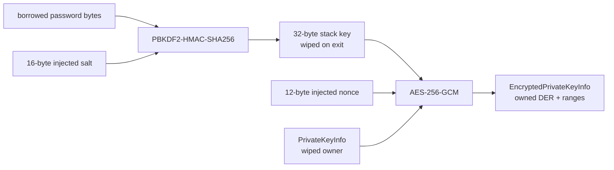

# ADR 0046: Modern encrypted PKCS #8 profile

- Status: Accepted
- Date: 2026-08-02

## Context

Private-key interchange needs an encrypted PKCS #8 responsibility without
recreating BoringSSL's generic cipher registry or accepting unauthenticated
legacy encryption. The same implementation must compile from one Pure Swift
source on Native, WASI, and Embedded targets. Password and plaintext lifetimes
must remain explicit, and authentication failure must not expose plaintext.

## Decision

`EncryptedPrivateKeyInfo` is an owned strict DER container. It accepts only
PBES2 with PBKDF2-HMAC-SHA256 and AES-256-GCM using a 16-byte salt, 12-byte
nonce, 32-byte derived key, and 16-byte authentication tag. PBKDF2-HMAC-SHA1,
CBC encryption, BER repair, unknown algorithms, noncanonical DER, and malformed
parameter shapes fail explicitly.

`PrivateKeyInfoEncryption` separates the encryption responsibility from the
container. `PBES2AES256GCM` is its modern concrete profile. Passwords enter as
scoped byte borrows; the library performs no `String` conversion and no legacy
PKCS #12 password transform. Entropy is injected through `EntropySource`.
Iteration policy is checked before key derivation or decryption. The derived
key remains in fixed stack storage and is wiped before return. AES-GCM validates
the tag before writing plaintext.

Decrypted DER is first written into a noncopyable `SecretBytes` owner. The
pinned Swift 6.4 snapshot cannot transfer that owner through a delegating
throwing initializer without a SIL failure, so import performs one explicit
copy into the `PrivateKeyInfo` wipe-on-destroy owner and immediately destroys
the source. This is a cold import boundary, not a platform fallback or a hot
payload path. Parsing and cryptography still share the same source and behavior
on every target.

The public operations use ordinary `throws` because the pinned compiler fails
SIL generation for the combination of typed throws, noncopyable results, and
nested scoped borrows. Every documented failure remains a concrete
`PBES2AES256GCMError`, `EncryptedPrivateKeyInfoError`, or
`PrivateKeyInfoError`; no error is converted to success or silently ignored.

## Responsibility alignment

| Concern | Contract |
|---|---|
| Public API | A narrow protocol defines seal/open; the profile is a separate concrete implementation |
| Errors | Unsupported algorithms, policy rejection, entropy failure, authentication failure, memory failure, and malformed DER remain distinct |
| Ownership | Password, salt, nonce, ciphertext, and DER are borrowed only inside synchronous scopes; plaintext owners are noncopyable and wiped |
| Concurrency | Configuration is immutable and `Sendable`; no shared mutable state or target-specific synchronization branch exists |
| Compatibility | Only the modern authenticated profile is supported; legacy OpenSSL behavior is intentionally absent |
| Performance | PBKDF2 prepares HMAC state once, the derived key is fixed stack storage, and parsing retains ranges instead of materializing fields |
| Platform | No Foundation, platform crypto, C backend, or target-specific semantic fallback is used |

## Verification

Native focused tests cover successful encryption/decryption, exact DER
round-trip, wrong-password authentication failure, modified-ciphertext
authentication failure, unsupported PBES2 algorithm rejection, and iteration
policy rejection before decryption. PBKDF2 has independent known-answer and
boundary tests. Interoperability, target execution, sanitizers, malformed-input
corpora, allocation/copy measurement, and security review remain completion
gates rather than inferred success.
