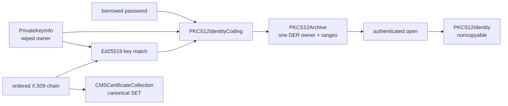

# ADR 0047: Modern PKCS #12 identity and CMS certificate containers

- Status: Accepted
- Date: 2026-08-02

## Context

Certificate and key interchange is required without importing BoringSSL's
generic PKCS #12 and CMS implementation or recreating legacy OpenSSL APIs. The
modern profile must retain strict DER, explicit ownership, bounded parsing,
authenticated private-key encryption, and one semantic implementation across
Native, WASI, and Embedded Swift.

## Decision

`PKCS12Archive` owns one PFX v3 DER document and stores checked ranges for one
`pkcs8ShroudedKeyBag` and an ordered X.509 certificate chain. Both outer
ContentInfo values use the standard data content type. The key bag must contain
the project's PBES2/PBKDF2-HMAC-SHA256/AES-256-GCM `EncryptedPrivateKeyInfo`.
Certificate bags must contain X.509 certificates. Unknown bag types, bag
attributes, multiple private keys, legacy encryption, and MacData are rejected
with typed errors.

MacData is intentionally absent because the standard PKCS #12 password and KDF
construction is a legacy compatibility mechanism. Private-key confidentiality
and integrity come from AES-256-GCM. The Ed25519 identity codec derives the
public key from the decrypted RFC 8410 seed and compares it in constant time to
the leaf certificate before returning the noncopyable identity. Additional
chain certificates remain public inputs whose signatures and trust are checked
by path validation, not by the archive container.

`PKCS12IdentityCoding` owns the seal/open responsibility. Its concrete modern
codec composes `PBES2AES256GCM`; the archive itself owns only format parsing and
encoding. `PKCS12Identity` uniquely owns decrypted `PrivateKeyInfo`, so private
DER remains in wipe-on-destroy memory and is exposed only through scoped
borrows.

`CMSCertificateCollection` implements only degenerate SignedData used for
certificate distribution. It requires an empty digest set, absent encapsulated
content, a nonempty canonical certificate SET, and empty signer information.
It has no generic CMS signing, CRL, or arbitrary content responsibility.

## Responsibility alignment

| Concern | Contract |
|---|---|
| Public API | Storage, cryptography, and decrypted identity ownership are separate types; seal/open is protocol-defined |
| Errors | Unsupported profiles and malformed structures fail explicitly; no legacy or silent fallback exists |
| Ownership | Archives and CMS containers retain one owned DER buffer and checked borrowed ranges; decrypted private DER remains uniquely owned and wiped |
| Concurrency | All stored state is immutable and `Sendable`; no shared mutable state or target-specific synchronization branch exists |
| Compatibility | PFX v3 and CMS DER structures are standard, while legacy PKCS #12 PBE/MacData and generic CMS signing are excluded |
| Performance | Parsing materializes no field buffers; copying occurs only when importing caller data or returning independently owned certificate/key objects |
| Platform | The implementation uses Pure Swift core, crypto, and ASN.1 modules with no Foundation or platform crypto backend |

## Verification

Focused Native tests execute PKCS #12 seal, parse, and authenticated open;
verify ordered certificate recovery and exact private DER; and reject incorrect
passwords, mismatched keys, unsupported private-key algorithms, MacData, and
out-of-range access. CMS tests cover encoding/parsing, canonical certificate
ordering, unsupported content, empty collections, and out-of-range access.
Interoperability, malformed corpora, Native/WASI/Embedded execution,
sanitizers, allocation/copy measurement, and security review remain completion
gates.
