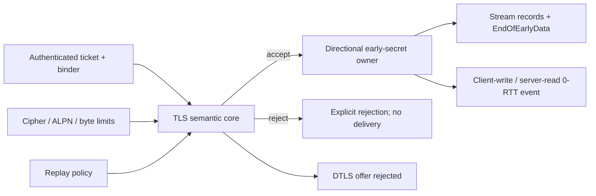

# ADR 0049: Separate TLS 1.3 early-data policy, ownership, and transport adaptation

- Status: Accepted
- Date: 2026-08-03

## Context

TLS 1.3 0-RTT combines four concerns that must not collapse into one Boolean:
PSK resumption authentication, application replay authorization, ownership of
one directional traffic secret, and transport-specific framing. Stream TLS and
QUIC use the same `client_early_traffic_secret` but expose it differently.
DTLS 1.3 does not use this TLS 1.3 early-data exchange. Rejected data must not
be delivered or automatically replayed, and HelloRetryRequest always terminates
the early-data attempt.

## Decision

The record-independent TLS semantic core owns the offer, acceptance, rejection,
transcript, and key-schedule decisions.

- `TLS13EarlyDataClientConfiguration` is explicit authorization to offer
  replayable application data and sets a caller limit.
- `TLS13EarlyDataServerConfiguration` sets a server limit and requires an
  injected `TLS13EarlyDataReplayProtecting` capability. No capability means no
  acceptance.
- `TLS13EarlyDataReplayProtecting` receives authenticated ticket identity,
  obfuscated ticket age, and selected ALPN. It must atomically persist or
  coordinate acceptance for its deployment threat model before returning
  `.accept`. Errors fail the handshake through a typed engine error.
- Acceptance requires the first PSK identity, a valid binder and ticket age,
  the ticket cipher suite, matching ticket/current ALPN, a positive ticket
  limit, the server limit, and replay approval.
- `TLS13EarlyTrafficSecret` uniquely owns the client-to-server secret. It is not
  represented as a pair because no server-to-client 0-RTT secret exists.
- `TLS13EarlyDataState` and explicit accepted/rejected actions let applications
  decide whether to retry idempotent work. The library never retransmits
  rejected data.
- HelloRetryRequest changes an offered state to rejected and removes the
  `early_data` extension from the second ClientHello.

## Transport contracts

Stream TLS seals application data with the early write protector. The server
delivers plaintext only after acceptance and enforces the negotiated cumulative
byte limit. On rejection with a known authenticated PSK, the server installs a
discard-only early read protector. When the ticket is unknown and no early key
can be derived, unauthenticated application-data records are discarded until a
record authenticates with the handshake key. EndOfEarlyData is sent only after
server Finished and is protected with the 0-RTT traffic key, as required by RFC
8446, before the client switches to its handshake write key.

QUIC emits the early secret only for client-write/server-read packet protection.
QUIC CRYPTO has no 0-RTT encryption level, and the TLS adapter does not emit
EndOfEarlyData. Packet protection, packet-number spaces, loss recovery, and
application replay behavior remain QUIC-stack responsibilities.

DTLS adapters reject early-data core effects and the shared core rejects an
early-data extension when configured for DTLS encoding. This is a typed profile
boundary rather than a compatibility fallback.

## Ownership and zero-copy contract

| Value | Owner and lifetime | Copy policy |
|---|---|---|
| Application payload | Caller input is borrowed; output records or delivery batches own one backing buffer with checked ranges | No intermediate payload materialization |
| Early traffic secret | One noncopyable `TLS13EarlyTrafficSecret`; consumed exactly once by the selected adapter | Scoped secret borrows only |
| Handshake bytes | One `OwnedBytes` backing per output with `ByteRange` descriptors | Framing and adapter routing borrow spans |
| Replay context | Independent immutable `Sendable` value for one synchronous policy call | Ticket identity is copied once at the trust/persistence boundary; payload is never copied into the context |

Unsafe pointers are not introduced by this feature. Existing cryptographic and
record-protection unsafe boundaries retain their owner, byte-count, alignment,
initialization, and nonescaping-borrow contracts.

## Consequences

- Resumption and early-data acceptance remain independent decisions.
- Applications cannot accidentally treat early data as established-session
  traffic.
- Server replay storage and cross-process coordination stay dependency-injected
  instead of becoming process-global mutable state.
- Stream, QUIC, and DTLS share TLS semantics without sharing an invalid effect
  surface.
- A rejected record is never exposed as successful application data.

## Verification

- Native Stream accept, policy reject, unknown-ticket discard, cumulative
  client byte-limit, and final handshake confirmation;
- typed NewSessionTicket early-data extension round trip;
- HelloRetryRequest rejection and removal from the second ClientHello;
- directional QUIC secret equality and absence of EndOfEarlyData;
- Native focused result: five selected protocol tests passed with zero failures;
- Native, WASI, and Embedded WASI release build, link, and target-validation
  execution passed. The final Embedded incremental build completed in 139.45
  seconds and the executable reported `swift-ssl target validation: ok`.

External Stream/QUIC interoperability, persistent replay-store fixtures,
allocation/copy measurement, fuzzing, sanitizer coverage of the new branches,
and security review remain completion gates for this profile.
