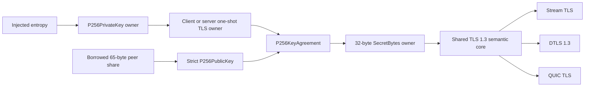

# ADR 0050: Promote fixed-control-flow P-256 to TLS 1.3 `secp256r1`

- Status: Accepted
- Date: 2026-08-03

## Context

RFC 8446 requires a compliant TLS application to support the `secp256r1`
key-exchange group. The package already owns a Pure Swift fixed-width P-256
key-agreement backend for RFC 9180 HPKE, but ADRs 0024 and 0045 deliberately
kept that backend out of TLS until its secret-scalar implementation had a
fixed-control-flow design and cross-target execution evidence.

Keeping TLS limited to X25519 and an experimental hybrid group leaves a
standards-required interoperability gap. Reimplementing P-256 inside the TLS
module would duplicate secret arithmetic and split the Native, WASI, and
Embedded security contract.

## Decision

The existing `P256PrivateKey`, `P256PublicKey`, and `P256KeyAgreement` backend
is the single P-256 arithmetic owner. `SwiftSSLTLS` adds role-specific,
noncopyable `TLS13P256ClientKeyExchange` and
`TLS13P256ServerKeyExchange` values and registers RFC 8446 named group
`0x0017` as `TLS13NamedGroup.secp256r1`.

- Client and server shares are exactly 65-byte SEC1 uncompressed points.
- Received shares remain borrowed and are parsed by the strict
  `P256PublicKey` boundary.
- Each role consumes its private scalar once. A second completion attempt is a
  typed invalid-state failure.
- The 32-byte ECDH component is copied once from its noncopyable primitive
  owner into the final `SecretBytes` key-schedule owner.
- Stream TLS, DTLS, and QUIC TLS construct the same record-independent core
  through explicit P-256 overloads. Transport adapters do not own arithmetic.
- Entropy is injected at key generation. The server protocol retains its
  common entropy argument, but P-256 acceptance performs no new random draw.
- Malformed length, point decoding, key generation, secret allocation, and
  state failures remain distinguishable typed errors.

This decision supersedes only the statements in ADRs 0024 and 0045 that P-256
is not selectable by TLS. Their fixed-limb arithmetic, ownership, HPKE, and
validation decisions remain in force. This decision does not promote P-256
ECDSA signing to `TLS13SigningKey`.

## Design-authority comparison

| Concern | Package design | This decision | Classification |
|---|---|---|---|
| Public API | Narrow role-specific protocols and concrete owners | Separate client/server P-256 values | Aligned |
| Error contract | Typed failure without silent fallback | P-256 generation, peer, memory, and state errors remain typed | Aligned |
| Ownership | Noncopyable private and shared-secret values | Scalar is consumed once; final secret has one owner | Aligned |
| Concurrency | Connection state is a single-owner mutable value | No shared mutable state is introduced | Aligned |
| Lifetime | Hot input is borrowed; owned output crosses calls | Peer point borrow does not escape; share and secret are owned | Aligned |
| Compatibility | Modern wire semantics without C API emulation | RFC 8446 group `0x0017`; no legacy curve API | Aligned |
| Performance | Borrowed inputs, bounded copies, static dispatch after selection | One public-share owner and one final secret copy | Compatible; measurement remains open |
| Platform | One semantic source for Native, WASI, and Embedded | No platform crypto backend or fallback | Aligned |
| Tests | Success and failure behavior plus real driver paths | Primitive, Stream, QUIC, DTLS, and three-target execution | Aligned |

## Shared-state review matrix

| Logical state | Native | WASI | Embedded WASI | Read/mutation | Release |
|---|---|---|---|---|---|
| Client private scalar | `TLS13P256ClientKeyExchange` unique optional owner | Same | Same | Borrow share; consuming completion | Scalar owner is consumed and wiped by its secret storage |
| Server private scalar | `TLS13P256ServerKeyExchange` unique optional owner | Same | Same | Consuming acceptance | Scalar owner is consumed and wiped by its secret storage |
| Shared secret | One `SecretBytes` owner | Same | Same | Scoped borrow by key schedule | Wiped and exactly-once deallocated |

No `Mutex`, actor, conditional `Sendable`, target-specific raw state, or unsafe
pointer boundary is added by this feature.

## Verification

- deterministic client/server shared-secret equality;
- strict 65-byte share length and uncompressed-point validation;
- malformed compressed-point rejection and second-use invalid-state failure;
- full TLS Stream handshake with `secp256r1` in ClientHello;
- full QUIC CRYPTO-stream handshake;
- full DTLS Cookie/retry handshake; and
- Native, WASI, and Embedded WASI Release build, link, and execution of
  `swift-ssl-target-validation` from the same source. The final Embedded
  incremental build completed in 139.45 seconds and the executable reported
  `swift-ssl target validation: ok`.

Independent TLS peer interoperability, focused sanitizer and constant-time
route automation, formal allocation/copy evidence, paired performance
measurement, and security review remain release gates.
