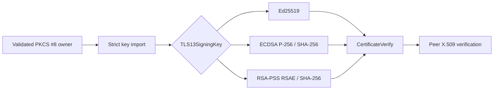

# ADR 0051: Promote modern TLS 1.3 signing profiles

- Status: Accepted
- Date: 2026-08-03

## Context

ADR 0036 reduced TLS signing to Ed25519 while the P-256 and RSA private-key
implementations were either absent or not suitable for secret-bearing protocol
use. The current implementation now has deterministic P-256 ECDSA, RSA-PSS
SHA-256 signing, strict PKCS #8 import, typed noncopyable private-key owners,
and matching X.509 verification paths. Keeping the TLS credential model
Ed25519-only would leave required modern certificate deployments outside the
declared BoringSSL-replacement profile.

## Decision

`TLS13SigningKey` is the closed credential owner for the modern TLS profile.
It accepts Ed25519, P-256 ECDSA with SHA-256, and RSA-PSS RSAE with SHA-256.
The signature scheme is derived from the owned key and cannot be selected
independently. PKCS #8 import validates the algorithm parameters and any
embedded P-256 public key before the credential becomes callable.

Private keys remain noncopyable owners. Secret byte access is scoped to
borrowing closures, temporary digests and scalar encodings are wiped where
they contain derived secret material, and no pointer escapes an unsafe
boundary. The handshake core depends on the closed signing capability rather
than on algorithm-specific concrete types.

This decision supersedes the Ed25519-only TLS selection rule in ADR 0036 and
the historical rejection gate in ADR 0030. P-384, P-521, RSA PKCS #1 v1.5,
and post-quantum TLS signatures remain outside this signing profile.

## Verification and release gates

- Native tests cover P-256 and RSA-PSS signing, mutation rejection, strict key
  import, signature-scheme selection, and successful TLS client/server
  CertificateVerify paths.
- Native, WASI, and Embedded WASI builds compile and link the same source and
  type contracts.
- The repository remains an active-development cryptographic implementation.
  Independent TLS interoperability, automated secret-dependent code-generation
  review, sanitizer coverage of each signing path, formal allocation/copy
  evidence, paired benchmarks, and security review remain release gates rather
  than silent runtime fallbacks.
