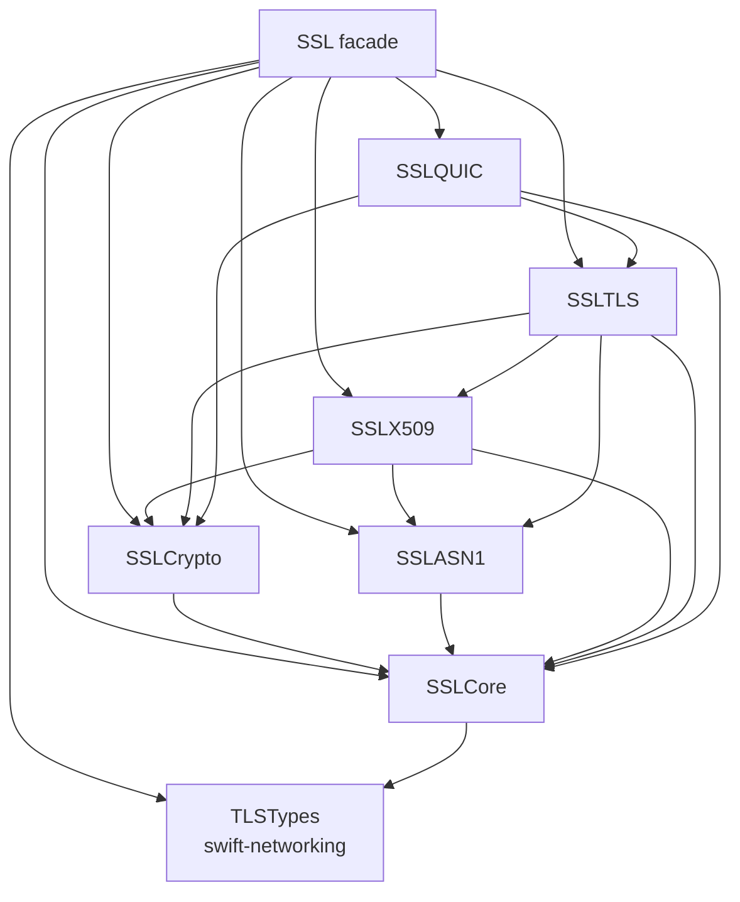

# ADR 0052: Use SSL module names without a Swift prefix

- Status: Accepted; package placement amended by ADR 0054
- Date: 2026-08-03

## Context

The repository name `swift-ssl` identifies the package in the Swift ecosystem,
but the `SwiftSSL` module family duplicated the implementation language in every
import. It also made the package's module hierarchy harder to distinguish from
the public SSL responsibility that the facade owns. No released compatibility
surface requires retaining the former module names.

## Decision

The package and executable product names retain the `swift-ssl` spelling. The
public library facade is `SSL`, and its responsibility-specific modules use the
same prefix:

| Responsibility | Module |
|---|---|
| Shared TLS vocabulary (including cipher-suite IDs and ALPN) | `TLSTypes` from `swift-networking` |
| Safe byte ownership, clocks, and entropy | `SSLCore` |
| Cryptographic algorithms and key owners | `SSLCrypto` |
| DER and PEM codecs | `SSLASN1` |
| Certificates, trust, and containers | `SSLX509` |
| TLS and DTLS protocol state | `SSLTLS` |
| QUIC integration | `SSLQUIC` |
| Public facade | `SSL` |

Validation, benchmark, and test targets use the `SSL` prefix as well. The
package does not provide compatibility targets, type aliases, or re-export
shims for the former names. Existing benchmark result files remain immutable
historical evidence and may therefore contain the identifiers recorded when
they were produced; newly generated artifacts use the current naming schema.

## Consequences

Consumers must replace former imports with the corresponding `SSL` module
imports. This is intentionally source breaking. The change does not alter
protocol contracts, error propagation, memory ownership, synchronization, or
algorithm selection.

The rename is accepted only when the package manifest exposes the new module
graph, current source contains no former module identifiers, native behavioral
tests pass, and the pinned WASI and Embedded WASI validation products compile,
link, and run through their real entry points.
