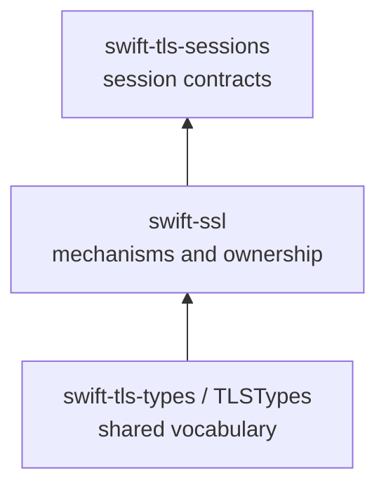

# ADR 0053: Make TLS vocabulary an independent package

## Status

Accepted for the canonical Pure Swift transport stack.

## Context

The public dependency direction is intentionally layered:



The vocabulary is consumed by protocol, certificate, and transport-facing
packages. Keeping it as an internal target of `swift-ssl` makes those consumers
depend on the mechanism package merely to name a TLS role, version, ALPN value,
or cipher-suite identifier. The original contract therefore requires a
standalone `swift-tls-types` package.

The extraction must not move ownership-backed contracts across the boundary.
`TLSTrafficSecret`, `TLSInput`, `TLSOutputSink`, and `TLSBufferRange` include
secure erasure, initialized-range, capacity, and non-escaping-borrow guarantees.
Those guarantees are implemented by `swift-ssl` and remain in `SSLCore`.

## Decision

1. `swift-tls-types` publishes the `TLSTypes` module. It contains only
   implementation-independent vocabulary and opaque byte-backed names:
   `TLSRole`, `TLSVersion`, `TLSCipherSuite`, `TLSApplicationProtocol`,
   `TLSServerName`, `TLSEncryptionLevel`, `TLSAlert`, and their bounded-value
   errors.
2. `swift-tls-types` has no cryptography, parsing, certificate policy,
   transport I/O, secret storage, protocol state, or dependency on
   `swift-ssl`.
3. `swift-ssl` depends on `swift-tls-types`; `SSLCore` owns all
   ownership-backed byte and secret contracts, including wipe and borrow
   lifetimes. The former internal `SSLTypes` target is removed.
4. `swift-tls-sessions` is the public session-contract layer above `swift-ssl`.
   It may consume `TLSTypes`, but `swift-ssl` never depends on sessions or
   transport packages.
5. DTLS retransmission flights remain engine-owned immutable buffers. The
   transport may borrow a checked range for sending, but it never owns or
   retains a pointer into the engine.

## Consequences

The package graph has an explicit common-type boundary and one additional
release pin:

```text
swift-tls-types (TLSTypes)
        ↓
swift-ssl (SSLCore / SSLCrypto / SSLTLS / SSLDTLS / SSLQUIC)
        ↓
swift-tls-sessions (TLS / DTLS / QUIC TLS sessions)
```

Consumers can import `TLSTypes` without linking cryptographic mechanisms.
Consumers that need secret ownership or scoped I/O use the `SSLCore` and `SSL`
products from `swift-ssl`. No compatibility target named `SSLTypes` is kept;
the package identity and module name now describe the actual shared boundary.

The output sink contract continues to report
`TLSOutputSinkError.insufficientCapacity(required:available:)`. It never
silently reallocates or truncates caller storage. Any adapter that needs to
retain output across a call must create an explicit owned buffer and document
that copy at the output boundary.
