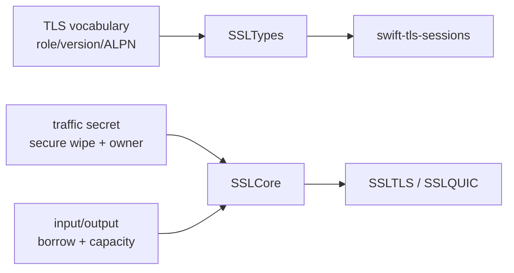

# ADR 0053: Keep ownership-backed transport types in SSLCore

## Status

Accepted during the Pure Swift backend migration.

## Context

The workspace has a dependency-light `SSLTypes` target and a mechanism owner in
`swift-ssl`. A standalone `swift-tls-types` package was proposed for all public
transport values. That grouping would mix two different contracts:

`TLSTrafficSecret`, `TLSInput`, `TLSOutputSink`, and `TLSBufferRange` are not
just names. Their contracts include secure erasure, initialized ranges,
capacity errors, and non-escaping borrows. Moving them into a zero-dependency
package would either duplicate the owner implementation or expose a shell
whose safety guarantees cannot be enforced.

The workspace also has only one canonical mechanism owner today. Extracting a
separate package before independent stable consumers exist would freeze the
most change-prone lifetime contract and create a multi-repository tag chain.

## Decision

1. `SSLTypes` contains only implementation-independent vocabulary and opaque
   boundary values. It has no secret storage, parser, algorithm, or transport
   I/O.
2. `SSLCore` owns `TLSTrafficSecret`, `TLSInput`, `TLSOutputSink`, and
   `TLSBufferRange`, including their wipe, borrow, range, and typed-capacity
   contracts.
3. The public session package is named `swift-tls-sessions` to avoid SwiftPM
   identity collision with Apple's `swift-tls`. It depends on `swift-ssl`; the
   mechanism package never depends on session or transport packages.
4. A standalone `swift-tls-types` package may be extracted only after at least
   two independent stable consumers use the same vocabulary without requiring
   ownership-backed types. Extraction must preserve the target-level API and
   include a migration decision record.
5. DTLS retransmission flights remain engine-owned immutable buffers. The
   transport may borrow a checked range for sending, but it never owns or
   retains a pointer into the engine.

## Consequences

The initial package graph has one fewer repository boundary and therefore fewer
tag-order constraints. Consumers receive the vocabulary through the public
`SSLCore` or `SSL` products; `SSLTypes` itself is not a SwiftPM product. That
trade-off is intentional: ownership and failure guarantees take precedence over
premature package extraction.

The output sink contract reports
`TLSOutputSinkError.insufficientCapacity(required:available:)`. It never
silently reallocates or truncates caller storage. Any adapter that needs to
retain output across a call must create an explicit owned buffer and document
that copy at the output boundary.
