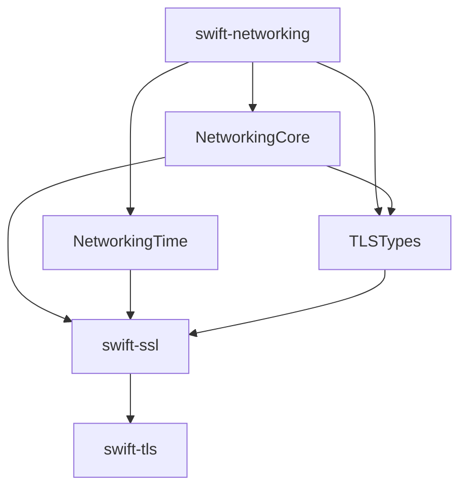

# ADR 0054: Co-locate TLS vocabulary in swift-networking

- Status: Accepted
- Date: 2026-08-13
- Supersedes: ADR 0053 package-placement decision

## Context

ADR 0053 correctly separated implementation-independent TLS vocabulary from
cryptographic mechanisms and session state. It placed that vocabulary in a
standalone `swift-tls-types` package. The networking stack subsequently
introduced `swift-networking` as the common portability package for
protocol-neutral byte ownership, time capabilities, datagram contracts, and
platform adapters.

Keeping two small foundation packages creates an additional release edge
without improving module isolation. SwiftPM products already provide the
required compile-time boundary: a consumer can depend on `TLSTypes` without
importing `NetworkingCore`, platform adapters, or TLS mechanisms.

## Decision

1. `swift-networking` publishes `TLSTypes` as a separate product and target.
2. `TLSTypes` contains only implementation-independent TLS vocabulary:
   `TLSRole`, `TLSVersion`, `TLSCipherSuite`, `TLSApplicationProtocol`,
   `TLSServerName`, `TLSEncryptionLevel`, `TLSAlert`, and bounded-value errors.
3. `TLSTypes` may depend on `NetworkingCore` only for protocol-neutral owned
   byte values. It does not depend on `NetworkingDatagram`, platform adapters,
   cryptography, certificates, or session state.
4. `swift-ssl` consumes the `TLSTypes`, `NetworkingCore`, and `NetworkingTime`
   products directly. Secret ownership, cryptographic mechanisms, parsing,
   certificate policy, and TLS/DTLS mechanisms remain in `swift-ssl`.
5. `swift-tls` remains the session lifecycle layer above `swift-ssl`. Neither
   `swift-networking` nor `swift-ssl` depends on `swift-tls`.
6. The standalone `swift-tls-types` package is retired. No compatibility
   product or package-identity fallback is introduced.

## Consequences

The responsibility boundary remains a module boundary while the number of
foundation package identities and release pins decreases. Consumers import
only the products they use. A consumer that needs TLS vocabulary does not link
cryptographic or session implementations merely because the product is
co-located in `swift-networking`.

The placement is valid only while `TLSTypes` remains dependency-light and does
not acquire secret storage, wire parsing, certificate policy, transport I/O,
or protocol state. Those responsibilities belong to `swift-ssl`, `swift-tls`,
or protocol-specific packages.
